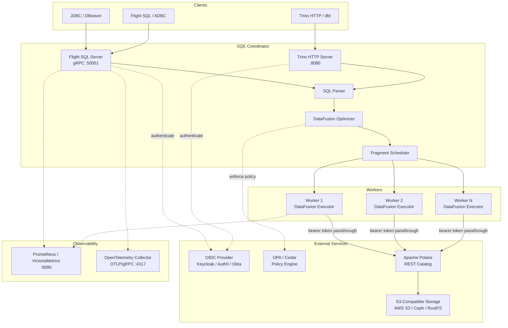
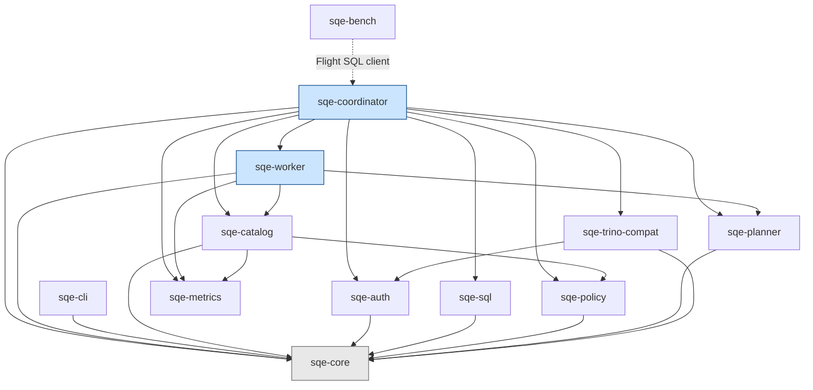
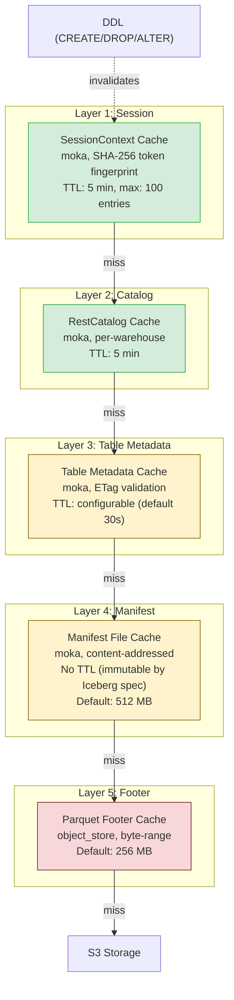
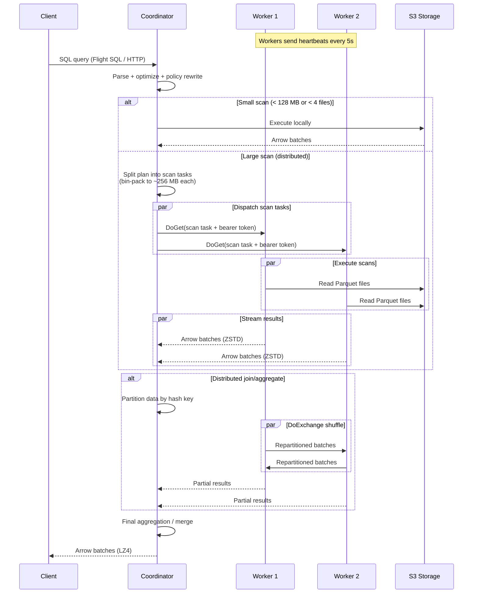

# SQE Architecture

This document provides visual architecture diagrams for the Sovereign Query Engine (SQE). All diagrams use Mermaid syntax for rendering in GitLab, GitHub, or any Markdown viewer with Mermaid support.

## 1. High-Level Architecture

## 2. Query Execution Pipeline

```mermaid
graph LR
    SQL["SQL String"] --> Parse["Parser<br/>(sqlparser-rs)"]
    Parse --> Classify["Statement<br/>Classifier"]
    Classify --> LP["Logical Plan"]
    LP --> PolicyRewrite["Policy Plan Rewrite<br/>(row filters,<br/>column masks)"]
    PolicyRewrite --> Optimize["DataFusion<br/>Optimizer"]
    Optimize --> PP["Physical Plan"]
    PP --> AdaptiveSort["Adaptive Sort<br/>Stripping"]
    AdaptiveSort --> DynFilter["Dynamic Filter<br/>Injection"]
    DynFilter --> Exec["Execution"]
    Exec --> Arrow["Arrow Batches<br/>(LZ4 compressed)"]

    style PolicyRewrite fill:#f9e2ae,stroke:#e8a838
    style AdaptiveSort fill:#d4edda,stroke:#28a745
    style DynFilter fill:#d4edda,stroke:#28a745
```

**Key stages:**

- **Policy Plan Rewrite** -- Security filters and column masks are injected into the logical plan *before* DataFusion optimization. This ensures that user predicates can be pushed through row filters but cannot bypass masked columns.
- **Adaptive Sort Stripping** -- Under memory pressure, non-partition sort requirements are stripped to prevent OOM. Falls back to partition-only ordering.
- **Dynamic Filters** -- Hash join build-side min/max ranges are pushed down into Iceberg scan operators at execution time, pruning files and row groups.

## 3. Crate Dependency Graph

All crates depend on `sqe-core` for shared types, configuration, and error definitions. The coordinator is the heaviest crate, pulling in nearly everything. Workers are lighter -- they only need catalog access, plan execution, and metrics.

## 4. Caching Architecture

**Invalidation rules:**

- Session cache is invalidated after any DDL statement (CREATE TABLE, DROP TABLE, ALTER TABLE, etc.)
- Table metadata uses ETag-based conditional requests -- Polaris returns 304 Not Modified when metadata has not changed
- Manifest files are immutable by Iceberg specification, so no TTL-based expiry is needed
- Footer cache evicts on LRU basis within the configured memory budget

## 5. Distributed Execution

**Distribution decision:**

- Queries scanning less than 128 MB total or fewer than 4 data files execute locally on the coordinator
- Larger scans are bin-packed into ~256 MB tasks and dispatched to workers
- Workers are stateless -- they receive the physical plan fragment and the user's bearer token, execute against S3, and stream results back
- Shuffle (for distributed joins and aggregates) uses Arrow Flight `DoExchange` with ZSTD compression
- Client-facing responses use LZ4 compression (faster decompression)
