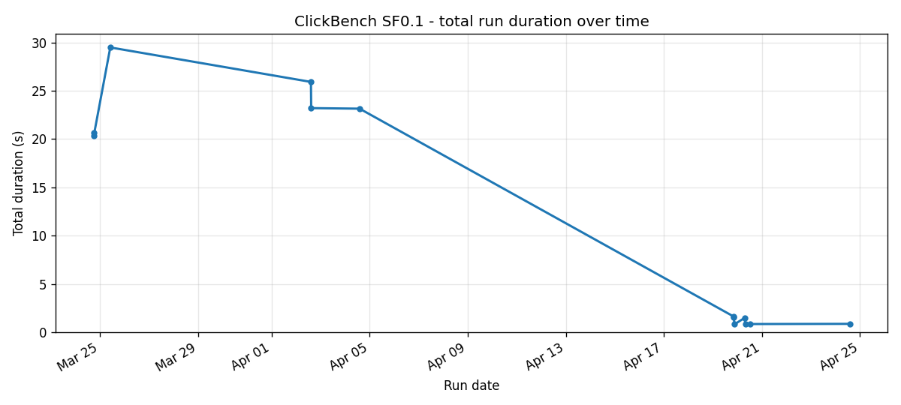
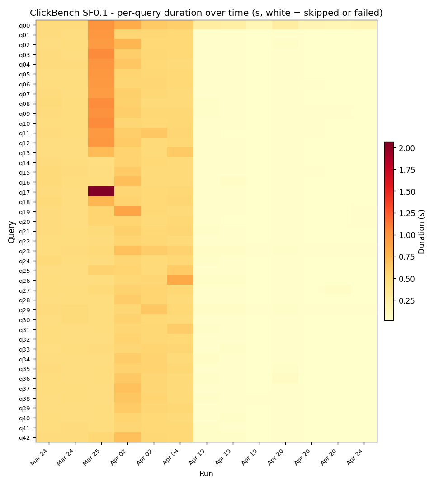
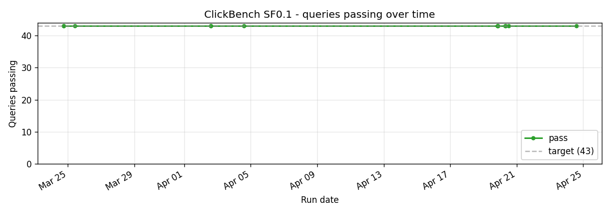
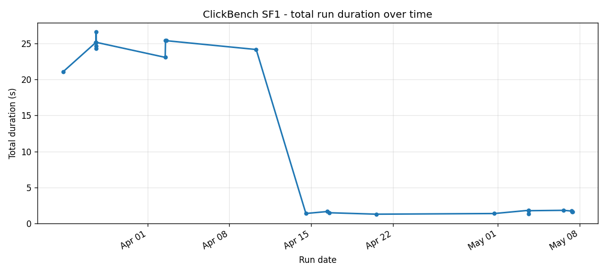
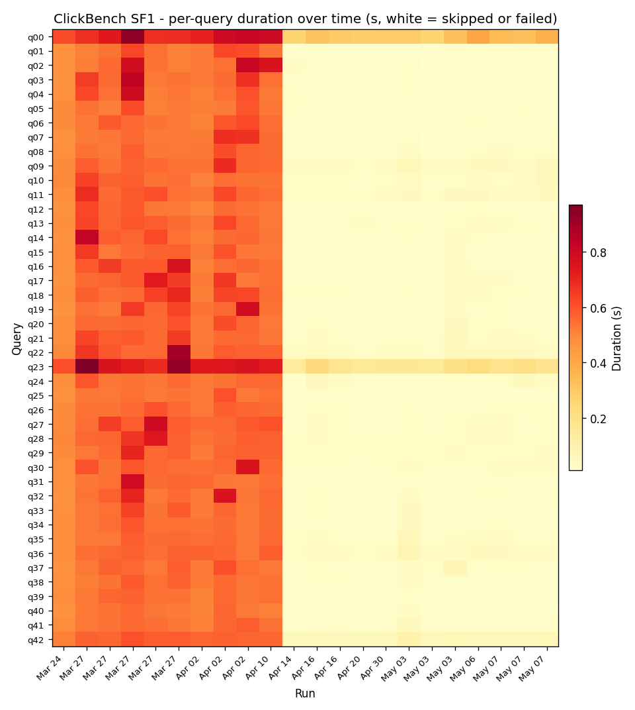
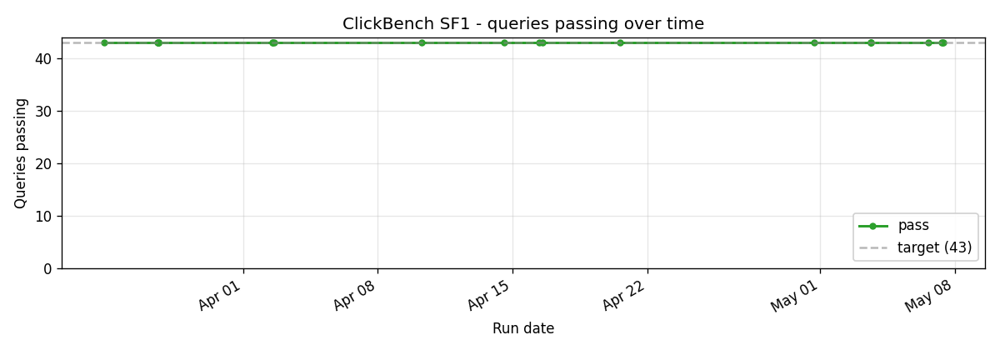
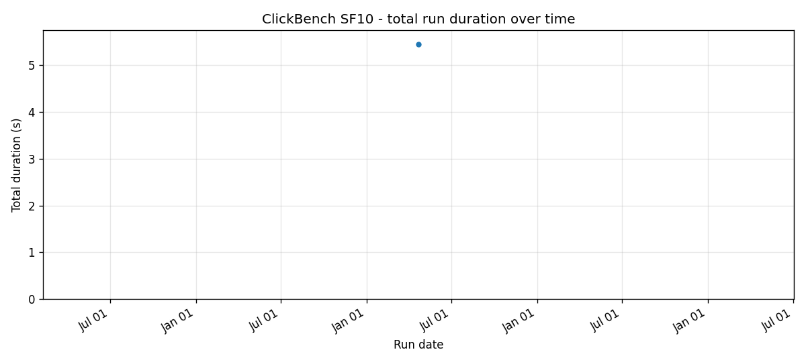
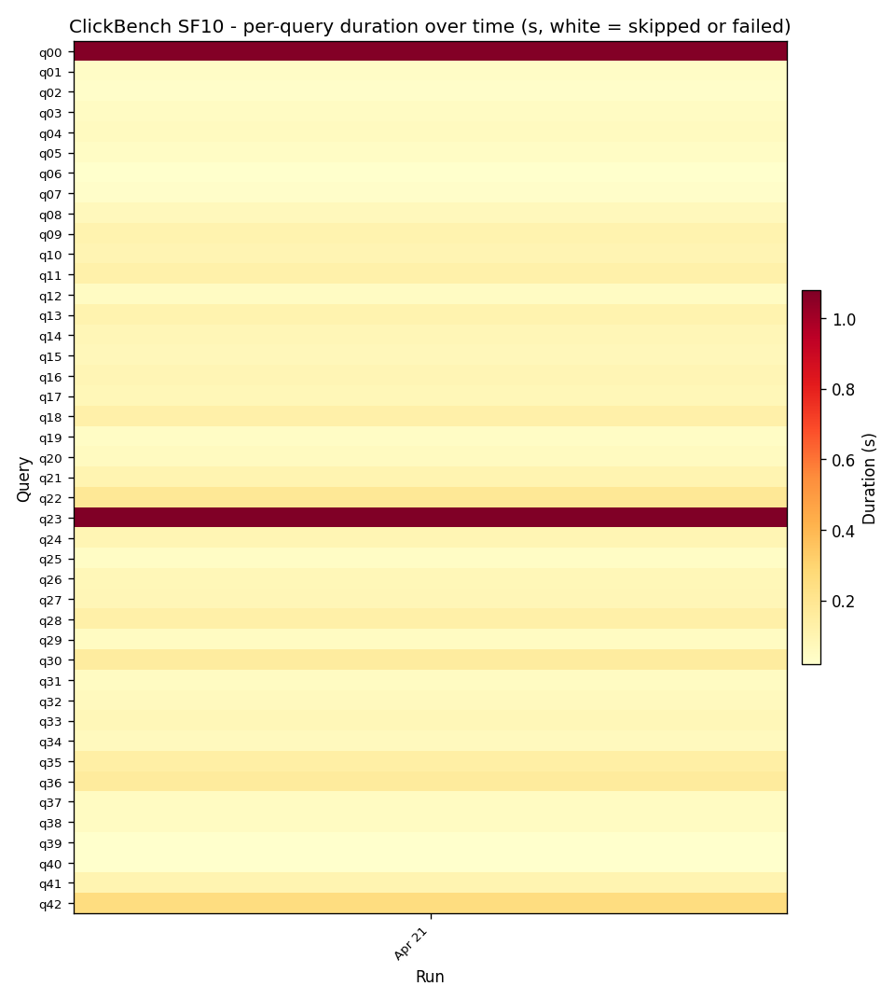
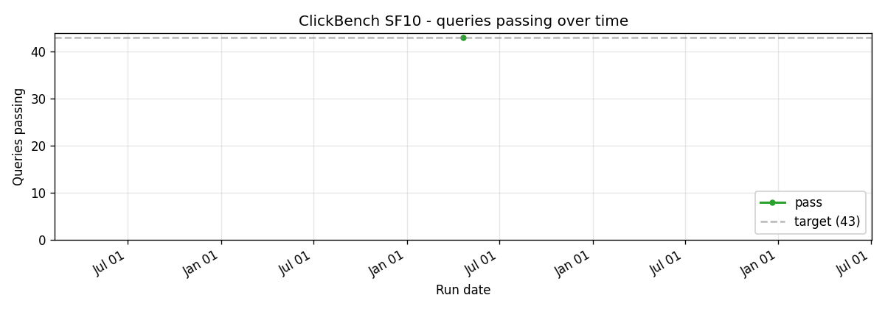

# ClickBench

43 queries against a single wide `hits` table. Designed for log analytics use cases (HTTP access logs, mobile event logs); heavy on string filters, point lookups, and counts over fixed columns.

This is the suite where SQE's caching layers shine: bloom filters on the few high-cardinality columns + manifest-level min/max stats + footer cache means most queries become "skip 99% of files, scan 1, return". The 4.6x speedup vs Trino at SF1 is the largest gap of any of the seven suites.

## Cross-scale

## SF0.1

## SF1

The headline scale. Total run sits at 1.7s; Trino takes 6.3s on the same data.

## SF10

One run. Will fill in as more land.

## Implementation references

- Queries: `crates/sqe-bench/queries/clickbench/`
- Bloom filter writer: `crates/sqe-catalog/src/parquet_writer_config.rs`
- Footer cache: `crates/sqe-catalog/src/footer_cache.rs`
- Caching strategy: [`docs/blog/2026-04-12-caching-and-the-8x-speedup.md`](../blog/2026-04-12-caching-and-the-8x-speedup.md)
- Runner: `scripts/benchmark-test.sh clickbench`
