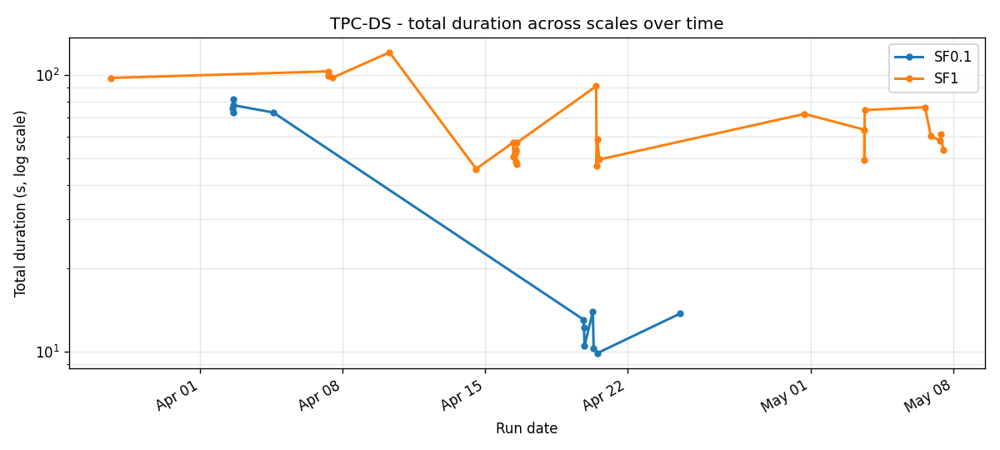
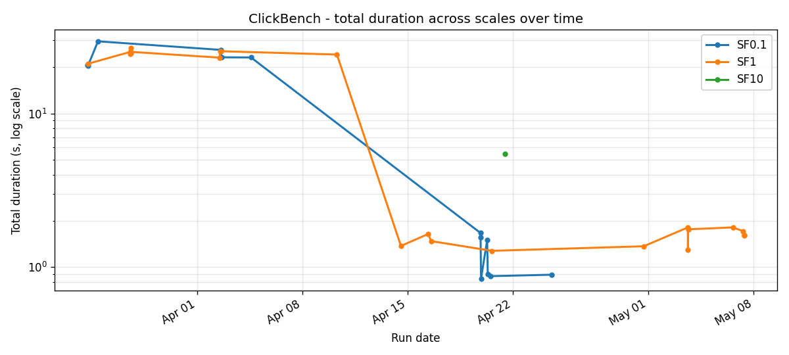
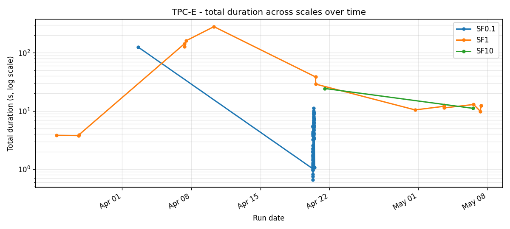

# Benchmark history

Timeline view of every benchmark run committed to `benchmarks/results/`. The README's headline table is a snapshot of the latest run; this is the longitudinal view that shows how each suite moved across six months of optimisation work.

Charts are regenerated by walking the JSON files in `benchmarks/results/`. Run `make benchmark-charts` to refresh after a new run lands.

## What is plotted

For each suite (TPC-H, TPC-DS, SSB, ClickBench, TPC-C, TPC-E, TPC-BB) at each scale (SF0.1, SF1, SF10) we plot three views:

1. **Total run duration over time**: one line, one point per run. Big drops show the day a planner / runtime fix landed; spikes show a bad benchmark machine or a regression caught fast.
2. **Per-query duration heatmap**: rows are queries, columns are runs, colour is duration in seconds. White cells are runs where the query was skipped or failed. Reading top-to-bottom shows which queries are consistently expensive; reading left-to-right shows where a fix moved a row from red to yellow.
3. **Pass count over time**: one line. Useful when a refactor introduces new failures we want to catch quickly.

## Suites at a glance

Each chart below puts SF0.1, SF1, and SF10 on the same time axis (log scale on Y so all three fit). Click through to a suite for the per-scale detail.

### TPC-H


22 queries, decision support. Strict comparison against Trino 465 lives in the [README's headline table](../../README.md#benchmark-results-sf1-vs-trino-465). Detail: [TPC-H](./tpch.md).

### TPC-DS



99 queries, decision support, harder than TPC-H. Q72 is consistently the slowest query and shows up as a dark band in the heatmap. Detail: [TPC-DS](./tpcds.md).

### Star Schema Benchmark (SSB)


13 queries derived from TPC-H, optimised for star joins. Used during the runtime-filter pushdown work as a sanity check. Detail: [SSB](./ssb.md).

### ClickBench



43 queries, focused on log analytics over a wide hits table. Detail: [ClickBench](./clickbench.md).

### TPC-C (read-only subset)


8 read queries from TPC-C. The full benchmark needs OLTP transaction support; SQE runs the read subset. Detail: [TPC-C](./tpcc.md).

### TPC-E



11 queries, financial trading workload. Heavy on date / range filters. Detail: [TPC-E](./tpce.md).

### TPC-BB


10 queries from BigBench. Mix of structured and semi-structured workloads. Detail: [TPC-BB](./tpcbb.md).

## How runs are recorded

Every `./scripts/benchmark-test.sh` invocation writes a JSON file with shape:

```json
{
  "benchmark": "tpch",
  "scale_factor": 1.0,
  "protocol": "flight",
  "timestamp": "2026-05-08T07:11:23",
  "summary": {
    "total": 22,
    "pass": 22,
    "fail": 0,
    "diff": 0,
    "skip": 0,
    "error": 0,
    "total_duration_ms": 19347
  },
  "queries": [
    { "id": "q01", "status": "pass", "duration_ms": 1124, "rows": 6 },
    ...
  ]
}
```

These JSON files are committed to the repo (per `CLAUDE.md`) so the timeline is reproducible by anyone with `git log`. The chart-generation script is `scripts/render-benchmark-charts.py`; it is pure Python with `matplotlib` as the only dependency.

## What the charts can and cannot tell you

What they show:

- **Day a fix landed**: a step-change in total duration usually corresponds to a single commit landing on `main`. Cross-reference with the [Performance Roadmap](../specs/performance-roadmap.md) and the dated blog posts.
- **Regression caught fast**: a single-run spike that the next run reverses is the common shape after a bad change is rolled back.
- **Consistently slow queries**: rows in the heatmap that stay orange / red across the whole period (q72 in TPC-DS, q01 in some TPC-H windows) are the queries the planner has not yet learned to handle well.
- **New benchmark machine**: a step-change that affects every query the same way is usually environmental (different machine, different disk, different Trino version).

What they do not show:

- **Wall-clock query latency** to a real client. Benchmarks run inside the SQE process loop with Flight SQL and capture only the engine time. Network round-trips are not included.
- **Variance from a single run**. We do not run with repeats and confidence intervals; one point per run. Smoothing comes from running benchmarks many times across the period.
- **Cost-per-query in the cluster mode**. Distributed execution adds shuffle / scheduling overhead that the single-node Flight SQL benchmarks do not capture. See `docs/blog/2026-04-02-distributed-execution.md` for the cluster-mode timings.

## Cross-suite headline (May 2026)

Numbers below are from the latest SF1 run on the same machine, against Trino 465 with identical Iceberg + S3 storage. Same data as the README table; reproduced here so the timeline is self-contained.

| Suite | SQE | Trino | Avg speedup | Pass |
|---|---|---|---|---|
| TPC-H (22) | 19.3s | 26.6s | **2.3x** | 22/22 |
| SSB (13) | 7.6s | 8.3s | **1.1x** | 13/13 |
| TPC-DS (99) | 57.1s | 39.7s | **1.4x** | 93/99 |
| TPC-C (8 read) | 0.45s | 3.4s | **9.6x** | 8/8 |
| TPC-E (11) | 10.4s | 138.8s | **7.8x** | 11/11 |
| TPC-BB (10) | 36.9s | 323.6s | **5.5x** | 10/10 |
| ClickBench (43) | 1.7s | 6.3s | **4.6x** | 43/43 |

The numbers are approximate (run-to-run variance is real) but the rank order is stable across the last month of runs.

## Related

- [Performance Roadmap](../specs/performance-roadmap.md): the optimisation backlog, in order.
- [Runtime Filter Pushdown](../features/runtime-filter-pushdown.md): the Path B+B-2 work that drove most of the April-May TPC-H speedups.
- [Our Nemesis: TPC-DS Q72](../blog/2026-04-16-our-nemesis-q72.md): the one query that stays expensive.
- [Five Layers of Caching and an 8.8x Speedup](../blog/2026-04-12-caching-and-the-8x-speedup.md): the early-April caching work.
