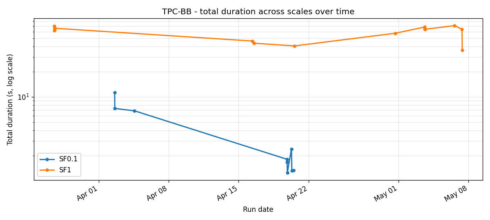
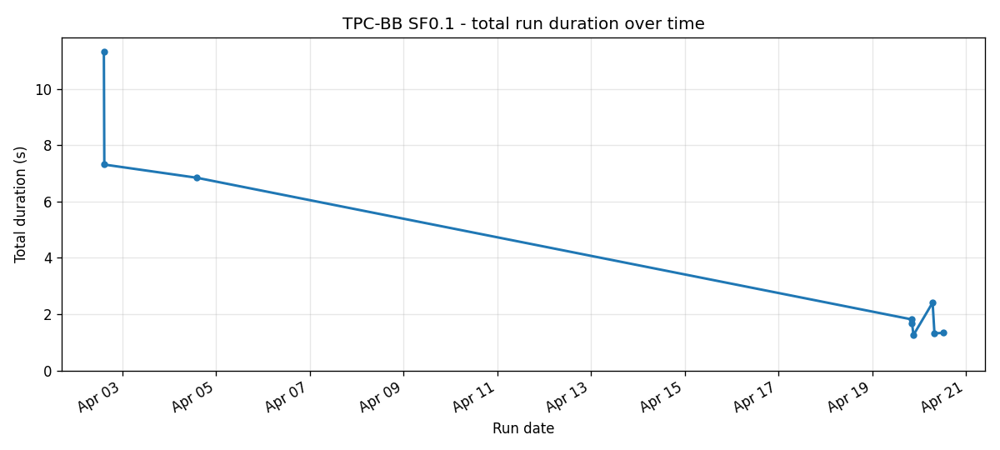
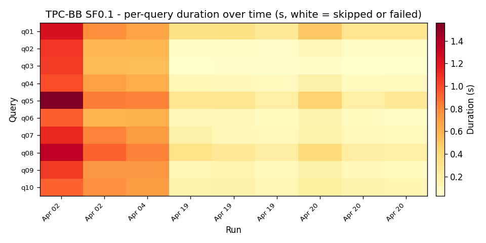
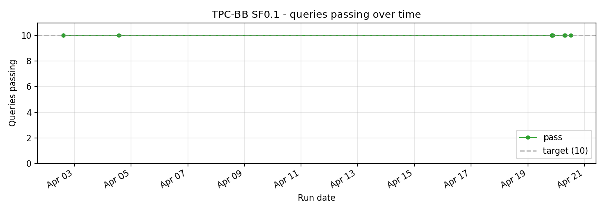
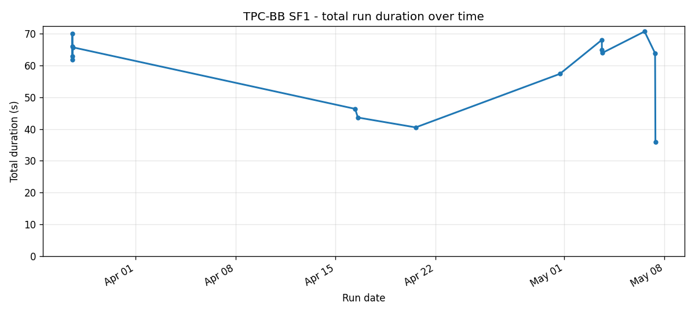
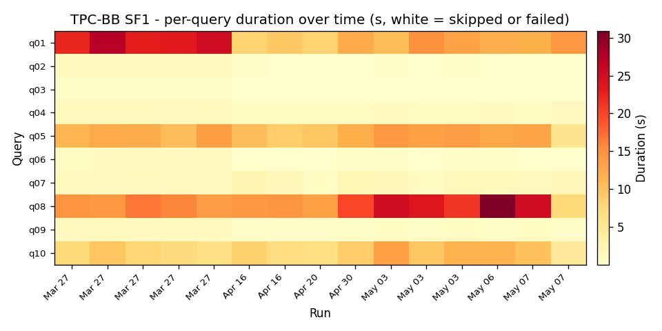
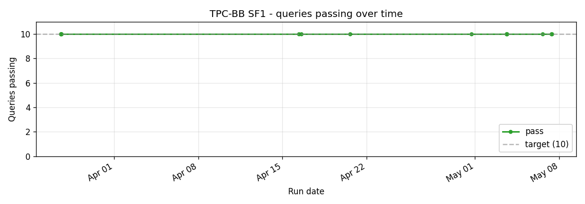

# TPC-BB (BigBench)

10 queries from the BigBench mixed-workload benchmark. A blend of structured analytics, semi-structured (JSON), and unstructured (text) operations against a retail data warehouse schema.

The 5.5x speedup vs Trino at SF1 reflects the structured-query subset; the JSON queries are where the gap is largest because Trino's JSON connector materialises strings that DataFusion can scan as columnar.

## Cross-scale

## SF0.1

## SF1

10/10 pass since late March.

## SF10

No clean runs at SF10 yet. The two attempted runs both errored and were dropped from the timeline.

## Implementation references

- Queries: `crates/sqe-bench/queries/tpcbb/`
- JSON functions: `crates/sqe-trino-functions/src/trino_functions.rs` and `datafusion-functions-json`
- Runner: `scripts/benchmark-test.sh tpcbb`
