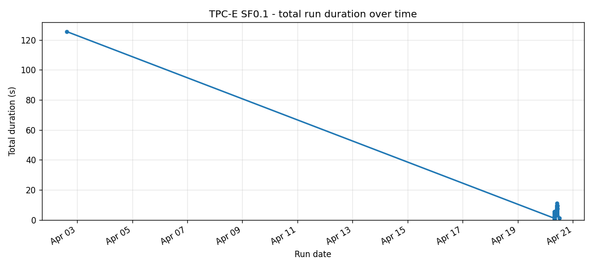
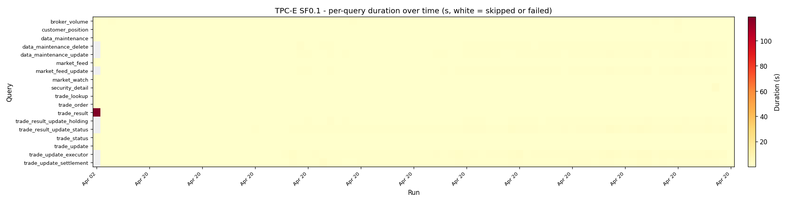
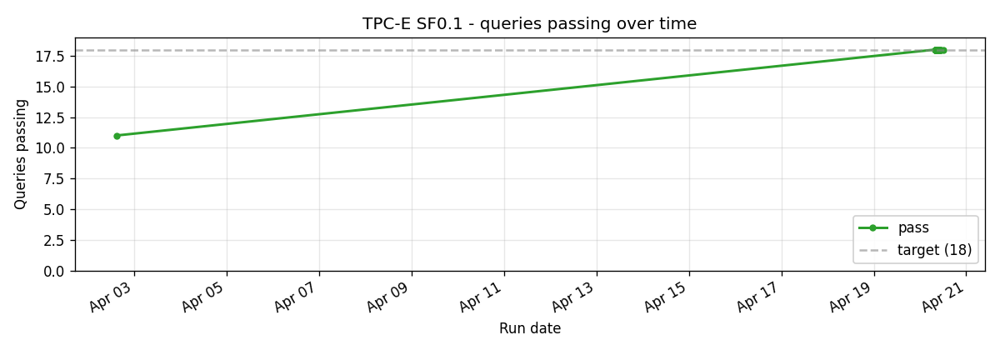
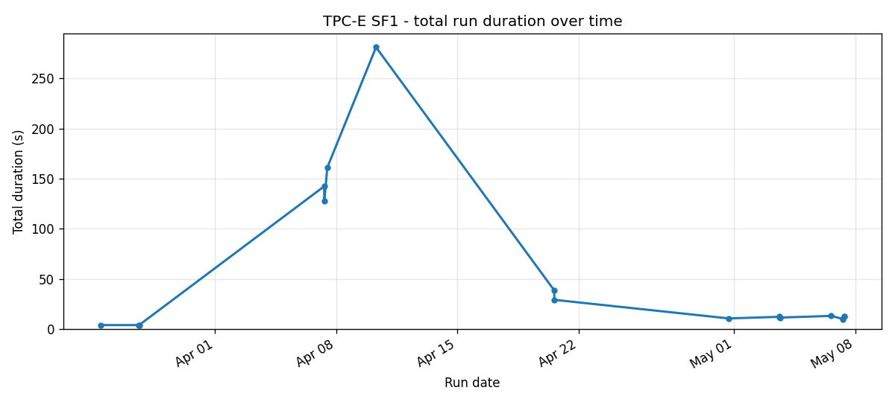
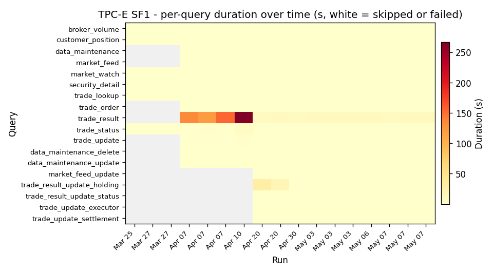
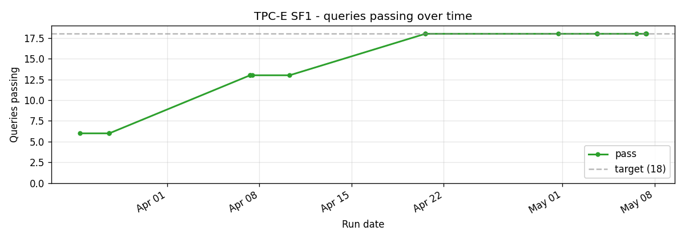
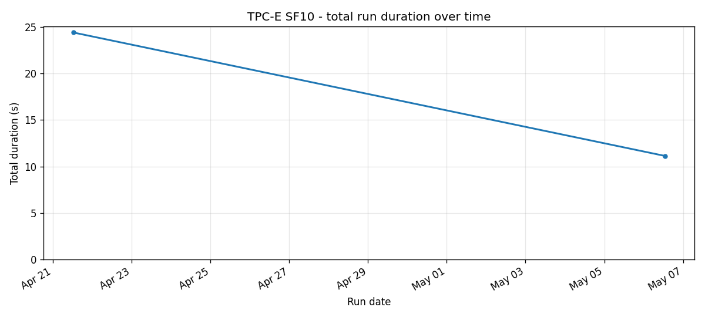
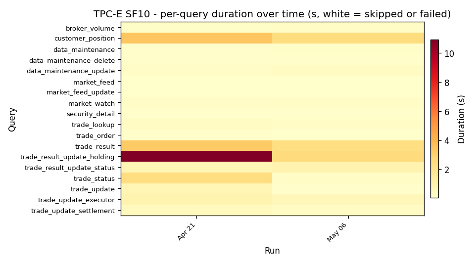
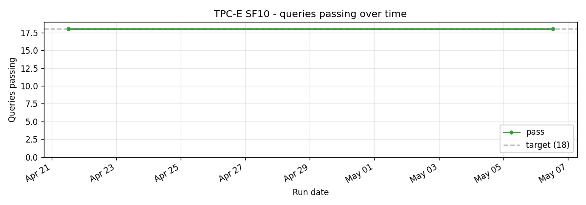

# TPC-E

11 queries from the financial-trading workload. Heavy on date-range filters, point lookups against trade-history tables, and aggregations across many small dimension tables.

The 7.8x speedup vs Trino at SF1 (10.4s vs 138.8s) is the second-largest of any suite. Most of the gap is Trino's planning overhead per query: TPC-E's per-query latency targets are short, and Trino spends a non-trivial chunk of the run wall-time on plan compilation.

## Cross-scale

## SF0.1

The 166-run history at SF0.1 is the result of TPC-E being the smoke-test suite during the auth chain rewrite in early April. Each commit on the auth branch ran the full SF0.1 sweep before merging. The chart shows the resulting density.

## SF1

The headline scale. 11/11 since late March.

## SF10

Four runs.

## Implementation references

- Queries: `crates/sqe-bench/queries/tpce/`
- Loader: `scripts/benchmark-load.sh`
- Runner: `scripts/benchmark-test.sh tpce`
