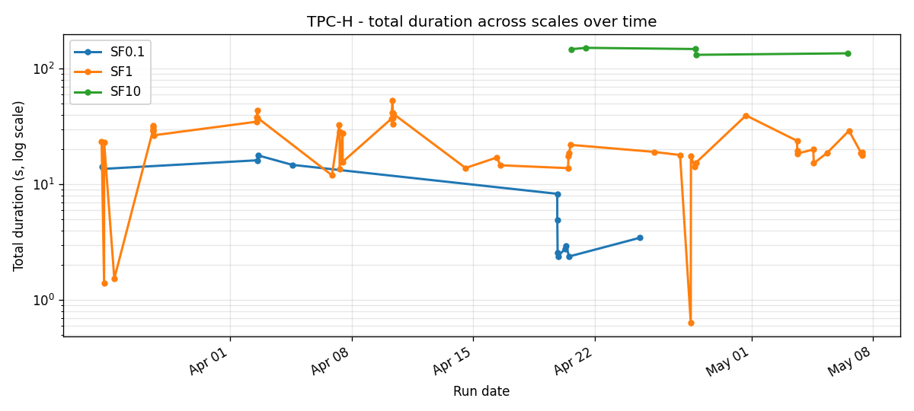
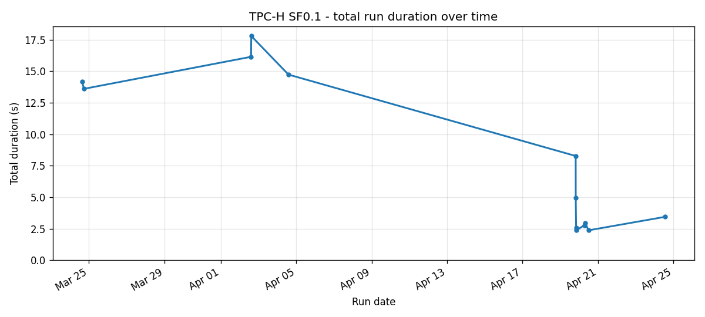
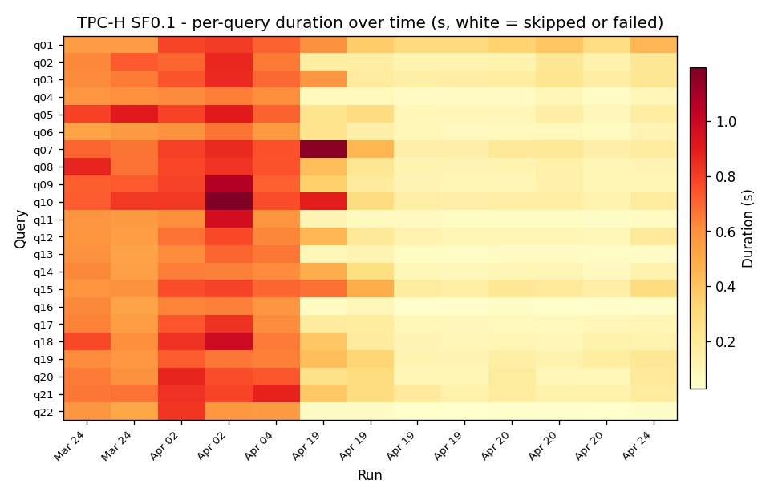
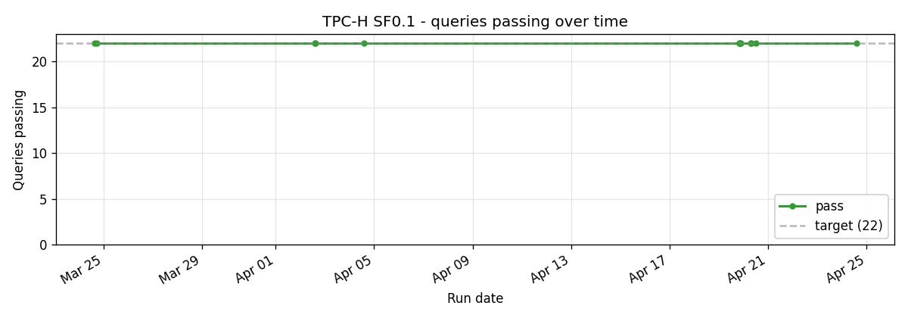
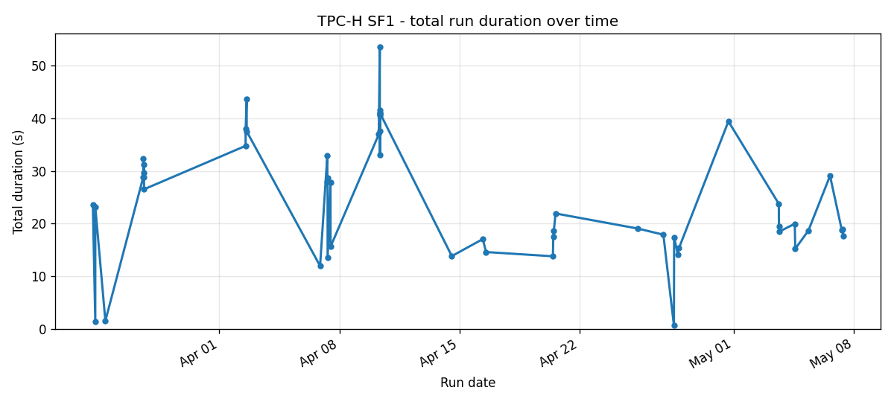
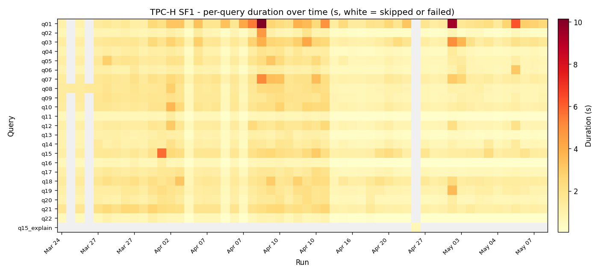
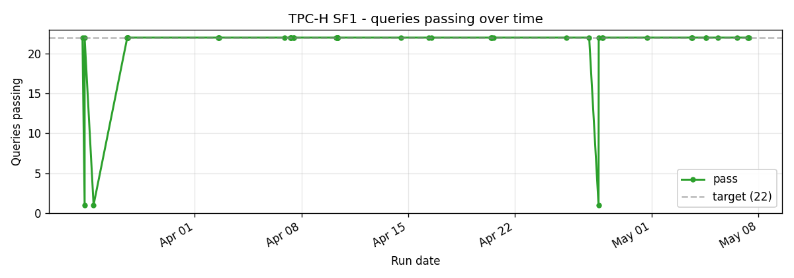
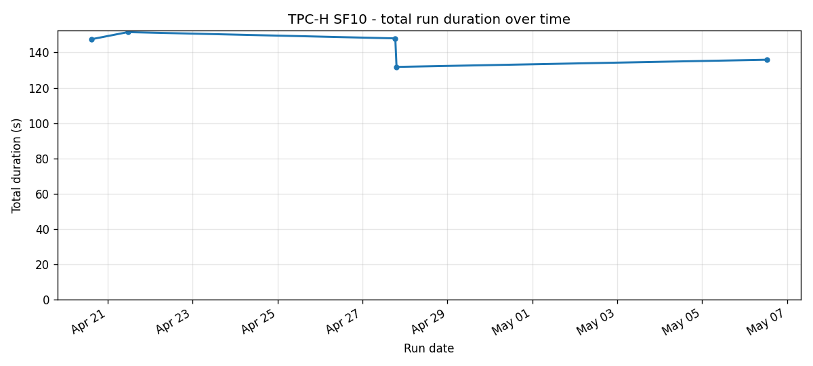
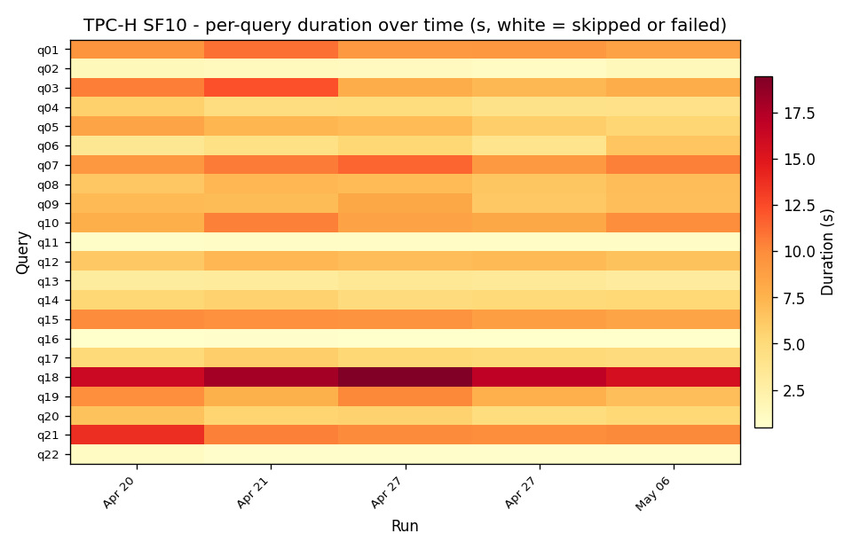
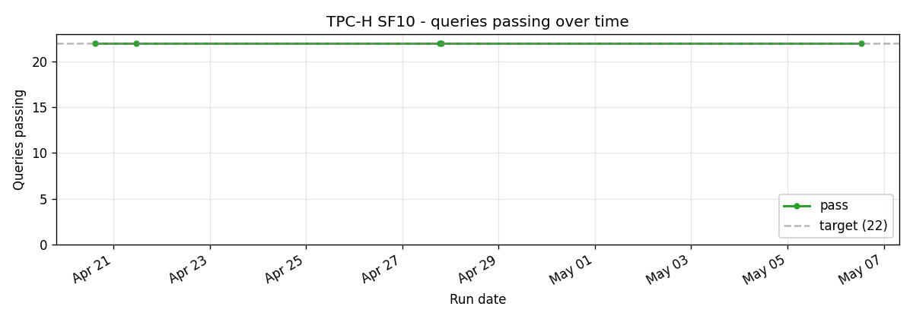

# TPC-H

22-query decision-support benchmark. The most widely benchmarked SQL workload; SQE's primary comparison target against Trino.

The May 2026 SF1 run sits at 19.3s vs Trino 465's 26.6s on the same machine and storage. The path here was not linear: q01 / q15 swung up and down as the planner learned and unlearned bits of statistics, and the runtime-filter pushdown work in mid-April moved q06 / q07 / q14 from the warm orange zone to the pale yellow you see in the late-April part of the heatmap.

## Cross-scale

## SF0.1

Small. Useful as a smoke test before the real benchmarks. Variance dominates the trendline.

## SF1

The headline scale. Same data the README table uses. The big April 9-10 rise is a known regression that the runtime-filter work shipped a week later resolved.

## SF10

The stress scale. Five runs on this scale to date. Q06 / q07 / q14 dominate the per-query view.

## Implementation references

- Queries: `crates/sqe-bench/queries/tpch/`
- Loader: `scripts/benchmark-load.sh`
- Runner: `scripts/benchmark-test.sh tpch`
- Trino comparison: `scripts/benchmark-test.sh --compare-trino tpch` writes `compare-tpch-sf*.json` alongside the SQE run.
