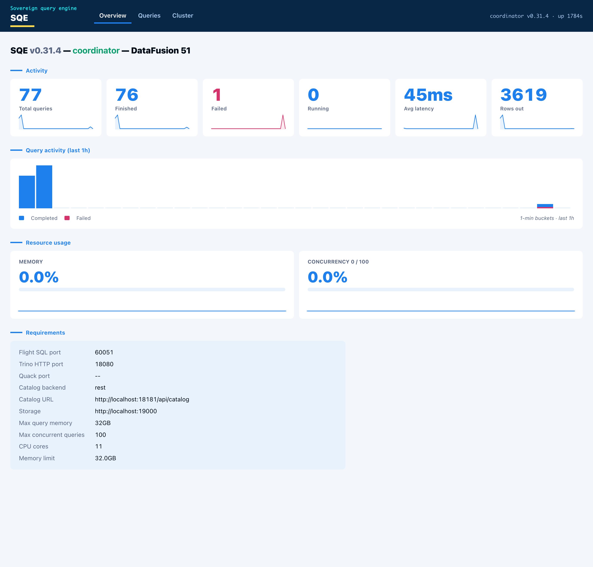

*June 2, 2026*

The engine already knew everything. Every query that runs through the coordinator lands in an in-memory tracker: its state, the user, the SQL, the queue and planning and execution timing, rows out, bytes scanned, spill, peak memory, and the per-fragment breakdown of which worker ran what. The worker registry knows every node and its health. None of it had a screen.

To watch a running query you tailed the coordinator log. To see throughput you scraped `/metrics` into Prometheus and built a Grafana board. Both work. Neither is the thing you want when someone asks "what is it doing right now" and you want an answer in one glance.

So we gave the engine a face.

## Additive, not a new service

The coordinator already runs a small axum health server on the metrics port plus one. It serves `/healthz`, `/readyz`, and a cluster-status JSON endpoint. The dashboard is additive: a few more routes on that same server, a JSON API over the state the coordinator already holds, and one HTML page. No new crate, no new port, no second binary to deploy.

The query path never sees it. The handlers read a snapshot of the tracker and the registry and serialize it. A bad render cannot slow a query, and a busy query cannot break the page.

## The constraints we set first

Four rules, decided before any code.

Read-only. The dashboard shows; it does not act. No query submission, no cancel, no config change. That keeps the blast radius at zero and the review short.

Network-gated, no login. The page has no auth, the same posture as the Prometheus endpoint next to it. Anyone who can reach the port sees every user's SQL and the cluster state, so the port stays on an internal network. A login screen is the obvious next step, and it is explicitly phase two.

No build step. This is a Rust repo. Adding a Node toolchain, a bundler, and a node_modules tree to render a status page is a bad trade. The page is one HTML file with vanilla JavaScript, embedded in the binary with `include_str!`.

Self-contained. No external fonts, no CDN, no logos, no images fetched at runtime. It follows our brand palette and layout with system fonts, so it renders the same on an air-gapped box as on a laptop.

## What it shows

Three tabs. Overview leads with the node identity and what the engine is wired to: protocols and ports, catalog backend and URL, storage, memory limit. Below that, the engine metrics as stat cards, each with a one-hour sparkline, and a query-activity histogram. Two gauges track memory-pool usage and concurrency against the configured cap.

Queries is the list: id, user, state, SQL, elapsed, rows, bytes. Click a row and the detail opens with the timing split into queue, planning, and execution, the totals, and the per-fragment table showing which worker ran each fragment.

Cluster is the nodes and their health and in-flight load. In single-node mode the coordinator lists itself as one node doing both roles, because that is the truth: the coordinator is also the executor.

## Making the charts move

A histogram of "queries over the last hour" needs history, and the engine kept none. The fix is a small in-memory ring buffer. The coordinator samples query counts, rows, latency, active queries, and memory-pool usage every five seconds and holds a rolling one-hour window. The history endpoint aggregates those samples into one-minute buckets.

That gives the charts their motion. A new bar appears each minute, the current bar refreshes every sample, and the line scrolls left over the hour even when the engine is idle. Hover any bar or point and a tooltip shows the time and the value. For history longer than an hour, Prometheus and Grafana are still the right tools. The web UI is the at-a-glance view that ships in the box.

## What it does not pretend

The gauges show what is real. On an idle engine the memory gauge reads zero, because the pool releases between queries, and a sub-millisecond query never registers as active at a five-second sample. That is honest, not a bug. Under a heavy scan the gauges climb.

The whole thing is read-only and unauthenticated by design. A SQL console and an OIDC login are the natural phase two, and keeping them out of phase one is what made phase one small enough to trust. The dashboard is roughly one library module, a handful of routes, and one HTML file. It carries no risk to the engine, and it answers the question in one glance.
