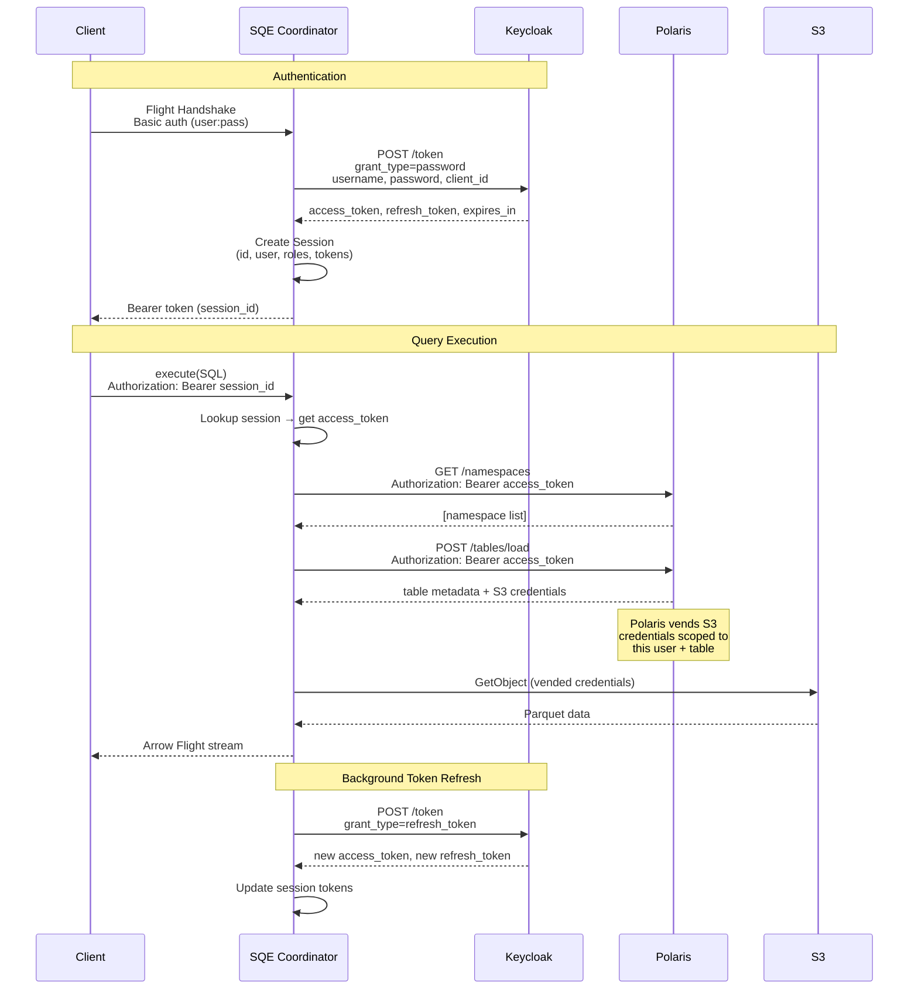
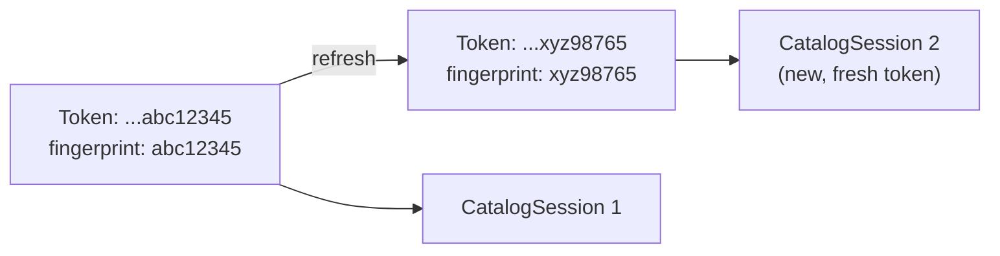

# Authentication Flow

SQE uses Keycloak OIDC with the **Resource Owner Password Credentials (ROPC)** grant for initial authentication, then manages token lifecycle transparently.

## Why ROPC?

Flight SQL's handshake sends username and password directly. There's no browser redirect flow possible over gRPC. ROPC is the standard mechanism for non-interactive clients (JDBC drivers, CLI tools, dbt adapters).

## Complete Flow



## Token Refresh

A background task runs every 10 seconds, scanning all active sessions:

```rust
// Pseudocode
loop {
    sleep(10 seconds);
    for session in sessions_expiring_within(60 seconds) {
        match keycloak.refresh_token(session.refresh_token) {
            Ok(new_tokens) => session.update(new_tokens),
            Err(_) => session.mark_expired(),
        }
    }
}
```

The 60-second buffer ensures tokens are refreshed well before expiry, avoiding mid-query auth failures.

## Token Fingerprinting

When a token is refreshed, the iceberg-rust catalog client's internal HTTP session cache still holds the old token. SQE uses a **token fingerprint** (last 8 characters of the access token) as part of the catalog session key. When the fingerprint changes, a new catalog session is created with the fresh token.



## Role Extraction

SQE extracts user roles from the JWT `realm_access.roles` claim. These roles are stored in the session and used for policy evaluation:

```json
{
  "realm_access": {
    "roles": ["data-analyst", "finance-reader", "admin"]
  }
}
```

Roles flow through to the Policy Enforcer, which uses them to determine row filters and column masks for each query.
