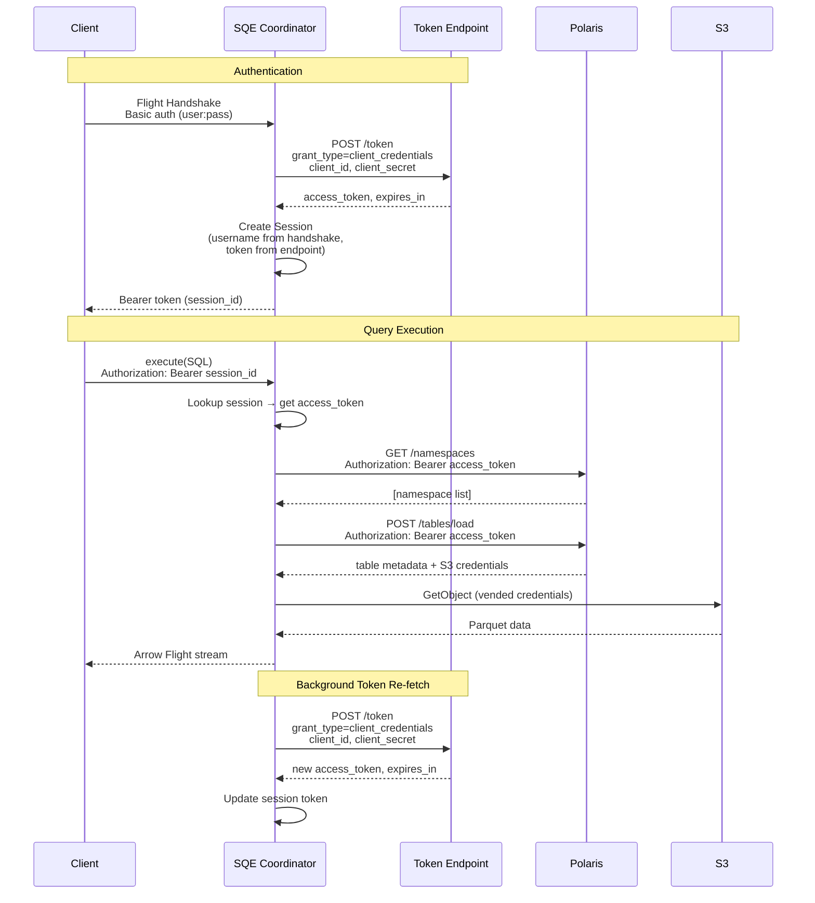
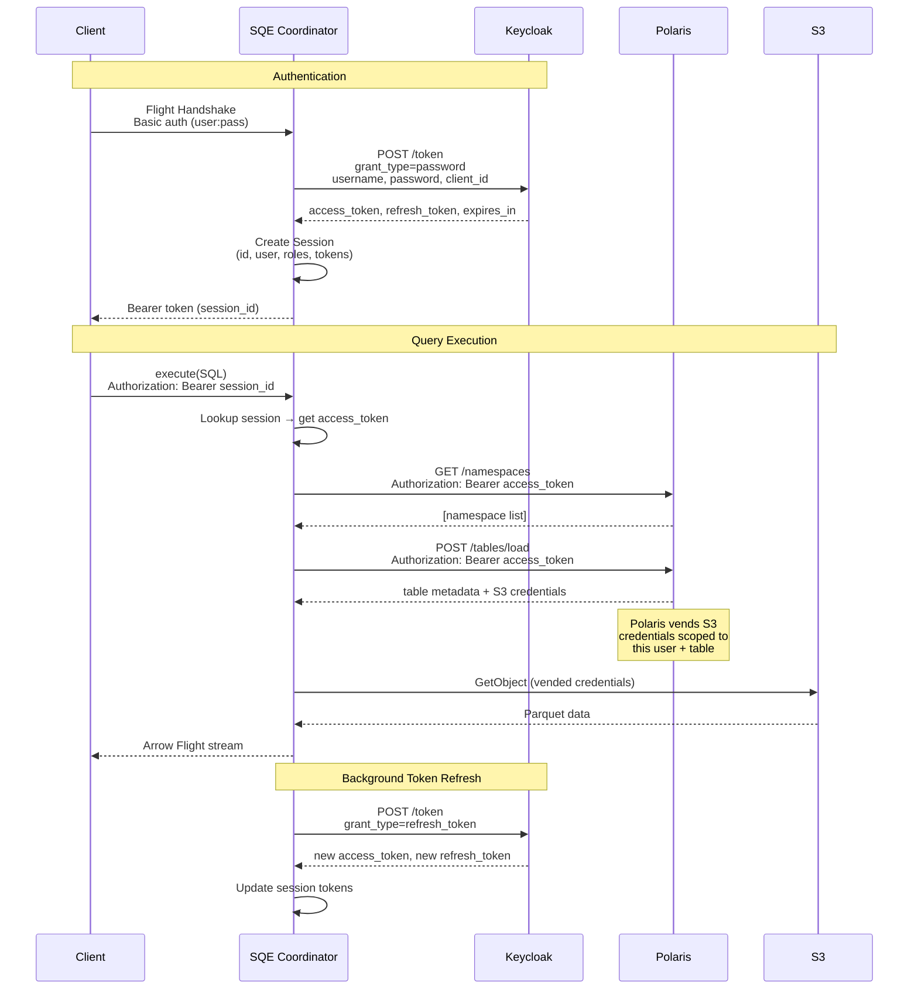
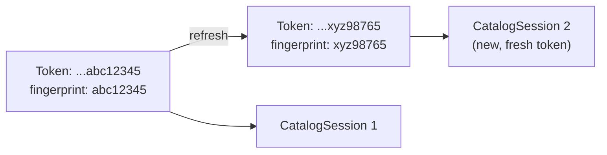

# Authentication Flow

SQE supports two OAuth2 flows for initial authentication, then manages token lifecycle transparently:

- **OIDC Password Grant (ROPC)** -- for user-interactive authentication where Flight SQL sends username and password. Works with Keycloak or any OIDC provider that supports the Resource Owner Password Credentials grant.
- **OAuth2 Client Credentials** -- for service-to-service auth, test environments, or OIDC providers that do not support ROPC. Configured by setting `token_endpoint` directly instead of `keycloak_url`.

The mode is selected automatically based on configuration: if `keycloak_url` is set, SQE uses ROPC; if `token_endpoint` is set (and `keycloak_url` is empty), SQE uses client credentials.

## Why ROPC?

Flight SQL's handshake sends username and password directly. There's no browser redirect flow possible over gRPC. ROPC is the standard mechanism for non-interactive clients (JDBC drivers, CLI tools, dbt adapters).

## Client Credentials Mode

When `token_endpoint` is set (and `keycloak_url` is empty), SQE uses the `client_credentials` grant instead of ROPC. In this mode:

- The coordinator obtains a service token using `client_id` + `client_secret` posted directly to the configured token endpoint.
- The username from the Flight SQL handshake is **informational only** -- it is used for session labeling and audit logs, but is not sent to the token endpoint.
- There is no `refresh_token` in client credentials responses. When a token nears expiry, SQE re-fetches a new token via another `client_credentials` request.
- This is the mode used by the lightweight test stack (Polaris built-in OAuth), where Polaris itself acts as the token issuer.

### Example Configuration

```toml
[auth]
token_endpoint = "http://polaris:8181/api/catalog/v1/oauth/tokens"
client_id = "root"
client_secret = "s3cr3t"
```

### Client Credentials Sequence



## ROPC Flow

The following sections describe the ROPC (password grant) flow in detail.

## Complete Flow



## Token Refresh

A background task runs every 10 seconds, scanning all active sessions:

```rust
// Pseudocode
loop {
    sleep(10 seconds);
    for session in sessions_expiring_within(60 seconds) {
        match keycloak.refresh_token(session.refresh_token) {
            Ok(new_tokens) => session.update(new_tokens),
            Err(_) => session.mark_expired(),
        }
    }
}
```

The 60-second buffer ensures tokens are refreshed well before expiry, avoiding mid-query auth failures.

> **Client Credentials mode:** There is no `refresh_token` in client credentials responses. The background task detects this and re-fetches a fresh token via a new `client_credentials` request to the token endpoint when the current token is near expiry. The same 60-second buffer applies.

## Token Fingerprinting

When a token is refreshed, the iceberg-rust catalog client's internal HTTP session cache still holds the old token. SQE uses a **token fingerprint** (last 8 characters of the access token) as part of the catalog session key. When the fingerprint changes, a new catalog session is created with the fresh token.



## Role Extraction

SQE extracts user roles from the JWT `realm_access.roles` claim. These roles are stored in the session and used for policy evaluation:

```json
{
  "realm_access": {
    "roles": ["data-analyst", "finance-reader", "admin"]
  }
}
```

Roles flow through to the Policy Enforcer, which uses them to determine row filters and column masks for each query.

> **Client Credentials mode:** Role extraction only applies in OIDC (ROPC) mode, where the JWT contains user-specific claims. In client credentials mode, the token represents the service itself and typically does not carry `realm_access.roles`. The session's role list is empty, and all authorization decisions are delegated to Polaris (which enforces access based on the service principal's catalog grants).
