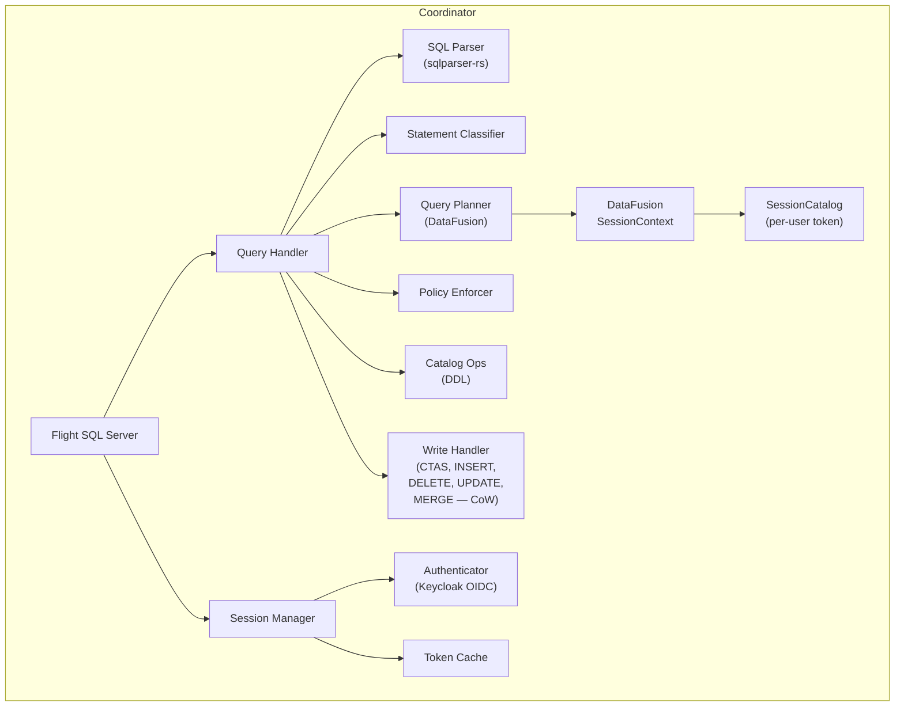
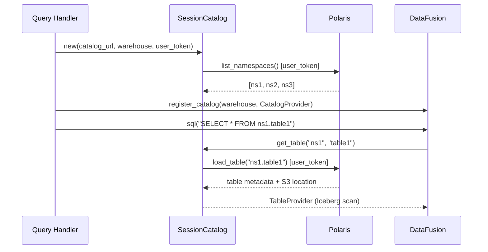

# Coordinator

The coordinator is the brain of SQE. It handles SQL parsing, query planning, security enforcement, and result delivery. In single-node mode, it also executes queries directly.

## Responsibilities

## Statement Routing

The coordinator classifies every SQL statement and routes it to the appropriate handler:

| Statement | Handler | Description |
|---|---|---|
| `SELECT` | `execute_query` | Plan → policy enforce → execute → stream results |
| `SHOW CATALOGS` | `handle_show_catalogs` | Returns warehouse name |
| `SHOW SCHEMAS` | `handle_show_schemas` | Lists namespaces from Polaris |
| `SHOW TABLES` | `handle_show_tables` | Lists tables in namespace(s) |
| `CREATE TABLE AS SELECT` | `handle_ctas` | Execute SELECT → write Parquet → commit to Iceberg |
| `INSERT INTO` | `handle_insert` | Execute SELECT → append Parquet → commit |
| `CREATE VIEW` | `handle_create_view` | Plan SELECT for schema validation → store in catalog |
| `DROP TABLE` | `catalog_ops.drop_table` | Forward to Polaris REST |
| `CREATE SCHEMA` | `catalog_ops.create_schema` | Create namespace in Polaris |
| `DROP SCHEMA` | `catalog_ops.drop_schema` | Drop namespace from Polaris |
| `EXPLAIN` | `handle_explain` | Show query plan |
| `DELETE FROM` | `handle_delete` | CoW: scan affected files, filter, rewrite via `rewrite_files()` |
| `UPDATE` | `handle_update` | CoW: scan affected files, apply SET, rewrite via `rewrite_files()` |
| `MERGE INTO` | `handle_merge` | CoW: full outer join, classify rows, rewrite via `rewrite_files()` |
| `GRANT/REVOKE` | Policy (Phase 5) | Not yet implemented |

## Session Context

Each query gets a fresh DataFusion `SessionContext` with the user's catalog:

This means two users running the same query may see different tables, schemas, or data — depending on what Polaris grants them.
