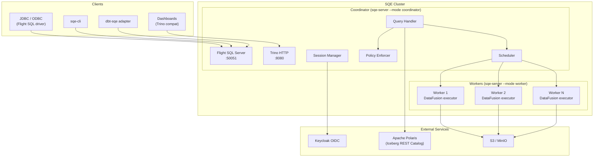
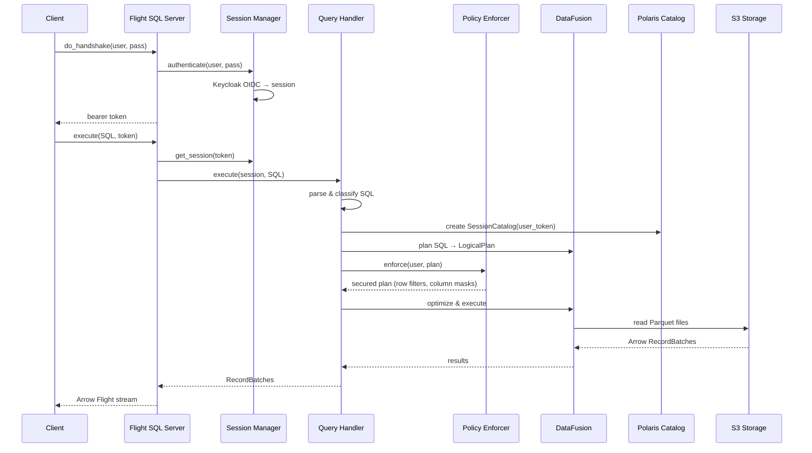
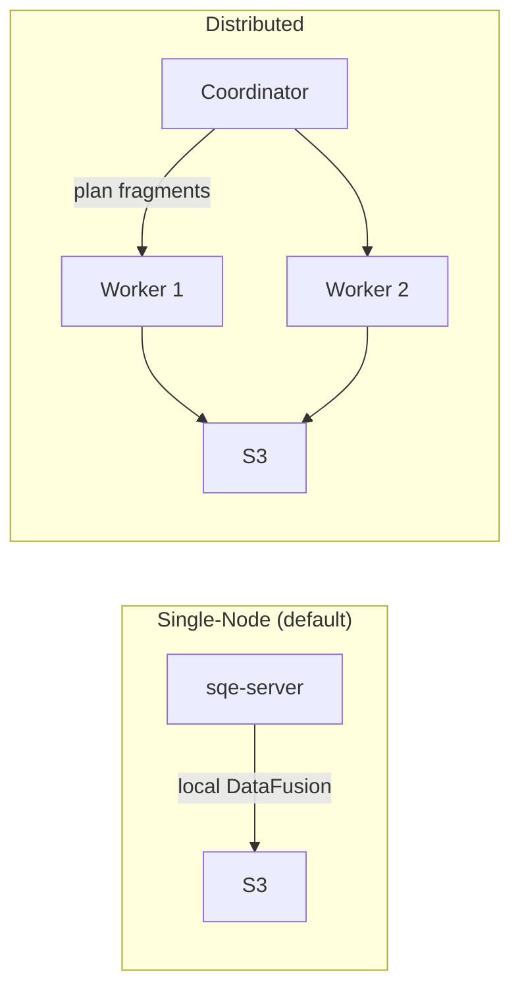

# System Overview

## Components

## Request Flow

A query flows through SQE in these stages:

## Single-Node vs Distributed

SQE starts in **single-node mode** by default — the coordinator executes queries locally using DataFusion. No workers needed.

For larger deployments, enable workers:

| Mode | When to use | Config |
|---|---|---|
| Single-node | Dev, small datasets, < 100GB | `sqe-server` (default) |
| Distributed | Production, large scans, parallel I/O | `worker.enabled=true` in Helm |

## Ports

| Port | Protocol | Purpose |
|---|---|---|
| 50051 | gRPC (Flight SQL) | Primary query interface |
| 50052 | gRPC (Flight) | Worker data exchange |
| 8080 | HTTP | Trino-compatible endpoint |
| 9090 | HTTP | Prometheus metrics |
| 9091 | HTTP | Health probes (`/healthz`, `/readyz`) |
