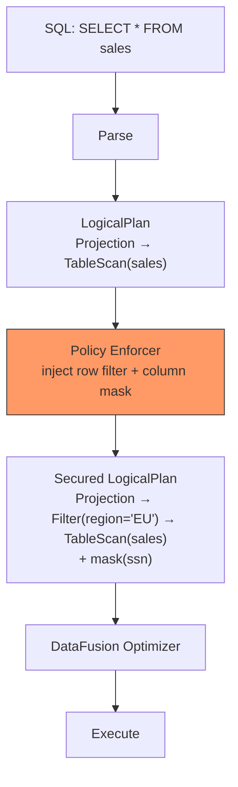

# Security & Policy

SQE enforces fine-grained security through **LogicalPlan rewriting** — injecting row filters and column masks into the query plan before DataFusion's optimizer runs.

> **Status:** The policy enforcement framework is designed and stubbed (Phase 5). Currently, a `PassthroughEnforcer` is active, which returns plans unmodified.

## Design Principle

Security enforcement happens at the **logical plan level**, not at the data level:



This approach means:
- **Row filters** are transparent — the user doesn't know they exist
- **Column masks** block predicate pushdown on raw values — you can't `WHERE ssn = '123-45-6789'` to probe masked data
- **Denied columns** are invisible — they don't appear in `SELECT *`, not as errors
- **The optimizer can push user predicates through row filters** but not through column masks

## Policy Enforcer Trait

```rust
#[async_trait]
pub trait PolicyEnforcer: Send + Sync {
    async fn evaluate(
        &self,
        user: &SessionUser,
        plan: LogicalPlan,
    ) -> Result<LogicalPlan>;
}
```

Implementations:
- **PassthroughEnforcer** — returns plan unchanged (current default)
- **OPA Enforcer** — queries Open Policy Agent for policies (planned)
- **Cedar Enforcer** — evaluates AWS Cedar policies locally (planned)

## Planned SQL Extensions

```sql
-- Grant row filter
GRANT SELECT ON sales TO ROLE analyst
  ROWS WHERE region = 'EU';

-- Grant column mask
GRANT SELECT ON customers TO ROLE support
  MASKED WITH (ssn AS '***-**-' || RIGHT(ssn, 4));

-- View effective policies
SHOW EFFECTIVE POLICY ON sales FOR ROLE analyst;

-- View grants
SHOW GRANTS ON sales;
```

## No Information Leakage

Following the **PostgreSQL RLS model**:

| Scenario | Behavior |
|---|---|
| User queries a denied column | Column is invisible in `SELECT *`, error on explicit reference |
| User queries filtered rows | Rows silently excluded, no indication they exist |
| User applies predicate on masked column | Predicate evaluated on masked value, not raw value |
| User runs `EXPLAIN` | Shows secured plan (filters visible, mask functions visible) |
| User runs `SHOW TABLES` | Only shows tables the user has access to (Polaris enforced) |
