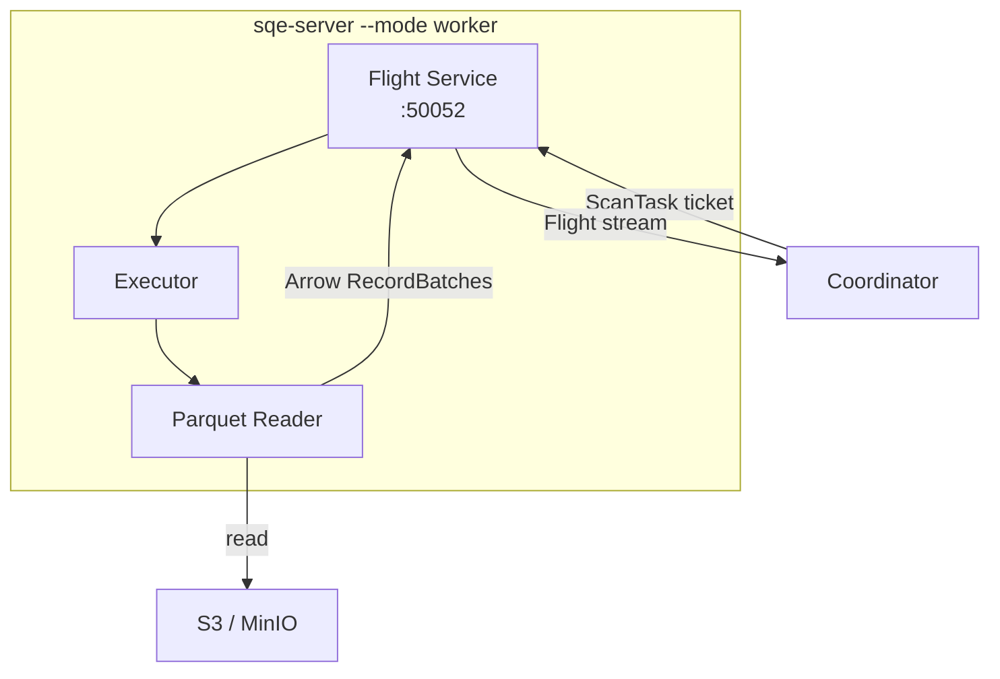
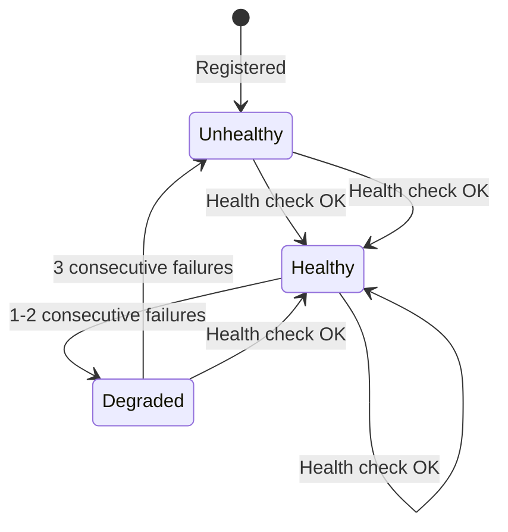

# Worker

Workers are stateless DataFusion executors. They receive plan fragments (scan tasks) from the coordinator, read Parquet files from S3, and stream Arrow results back.

## Architecture



## Scan Task

The coordinator sends workers a `ScanTask` — a lightweight JSON message containing everything the worker needs:

```json
{
  "fragment_id": "frag-001",
  "data_file_paths": [
    "s3://warehouse/ns/table/data/00001.parquet",
    "s3://warehouse/ns/table/data/00002.parquet"
  ],
  "projected_columns": ["id", "name", "amount"],
  "s3_endpoint": "http://s3:9000",
  "s3_region": "us-east-1",
  "s3_access_key": "...",
  "s3_secret_key": "...",
  "s3_path_style": true
}
```

Workers don't need access to Polaris or Keycloak. The coordinator resolves table metadata, applies security, and provides the worker with direct S3 credentials and file paths.

## Health Checking

The coordinator monitors workers with a background health check task:



- Health checks run every **5 seconds** via Flight `Action("health_check")`
- A worker is marked **unhealthy** after **3 consecutive failures**
- Unhealthy workers are excluded from query scheduling
- Recovery is automatic — a healthy response resets the failure counter

## Scaling

Workers are stateless, so scaling is just changing the replica count:

```bash
# Helm
helm upgrade sqe deploy/helm/sqe/ --set worker.replicas=5

# kubectl
kubectl scale deployment sqe-worker --replicas=5
```

The coordinator discovers workers from the config or service discovery. No re-registration needed.
