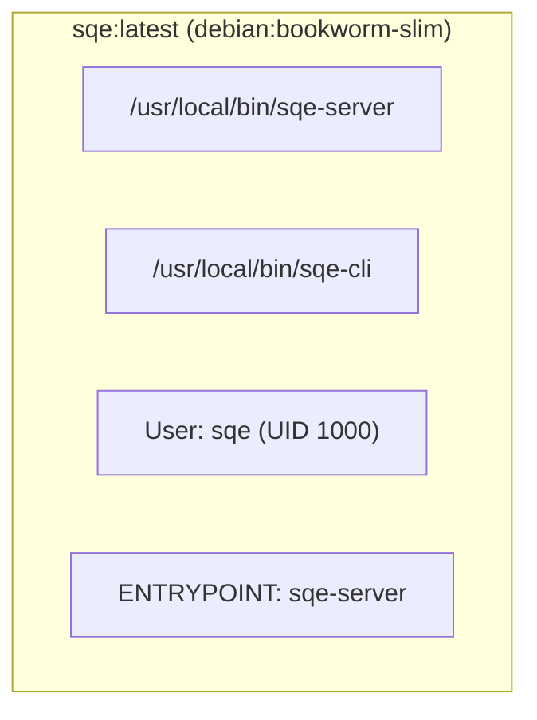

# Docker

SQE ships as a **single Docker image** containing two binaries: `sqe-server` (the engine) and `sqe-cli` (the client).

## Image Layout



- **Base:** `debian:bookworm-slim` (~80MB) — provides glibc, OpenSSL, CA certificates
- **User:** Non-root `sqe` (UID 1000)
- **Entrypoint:** `sqe-server` — the mode is selected via `--mode` flag or `SQE_MODE` env var

## Build

```bash
docker build -t sqe:latest .

# With metadata labels
docker build -t sqe:0.1.0 \
  --build-arg VERSION=0.1.0 \
  --build-arg BUILD_DATE=$(date -u +%Y-%m-%dT%H:%M:%SZ) \
  --build-arg GIT_REVISION=$(git rev-parse HEAD) \
  .
```

## Run Coordinator

```bash
docker run -d \
  --name sqe-coordinator \
  -p 50051:50051 \
  -p 8080:8080 \
  -p 9090:9090 \
  -p 9091:9091 \
  -v $(pwd)/sqe.toml:/etc/sqe/sqe.toml:ro \
  -e SQE_AUTH__CLIENT_SECRET=my-secret \
  -e SQE_STORAGE__S3_ACCESS_KEY=minioadmin \
  -e SQE_STORAGE__S3_SECRET_KEY=minioadmin \
  sqe:latest --config /etc/sqe/sqe.toml
```

The default mode is `coordinator`, so no `--mode` flag needed.

## Run Worker

```bash
docker run -d \
  --name sqe-worker-1 \
  -p 50052:50052 \
  -v $(pwd)/sqe.toml:/etc/sqe/sqe.toml:ro \
  sqe:latest --mode worker --config /etc/sqe/sqe.toml
```

## Use the CLI

```bash
# Interactive SQL against running coordinator
docker exec -it sqe-coordinator sqe-cli

# One-shot query
docker exec sqe-coordinator sqe-cli -e "SELECT COUNT(*) FROM raw.orders;"

# With explicit connection
docker run --rm -it --network host \
  sqe:latest sqe-cli --host localhost --port 50051 --user alice
```

Note: when using `docker exec`, `sqe-cli` connects to `localhost:50051` by default — which is the coordinator running in the same container.

## Docker Compose

```yaml
services:
  coordinator:
    image: sqe:latest
    command: ["--config", "/etc/sqe/sqe.toml"]
    ports:
      - "50051:50051"
      - "8080:8080"
      - "9090:9090"
      - "9091:9091"
    volumes:
      - ./sqe.toml:/etc/sqe/sqe.toml:ro
    environment:
      SQE_AUTH__CLIENT_SECRET: ${SQE_AUTH_SECRET}
      SQE_STORAGE__S3_ACCESS_KEY: ${S3_ACCESS_KEY}
      SQE_STORAGE__S3_SECRET_KEY: ${S3_SECRET_KEY}
    healthcheck:
      test: ["CMD", "curl", "-f", "http://localhost:9091/healthz"]
      interval: 10s
      timeout: 5s
      retries: 3

  worker:
    image: sqe:latest
    command: ["--mode", "worker", "--config", "/etc/sqe/sqe.toml"]
    deploy:
      replicas: 2
    volumes:
      - ./sqe.toml:/etc/sqe/sqe.toml:ro
    depends_on:
      coordinator:
        condition: service_healthy
```

## Why One Image?

| Concern | Answer |
|---|---|
| **Version skew** | Coordinator, workers, and CLI are always the same build |
| **CI/CD** | One image to build, scan, and promote |
| **K8s simplicity** | Same `image:` field, different `--mode` arg |
| **Debugging** | `kubectl exec` into any pod → `sqe-cli` is right there |
| **Size overhead** | Minimal — both roles share 95% of their code |
