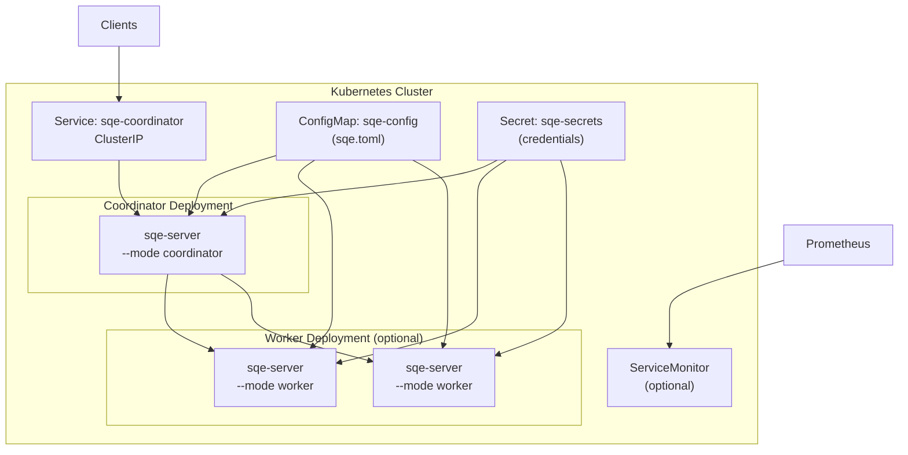

# Kubernetes & Helm

SQE includes a Helm chart for production Kubernetes deployment.

## Architecture on K8s



## Install with Helm

### Single-Node (small environments)

```bash
helm install sqe deploy/helm/sqe/ \
  --set config.auth.keycloak_url=https://keycloak.example.com \
  --set config.catalog.catalog_url=http://polaris:8181/api/catalog \
  --set secrets.SQE_AUTH__CLIENT_SECRET=my-secret \
  --set secrets.SQE_STORAGE__S3_ACCESS_KEY=minioadmin \
  --set secrets.SQE_STORAGE__S3_SECRET_KEY=minioadmin
```

Workers are **disabled by default** — the coordinator runs queries locally.

### Distributed (production)

```bash
helm install sqe deploy/helm/sqe/ \
  --set worker.enabled=true \
  --set worker.replicas=4 \
  --set coordinator.resources.limits.memory=4Gi \
  --set worker.resources.limits.memory=16Gi \
  --set worker.resources.limits.cpu=8 \
  --set config.auth.keycloak_url=https://keycloak.example.com \
  --set config.catalog.catalog_url=http://polaris:8181/api/catalog \
  --set existingSecret=sqe-credentials
```

### Using an Existing Secret

Create the secret separately (e.g., via sealed-secrets or external-secrets-operator):

```yaml
apiVersion: v1
kind: Secret
metadata:
  name: sqe-credentials
type: Opaque
stringData:
  SQE_AUTH__CLIENT_SECRET: "my-secret"
  SQE_STORAGE__S3_ACCESS_KEY: "AKIA..."
  SQE_STORAGE__S3_SECRET_KEY: "wJalrXUtnFEMI/K7MDENG..."
```

Then reference it:
```bash
helm install sqe deploy/helm/sqe/ --set existingSecret=sqe-credentials
```

## Values Reference

### Image

```yaml
image:
  repository: sqe
  tag: latest           # Defaults to Chart.appVersion
  pullPolicy: IfNotPresent
imagePullSecrets: []
```

### Coordinator

```yaml
coordinator:
  replicas: 1
  resources:
    requests: { memory: "512Mi", cpu: "500m" }
    limits:   { memory: "2Gi",   cpu: "2" }
  nodeSelector: {}
  tolerations: []
  affinity: {}
  podAnnotations: {}
```

### Workers

```yaml
worker:
  enabled: false         # Enable for distributed execution
  replicas: 2
  resources:
    requests: { memory: "1Gi", cpu: "1" }
    limits:   { memory: "8Gi", cpu: "4" }
  nodeSelector: {}
  tolerations: []
  affinity: {}
  podAnnotations: {}
```

### Service

```yaml
service:
  type: ClusterIP
  flightSqlPort: 50051
  trinoHttpPort: 8080
  metricsPort: 9090
```

### Health Probes

```yaml
healthPort: 9091
livenessProbe:
  initialDelaySeconds: 5
  periodSeconds: 10
readinessProbe:
  initialDelaySeconds: 5
  periodSeconds: 5
```

### Monitoring

```yaml
serviceMonitor:
  enabled: false
  interval: 30s
  labels: {}            # e.g., { release: prometheus }
```

## Operations

### Scaling Workers

```bash
kubectl scale deployment sqe-worker --replicas=8
# or
helm upgrade sqe deploy/helm/sqe/ --set worker.replicas=8
```

### Rolling Update

Config changes trigger automatic rolling restarts (via checksum annotation on the ConfigMap):

```bash
helm upgrade sqe deploy/helm/sqe/ --set config.catalog.metadata_cache_ttl_secs=60
```

### Interactive SQL

```bash
kubectl exec -it deploy/sqe-coordinator -- sqe-cli
```

### Port Forwarding

```bash
# Flight SQL
kubectl port-forward svc/sqe-coordinator 50051:50051

# Trino HTTP (for dashboards)
kubectl port-forward svc/sqe-coordinator 8080:8080

# Metrics
kubectl port-forward svc/sqe-coordinator 9090:9090
```

### Logs

```bash
kubectl logs deploy/sqe-coordinator -f
kubectl logs deploy/sqe-worker -f
```

Logs are structured JSON — pipe to `jq` for readability:
```bash
kubectl logs deploy/sqe-coordinator | jq .
```
