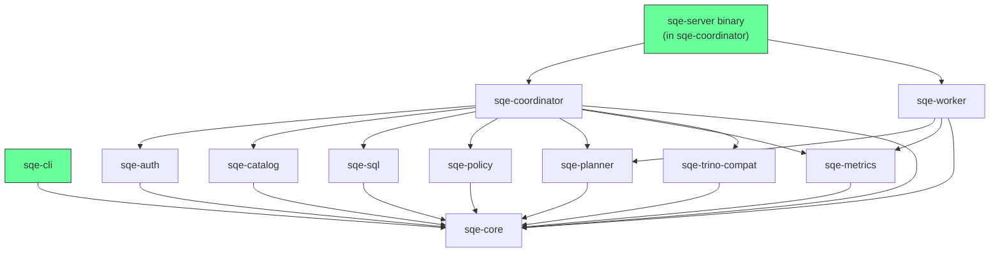

# Rust Crate Structure

SQE is organized as a Cargo workspace with 11 crates. Each crate has a focused responsibility.

## Dependency Graph

## Crate Reference

### sqe-core

Shared types used across all crates.

| Module | Contents |
|---|---|
| `config.rs` | `SqeConfig` and all sub-configs, TOML loading, env var overrides |
| `error.rs` | `SqeError` enum (Auth, Catalog, Execution, Config, NotImplemented, Internal) |
| `session.rs` | `Session` struct (id, user, tokens, expiry), `SessionUser` (username, roles) |
| `lib.rs` | `VERSION` constant |

### sqe-auth

Keycloak OIDC authentication.

| Module | Contents |
|---|---|
| `authenticator.rs` | `Authenticator` — ROPC grant, token refresh, background refresh task |
| `keycloak.rs` | `KeycloakClient` — HTTP calls to Keycloak token endpoint, role extraction |
| `token_cache.rs` | `TokenCache` — DashMap of session → cached tokens, expiry tracking |

### sqe-catalog

Iceberg REST catalog client (wraps iceberg-rust).

| Module | Contents |
|---|---|
| `rest_catalog.rs` | `SessionCatalog` — per-user catalog with bearer token, namespace/table ops |
| `catalog_provider.rs` | `SqeCatalogProvider` — DataFusion `CatalogProvider` bridge |
| `schema_provider.rs` | `SqeSchemaProvider` — DataFusion `SchemaProvider` for Iceberg namespaces |
| `table_provider.rs` | Iceberg → DataFusion `TableProvider` |
| `credential_vending.rs` | Extract S3 credentials from Polaris table load response |
| `iceberg_scan.rs` | Iceberg scan configuration |
| `info_schema.rs` | Virtual `information_schema` (tables, schemata, columns) |

### sqe-sql

SQL parsing and statement classification.

| Module | Contents |
|---|---|
| `classifier.rs` | `parse_and_classify(sql)` → `StatementKind`, routes all SQL statement types |

### sqe-policy

Policy enforcement framework (pluggable backend).

| Module | Contents |
|---|---|
| `lib.rs` | `PolicyEnforcer` trait, `PassthroughEnforcer` (default no-op) |

### sqe-planner

Distributed query planning.

| Module | Contents |
|---|---|
| `scan_task.rs` | `ScanTask` — serializable message from coordinator to worker |
| `splitter.rs` | `split_files()` — divide data files across workers |

### sqe-coordinator

The coordinator: SQL routing, session management, write handling.

| Module | Contents |
|---|---|
| `flight_sql.rs` | `SqeFlightSqlService` — Arrow Flight SQL server (735 lines) |
| `query_handler.rs` | `QueryHandler` — central query routing and execution (596 lines) |
| `session_manager.rs` | `SessionManager` — session lifecycle, token refresh integration |
| `worker_registry.rs` | `WorkerRegistry` — worker discovery, health checking |
| `catalog_ops.rs` | DDL operations (DROP TABLE, CREATE/DROP SCHEMA) |
| `write_handler.rs` | CTAS and INSERT INTO handling |
| `writer.rs` | Parquet file writing to S3 |
| `distributed_scan.rs` | Distributed scan coordination |
| `mode.rs` | `Mode` enum, `resolve_mode()` for sqe-server |
| `bin/sqe_server.rs` | Unified server binary entry point |

### sqe-worker

Stateless scan executor.

| Module | Contents |
|---|---|
| `executor.rs` | `execute_scan(ScanTask)` — read Parquet from S3, return Arrow batches |
| `flight_service.rs` | `WorkerFlightService` — Flight server for receiving scan tasks |

### sqe-cli

Interactive SQL client.

| Module | Contents |
|---|---|
| `main.rs` | CLI argument parsing (clap), REPL loop, auth flow |
| `client.rs` | `SqlClient` trait, `QueryResult` type |
| `flight.rs` | `FlightClient` — Flight SQL client with handshake and token auth |
| `http.rs` | `HttpClient` — Trino HTTP protocol client |
| `display.rs` | Output formatting: ASCII table, CSV, JSON |

### sqe-metrics

Observability stack.

| Module | Contents |
|---|---|
| `lib.rs` | `MetricsRegistry` — Prometheus counters, histograms, gauges |
| `server.rs` | Prometheus HTTP `/metrics` endpoint (axum) |
| `audit.rs` | `AuditLogger` — JSONL audit log writer |
| `otel.rs` | OpenTelemetry init (traces, metrics, logs via OTLP/gRPC) |

### sqe-trino-compat

Trino wire protocol compatibility layer.

| Module | Contents |
|---|---|
| `server.rs` | Trino HTTP server (`/v1/statement` endpoint) |
| `protocol.rs` | RecordBatch → Trino JSON response serialization |
| `types.rs` | Arrow → Trino type mapping |

## Key External Dependencies

| Crate | Version | Purpose |
|---|---|---|
| `datafusion` | 51 | Query engine (SQL planning, optimization, execution) |
| `arrow` / `arrow-flight` | 57 | Columnar data format and Flight SQL protocol |
| `iceberg` / `iceberg-catalog-rest` | 0.8 | Iceberg table format and REST catalog |
| `tonic` | 0.14 | gRPC framework (Flight SQL server + client) |
| `axum` | 0.8 | HTTP framework (health, metrics, Trino compat) |
| `tokio` | 1 | Async runtime |
| `sqlparser` | 0.59 | SQL parsing |
| `moka` | 0.12 | Async TTL cache (metadata caching) |
| `clap` | 4 | CLI argument parsing |
| `tracing` | 0.1 | Structured logging |
| `opentelemetry` | 0.31 | Distributed tracing and metrics |
