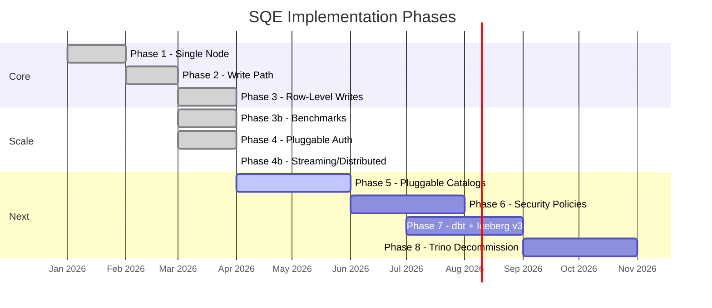
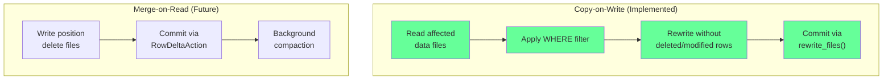
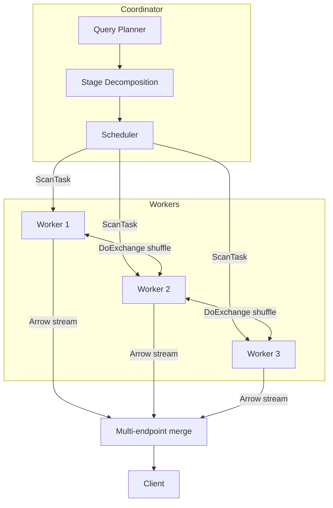
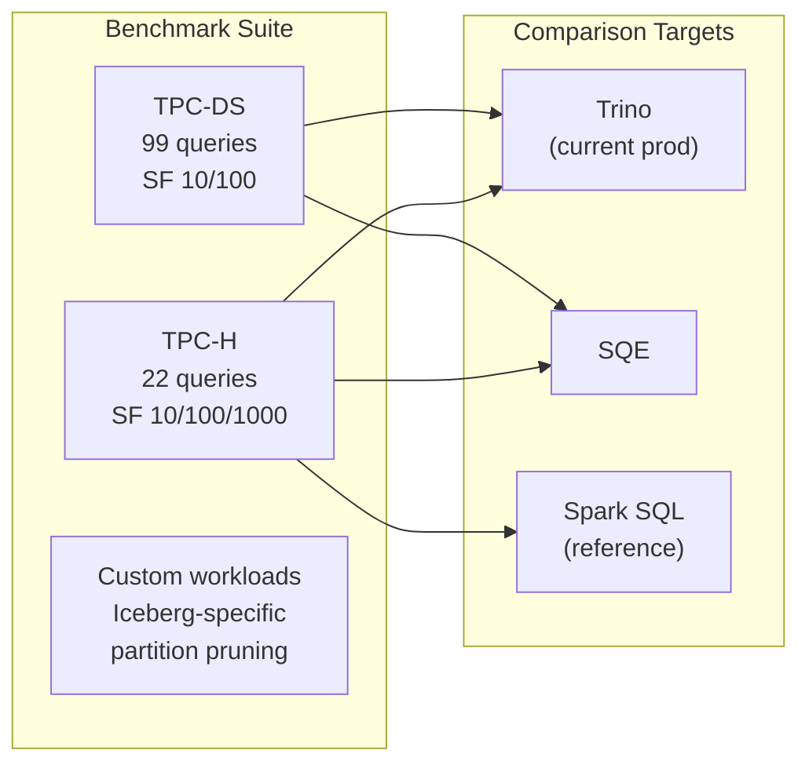

# Roadmap

SQE is developed in phases, each building on the previous.

## Phase Overview

---

## Phase 1 — Single-Node Engine (Done)

The foundation: a working SQL engine that queries Iceberg tables through Polaris with Keycloak auth.

- DataFusion query execution
- Keycloak OIDC authentication (ROPC grant)
- Per-session catalog with bearer token passthrough
- Arrow Flight SQL server
- CLI client (`sqe-cli`)
- `SELECT`, `SHOW CATALOGS/SCHEMAS/TABLES`, `EXPLAIN`
- Prometheus metrics + structured JSON logging

## Phase 2 — Write Path & Views (Done)

SQL write operations and catalog DDL.

- `CREATE TABLE AS SELECT`
- `CREATE OR REPLACE TABLE`
- `INSERT INTO SELECT`
- `CREATE VIEW` / `DROP VIEW`
- `CREATE SCHEMA` / `DROP SCHEMA`
- `DROP TABLE` / `DROP TABLE IF EXISTS`
- Parquet writer (to S3 via Iceberg)
- Audit logging (JSONL)
- OpenTelemetry export (OTLP/gRPC)
- Trino-compatible HTTP endpoint

## Phase 2c — dbt Compatibility (Active)

Native dbt support via `dbt-sqe` adapter over ADBC Flight SQL.

- `information_schema` virtual providers (tables, schemata, columns)
- `dbt-sqe` Python adapter (connection manager, materializations)
- `ALTER TABLE RENAME`
- dbt `table`, `view`, and append-only `incremental` materializations

---

## Phase 3 — Row-Level Writes (Done)

DELETE FROM, UPDATE, and MERGE INTO are implemented via Copy-on-Write using the [risingwavelabs/iceberg-rust](https://github.com/risingwavelabs/iceberg-rust) fork (rev `1978911ec4`), which provides `rewrite_files()` transaction support.

### Strategy: Copy-on-Write

CoW rewrites affected data files entirely. MoR support can be added later for write-heavy workloads when upstream iceberg-rust ships `RowDeltaAction`.

### Delivered

- `DELETE FROM table WHERE condition` — removes matching rows; supports cross-table subqueries; DELETE without WHERE = truncate
- `UPDATE table SET col = expr WHERE condition` — modifies matching rows; supports CASE WHEN transformations and cross-table subqueries
- `MERGE INTO target USING source ON condition WHEN MATCHED/NOT MATCHED ...` — full outer join approach with WHEN MATCHED/NOT MATCHED clauses
- All operations atomic via Iceberg snapshot isolation
- dbt `incremental` with `merge` strategy
- Integration tests against Polaris + MinIO
- TPC-C write queries (17/17 pass), TPC-E write queries enabled

### Iceberg Dependency

Uses `risingwavelabs/iceberg-rust` fork (rev `1978911ec4`) for `rewrite_files()`. When upstream iceberg-rust ships `OverwriteAction` (tracked in Epic #2186), the dependency can be migrated back to the official crate.

### SQE Changes

| File | Change |
|---|---|
| `Cargo.toml` | Switched to risingwavelabs/iceberg-rust fork |
| `crates/sqe-coordinator/src/delete_handler.rs` | DELETE FROM execution via CoW |
| `crates/sqe-coordinator/src/update_handler.rs` | UPDATE execution via CoW |
| `crates/sqe-coordinator/src/merge_handler.rs` | MERGE INTO execution via CoW |
| `crates/sqe-coordinator/src/query_handler.rs` | Routes Merge/Delete/Update to handlers |
| `crates/sqe-coordinator/src/write_handler.rs` | Shared CoW rewrite logic |

---

## Phase 7 — Iceberg v3 & Fixes (Blocked)

Upgrade to Iceberg table format v3 and address gaps found during Phase 2-3 usage. **Blocked:** iceberg-rust v3 format support not yet shipped; RisingWave fork pinned to 0.8.0/DF 52 for `rewrite_files()`. Track upstream apache/iceberg-rust for v3 and `OverwriteAction`.

### Iceberg v3 Features

| Feature | v2 | v3 | SQE Benefit |
|---|---|---|---|
| Multi-arg transforms | No | Yes | Better partitioning (e.g., `bucket(16, col)`) |
| Default values | No | Yes | `ALTER TABLE ADD COLUMN ... DEFAULT` |
| Row lineage | No | Yes | Track which operation produced each row |
| Variant type | No | Yes | Semi-structured data without JSON strings |
| Geo types | No | Yes | Spatial query support |

### Known Issues to Fix

Based on Phase 2/2c usage, expected fixes include:

- **Metadata caching edge cases** — stale schema after `ALTER TABLE`
- **Large result set streaming** — backpressure handling for Flight SQL `do_get`
- **Error messages** — improve user-facing errors for catalog/auth failures
- **Schema evolution** — `ALTER TABLE ADD COLUMN`, `ALTER TABLE DROP COLUMN`
- **Partition pruning accuracy** — ensure all predicate types push down correctly
- **Timestamp timezone handling** — Iceberg timestamptz vs DataFusion timestamp semantics
- **Nested type support** — struct, list, map columns in reads and writes

### Deliverables

- Bump iceberg-rust to version with v3 table format support
- `ALTER TABLE ADD COLUMN` / `DROP COLUMN`
- Fix metadata cache invalidation on DDL
- Improve error messages and user experience
- Address any issues found during dbt/MERGE testing

---

## Phase 4b/4c — Distributed Execution (Done)

Scale-out query execution with stateless workers. Implemented via streaming execution in two phases.

### Delivered

- **Phase A (spill-to-disk):** FairSpillPool with watermarks, late materialization, file/page pruning, TopK, S3 I/O pipeline (coalescing, footer cache, prefetch), SortMergeJoin fallback
- **Phase B (distributed):** DoExchange shuffle, distributed sort (range-partition with sampling), two-phase aggregation, distributed joins (broadcast, shuffle hash, pre-sorted merge, predicate transfer), multi-endpoint Flight SQL, stage decomposition
- **Adaptive sort stripping** — memory-aware sort mode selection
- **Metrics** — spill, shuffle, late-mat, pruning, time-to-first-row, S3 I/O, auth, write path

### Benchmark Results (SF1, distributed 2-worker)

| Suite | Pass Rate | Time | Speedup vs single |
|---|---|---|---|
| TPC-H | 22/22 | 13.5s | 2.1x |
| TPC-DS | 98/99 | 36.1s | 2.8x |
| SSB | 13/13 | 5.3s | 2.7x |
| TPC-C | 17/17 | 8.6s | 2.6x |

---

## Phase 5 — Pluggable Catalogs (Next)

Replace the hard-coded Polaris REST catalog with a `CatalogBackend` trait.

| Backend | Notes |
|---|---|
| `IcebergRestBackend` | Current default — Polaris, Lakeformation REST |
| `AwsGlueBackend` | AWS SDK; IAM auth |
| `NessieBackend` | Project Nessie REST API; branch/tag awareness |
| `HiveMetastoreBackend` | Thrift HMS; legacy warehouse migration |
| `StorageOnlyBackend` | Scan base path for metadata; no catalog server |

Multi-cloud storage via `object_store`: S3 (+ endpoint override for R2/Ceph/Garage), Azure ADLS Gen2/Blob, GCS, local filesystem. Delta Lake support (`delta-rs`) as optional Cargo feature.

---

## Phase 6 — Security Policies (Planned)

Fine-grained access control via LogicalPlan rewriting.

- `PolicyEnforcer` implementations (OPA via Rego, Cedar)
- `GRANT/REVOKE` with `ROWS WHERE` and `MASKED WITH`
- `SHOW GRANTS` / `SHOW EFFECTIVE POLICY`
- Column restriction (invisible columns)
- Policy caching with TTL (moka)
- No-information-leakage model (PostgreSQL RLS style)

---

## Phase 7 — Performance & Reliability Testing (Planned)

Validate SQE is production-ready through systematic benchmarking and reliability testing.

### Performance Benchmarks

| Benchmark | Scale Factors | Purpose |
|---|---|---|
| **TPC-H** | SF10, SF100, SF1000 | Standard analytical workload, join-heavy |
| **TPC-DS** | SF10, SF100 | Complex analytics, subqueries, window functions |
| **Iceberg-specific** | Varies | Partition pruning, metadata operations, time travel |
| **Write path** | 1M, 10M, 100M rows | CTAS, INSERT, MERGE throughput |
| **Concurrent users** | 10, 50, 100 sessions | Connection handling, session isolation |

#### Key Metrics

- **Query latency** — P50, P95, P99 per query
- **Throughput** — queries/second under load
- **Memory usage** — peak RSS per query complexity
- **Startup time** — cold start to first query
- **Scan speed** — GB/s from S3 (single-node vs distributed)

#### Performance Targets

| Metric | Target | Rationale |
|---|---|---|
| TPC-H SF100 geometric mean | Within 2x of Trino | Parity goal for migration |
| Cold start to ready | < 2 seconds | K8s autoscaling responsiveness |
| Peak memory (SF100 query) | < 4GB coordinator | Fit in standard K8s pod limits |
| Concurrent session overhead | < 10MB per session | Support 100+ sessions |

### Reliability Testing

| Test | Method | What it validates |
|---|---|---|
| **Chaos: kill worker mid-query** | `kubectl delete pod` during scan | Coordinator retries/fails gracefully |
| **Chaos: kill coordinator** | SIGKILL during query | In-flight queries fail cleanly, no data corruption |
| **Chaos: Polaris unavailable** | Block network to Polaris | Graceful error, no hang, cached metadata still works |
| **Chaos: Keycloak unavailable** | Block network to Keycloak | Existing sessions continue, new auth fails cleanly |
| **Chaos: S3 latency spike** | tc netem delay on S3 | Query timeout, not hang |
| **Memory pressure** | Large query + small memory limit | Spill-to-disk or clean OOM, no silent corruption |
| **Token expiry during query** | Set very short token TTL | Refresh mid-query, or clean auth error |
| **Concurrent DDL + DML** | CTAS while DROP TABLE on same table | Iceberg conflict detection, clean error |
| **Long-running soak test** | 24h mixed workload | No memory leaks, no connection leaks, stable latency |

### Profiling & Optimization

- **CPU profiling** — `perf` + flamegraphs on hot queries
- **Memory profiling** — `jemalloc` stats, allocation tracking
- **I/O profiling** — S3 request counts, Parquet read amplification
- **Query plan analysis** — DataFusion `EXPLAIN ANALYZE` for bottleneck identification

### Deliverables

- Automated benchmark harness (run TPC-H/DS, collect results, compare)
- Performance regression CI (catch slowdowns before merge)
- Published benchmark results: SQE vs Trino on identical data
- Reliability test playbook with pass/fail criteria
- Memory/CPU profiling report with optimization recommendations
- Soak test (24h) passing without degradation

---

## Phase 8 — Trino Decommission (Future)

Complete migration from Trino DCAF fork.

- Full Trino wire protocol compatibility for remaining tools
- Dashboard migration playbook (Superset, Grafana, etc.)
- JDBC driver migration guide (Trino JDBC → Flight SQL JDBC)
- Performance parity validation (benchmark comparison)
- Runbook for operators
- Trino fork sunset and decommission
