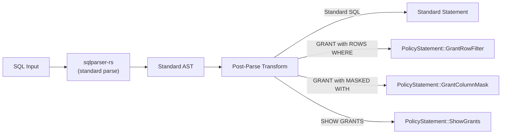

# Custom SQL Extensions

SQE extends standard SQL with statements for security policy management. These are parsed by wrapping `sqlparser-rs` — we don't fork the parser.

> **Status:** Parser extensions are designed (Phase 5). The parser currently recognizes `GRANT` and `REVOKE` as standard SQL but does not yet handle the custom `ROWS WHERE` and `MASKED WITH` clauses.

## Policy Statements

### GRANT with Row Filter

```sql
GRANT SELECT ON schema.table TO ROLE role_name
  ROWS WHERE condition;
```

Example:
```sql
-- Analysts can only see European data
GRANT SELECT ON sales.orders TO ROLE eu_analyst
  ROWS WHERE region = 'EU';

-- Finance team sees only their cost center
GRANT SELECT ON hr.expenses TO ROLE finance
  ROWS WHERE cost_center = current_user_attr('cost_center');
```

### GRANT with Column Mask

```sql
GRANT SELECT ON schema.table TO ROLE role_name
  MASKED WITH (column AS expression);
```

Example:
```sql
-- Support sees masked SSN (last 4 digits only)
GRANT SELECT ON customers TO ROLE support
  MASKED WITH (ssn AS '***-**-' || RIGHT(ssn, 4));

-- Partial email masking
GRANT SELECT ON users TO ROLE viewer
  MASKED WITH (email AS CONCAT(LEFT(email, 2), '***@', SPLIT_PART(email, '@', 2)));
```

### REVOKE

```sql
REVOKE SELECT ON schema.table FROM ROLE role_name;
```

### SHOW Statements

```sql
-- All grants on a table
SHOW GRANTS ON schema.table;

-- Effective policy for a role (combines all grants, resolves conflicts)
SHOW EFFECTIVE POLICY ON schema.table FOR ROLE analyst;
```

## Parser Strategy

SQE wraps `sqlparser-rs` rather than forking it:



The post-parse transform detects GRANT/REVOKE statements with the custom extensions and converts them to `PolicyStatement` AST nodes. Standard GRANT/REVOKE (without extensions) passes through unchanged.

## Statement Classification

Every SQL statement is classified for routing, metrics, and audit:

```rust
pub enum StatementKind {
    Query,          // SELECT
    Ctas,           // CREATE TABLE AS SELECT
    Insert,         // INSERT INTO
    Merge,          // MERGE INTO (planned)
    Delete,         // DELETE FROM (planned)
    Drop,           // DROP TABLE/VIEW
    Rename,         // ALTER TABLE RENAME
    CreateView,     // CREATE VIEW
    DropView,       // DROP VIEW
    CreateSchema,   // CREATE SCHEMA
    DropSchema,     // DROP SCHEMA
    ShowCatalogs,   // SHOW CATALOGS
    ShowSchemas,    // SHOW SCHEMAS
    ShowTables,     // SHOW TABLES
    Policy,         // GRANT, REVOKE
    Utility,        // EXPLAIN, SET, etc.
}
```

Each kind maps to a stable lowercase label (`"query"`, `"ctas"`, `"insert"`) used in Prometheus metrics and audit logs.
