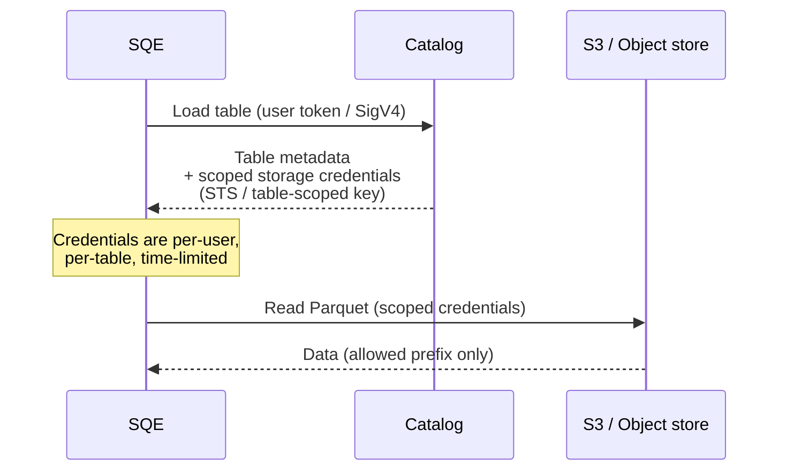
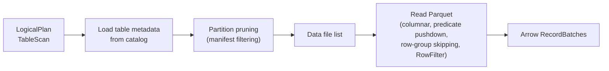
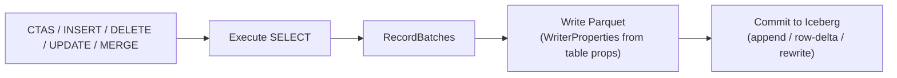

# Iceberg Integration

SQE is built on the [iceberg-rust](https://github.com/apache/iceberg-rust) library (vendored fork) and speaks the [Iceberg REST Catalog](https://iceberg.apache.org/spec/#rest-catalog) protocol natively. Iceberg is the only table format SQE supports.

## Iceberg version

- **iceberg-rust**: SQE-rebased fork of [risingwavelabs/iceberg-rust](https://github.com/risingwavelabs/iceberg-rust) `dev_rebase_main_20260303` at commit `645f02a4b533`, vendored at `vendor/iceberg-rust/`. Provides `RewriteFilesAction` / `OverwriteFilesAction` (Copy-on-Write DELETE/UPDATE), `PositionDeleteFileWriter` (Merge-on-Read position deletes), and `DeletionVectorWriter` (Iceberg V3) on top of upstream v0.9.0.
- **DataFusion**: 53.0
- **Arrow**: 58
- **Parquet**: 58
- **Iceberg table format**: V2 and V3. V3 features verified end-to-end (TIMESTAMP_NS, column defaults, equality-delete UPDATE on identifier-fields, partition evolution).

The matrix score against [icebergmatrix.org](https://icebergmatrix.org) is 162/189 (85.7%). See [iceberg-matrix.md](../../../iceberg-matrix.md) for the per-cell breakdown.

## Architecture

```mermaid
graph TB
    subgraph SQE
        SC["SessionCatalog<br/>(per-user token)"]
        TP["IcebergTableProvider<br/>(DataFusion TableProvider)"]
        WR["Writer<br/>(Parquet output)"]
    end

    SC -->|REST API + bearer / SigV4| CAT["Catalog backend<br/>(Polaris / Nessie / Glue REST /<br/>S3 Tables / Unity / HMS / JDBC / Hadoop)"]
    CAT -->|table metadata| SC
    CAT -->|S3 credentials<br/>(credential vending)| SC

    TP -->|read Parquet| OS["S3-compatible storage<br/>(AWS / Ceph / R2 / rustfs)"]
    WR -->|write Parquet| OS

    SC -->|commit| CAT
```

## Supported catalogs

SQE keeps the catalog choice as a runtime configuration concern. Every catalog below ships compiled in by default; pick one in `[catalog]`.

| Catalog | Protocol | Auth | Status |
|---|---|---|---|
| Apache Polaris | Iceberg REST | OIDC bearer + credential vending | primary |
| Project Nessie 0.107+ | Iceberg REST | bearer / anonymous | live verified |
| AWS Glue (Iceberg REST) | Iceberg REST + AWS SigV4 | AWS provider chain | live verified |
| AWS S3 Tables | Iceberg REST + AWS SigV4 (`s3tables` signing) | AWS provider chain | live verified |
| Unity Catalog OSS | Iceberg REST | bearer (Databricks) / anonymous (OSS) | live verified, read-only on OSS |
| Hive Metastore | Thrift | none / Kerberos | live verified |
| JDBC (Postgres / MySQL / SQLite) | iceberg-catalog-sql | DB credentials | live verified (Postgres) |
| Hadoop / storage-only | object_store path scan | none | live verified, read-only |

Live integration tests for HMS, Nessie, JDBC Postgres, AWS Glue, AWS S3 Tables, and Unity OSS live in `crates/sqe-catalog/tests/backends_integration.rs`. Each is `#[ignore]` and runs against a docker-compose overlay or a real cloud account configured via `.env`.

The AWS endpoints share the OSS Iceberg REST code path. Phase P added an `aws-sigv4` cargo feature to the vendored `iceberg-catalog-rest` crate that swaps the OAuth/Bearer authenticator for an AWS SigV4 signer when `rest.sigv4-enabled=true` lands in the catalog properties (or in the server's `/v1/config` defaults). The signer reads credentials from the standard AWS provider chain.

## Catalog REST surface

For Polaris, Nessie, Unity OSS, AWS Glue, and AWS S3 Tables, SQE talks to the catalog via the Iceberg REST API. Key interactions:

| Operation | REST endpoint | SQE use |
|---|---|---|
| List namespaces | `GET /v1/{prefix}/namespaces` | `SHOW SCHEMAS` |
| List tables | `GET /v1/{prefix}/namespaces/{ns}/tables` | `SHOW TABLES` |
| Load table | `GET /v1/{prefix}/namespaces/{ns}/tables/{t}` | Query planning |
| Create table | `POST /v1/{prefix}/namespaces/{ns}/tables` | `CREATE TABLE` |
| Drop table | `DELETE /v1/{prefix}/namespaces/{ns}/tables/{t}` | `DROP TABLE` |
| Create namespace | `POST /v1/{prefix}/namespaces` | `CREATE SCHEMA` |
| Drop namespace | `DELETE /v1/{prefix}/namespaces/{ns}` | `DROP SCHEMA` |
| Commit table | `POST /v1/{prefix}/namespaces/{ns}/tables/{t}` | After write |
| Server config | `GET /v1/config?warehouse=...` | Discovery / signing hints |

Every request includes the user's bearer token (Polaris, Unity, Nessie, anything OIDC) or is signed with AWS SigV4 (Glue, S3 Tables). The catalog enforces access control.

## Credential vending

When SQE loads a table, the catalog returns the table metadata and scoped storage credentials for accessing the data files:



This means:

- No service account with broad storage access.
- Each user's storage access is scoped to exactly the tables they are querying.
- Credentials are short-lived (STS or equivalent).

## Read path



Read-side optimizations:

- **Partition pruning**: Iceberg manifest stats skip whole partitions that cannot match the query predicate.
- **Column projection**: only requested columns leave Parquet.
- **Predicate pushdown**: filters land at the row group level, the page-index level, and the Parquet `RowFilter`.
- **Runtime filter pushdown**: Phase P shipped a `DynamicPredicate` API that absorbs DataFusion 53 hash-join build-side runtime filters into the same pruning surface. SF10 TPC-H lineitem-heavy queries saw `q06 -51%`, `q07 -31%`, `q14 -33%`. Engineering log at [`docs/features/runtime-filter-pushdown.md`](../../../features/runtime-filter-pushdown.md).
- **Bloom filter consultation**: `write.parquet.bloom-filter-columns` lands bloom offsets in the file footer; DataFusion consults them automatically for literal equality predicates at scan time.
- **5-layer caching**: REST catalog cache, table metadata cache, manifest cache, SessionContext cache, OAuth token cache. Warm queries hit sub-millisecond planning.

## Write path



Supported DML, both V2 and V3 verified:

- **CREATE TABLE AS SELECT**: Apache Iceberg V2 and V3, including TIMESTAMP_NS columns and DEFAULT literals.
- **INSERT INTO**: streaming, with proper schema validation against the catalog.
- **DELETE FROM**: Copy-on-Write via `RewriteFilesAction`, or Merge-on-Read via `PositionDeleteFileWriter` when `write.delete.mode=merge-on-read`.
- **UPDATE**: CoW or MoR (equality deletes when the table declares an identifier-field-id).
- **MERGE INTO**: full WHEN MATCHED / WHEN NOT MATCHED semantics, dispatching to CoW or MoR based on the table's `write.update.mode`.
- **ALTER TABLE**: `ADD/DROP/RENAME COLUMN`, `SET/DROP NOT NULL`, type promotion, `ADD/DROP/REPLACE PARTITION FIELD` (partition evolution), `CREATE/DROP BRANCH/TAG`, `SET WRITE BRANCH`.

The writer respects `write.parquet.bloom-filter-columns` and `write.parquet.bloom-filter-fpp` for any column the schema knows about. The footer-inspection test in `crates/sqe-catalog/src/parquet_writer_config.rs` proves bloom offsets land in the resulting Parquet file.

## V3 features verified

- **TIMESTAMP_NS / TIMESTAMPTZ_NS**: V3 nanosecond timestamps round-trip end-to-end.
- **Column defaults**: `CREATE TABLE ... DEFAULT <literal>` applies `write_default`; `ALTER TABLE ADD COLUMN ... DEFAULT` applies `initial_default`.
- **Position deletes (V3)**: MoR DELETE on a V3 table writes position-delete files.
- **Equality deletes (V3)**: UPDATE with a declared identifier-field-id commits a single RowDelta with new data file plus equality-delete row.
- **Partition evolution (V3)**: `ALTER TABLE ADD/DROP/REPLACE PARTITION FIELD` evolves the spec on V3 tables, including with day(ts) on TIMESTAMP_NS columns.
- **Time travel (V3)**: `FOR SYSTEM_TIME AS OF` and `FOR VERSION AS OF` work against V3 tables through the same snapshot walk as V2.
- **Schema evolution (V3)**: `ADD COLUMN`, `DROP COLUMN`, `RENAME COLUMN`, `SET DATA TYPE` all work on V3.

V3 features still blocked upstream:

- **Variant**: pending iceberg-rust [#2188](https://github.com/apache/iceberg-rust/pull/2188).
- **Geometry**: pending DataFusion UDT [#12644](https://github.com/apache/datafusion/issues/12644).
- **Vector / Embedding**: V3 spec not finalised.

The deferred list is tracked in [docs/iceberg-matrix-state.json](../../../iceberg-matrix-state.json) under `caveats` for each cell.
