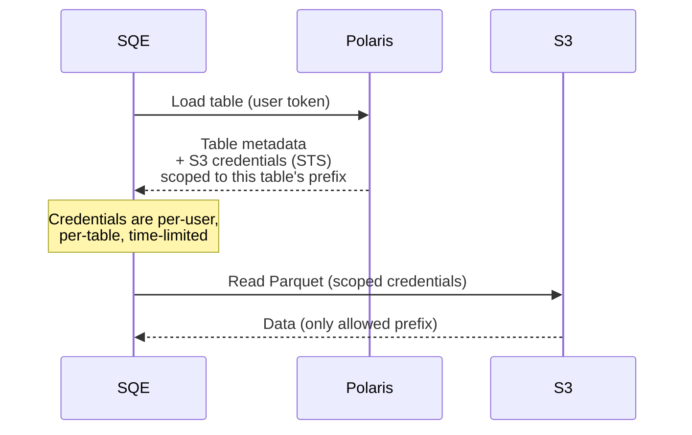
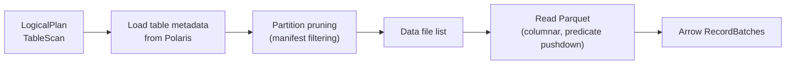
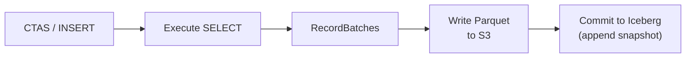

# Iceberg Integration

SQE is built on [iceberg-rust](https://github.com/apache/iceberg-rust) and [Apache Polaris](https://polaris.apache.org/) (Iceberg REST Catalog). It's not a connector — Iceberg is the only table format SQE supports.

## Architecture

```mermaid
graph TB
    subgraph SQE
        SC["SessionCatalog<br/>(per-user token)"]
        TP["IcebergTableProvider<br/>(DataFusion TableProvider)"]
        WR["Writer<br/>(Parquet output)"]
    end

    SC -->|REST API + bearer token| POL["Apache Polaris<br/>(Iceberg REST Catalog)"]
    POL -->|table metadata| SC
    POL -->|S3 credentials<br/>(credential vending)| SC

    TP -->|read Parquet| S3["S3 / MinIO"]
    WR -->|write Parquet| S3

    SC -->|commit| POL
```

## Catalog: Apache Polaris

SQE talks to Polaris via the [Iceberg REST Catalog API](https://iceberg.apache.org/spec/#rest-catalog). Key interactions:

| Operation | REST Endpoint | SQE Use |
|---|---|---|
| List namespaces | `GET /v1/namespaces` | `SHOW SCHEMAS` |
| List tables | `GET /v1/namespaces/{ns}/tables` | `SHOW TABLES` |
| Load table | `POST /v1/namespaces/{ns}/tables/{t}` | Query planning |
| Create table | `POST /v1/namespaces/{ns}/tables` | `CREATE TABLE` |
| Drop table | `DELETE /v1/namespaces/{ns}/tables/{t}` | `DROP TABLE` |
| Create namespace | `POST /v1/namespaces` | `CREATE SCHEMA` |
| Drop namespace | `DELETE /v1/namespaces/{ns}` | `DROP SCHEMA` |
| Commit table | `POST /v1/namespaces/{ns}/tables/{t}` | After write |

Every request includes the **user's bearer token** — Polaris enforces catalog-level access control.

## Credential Vending

When SQE loads a table, Polaris returns the table metadata *and* scoped S3 credentials for accessing that table's data files:



This means:
- No service account with broad S3 access
- Each user's S3 access is scoped to exactly the tables they're querying
- Credentials are short-lived (STS tokens)

## Read Path



SQE leverages:
- **Partition pruning** — Iceberg metadata is used to skip entire partitions that don't match query predicates
- **Column projection** — only requested columns are read from Parquet
- **Predicate pushdown** — filters pushed down to Parquet row group level
- **Metadata caching** — table metadata cached with configurable TTL (default 30s) via `moka`

## Write Path



Currently supported:
- **CTAS** (`CREATE TABLE AS SELECT`) — creates table schema from query, writes Parquet data files, commits initial snapshot
- **INSERT INTO** — appends data files to existing table, commits new snapshot

Coming soon (blocked on iceberg-rust):
- **MERGE INTO** — row-level upsert with position deletes
- **DELETE FROM** — row-level delete with position deletes
- **UPDATE** — row-level update (rewrite affected rows)

## Iceberg Version

SQE uses **iceberg-rust 0.8.0** with **Iceberg table format v2** (v3 support planned). This pairs with:
- DataFusion 51.x
- Arrow 57.x
- Parquet 57.x
