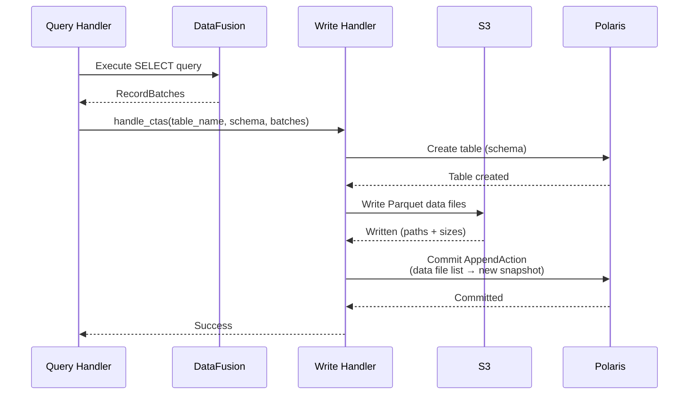

# Write Path

SQE supports writing data to Iceberg tables through SQL. Writes go through the coordinator, which executes the SELECT portion, writes Parquet files to S3, and commits to the Iceberg catalog.

## Supported Operations

### CREATE TABLE AS SELECT (CTAS)

```sql
CREATE TABLE analytics.monthly_sales AS
SELECT
    DATE_TRUNC('month', order_date) AS month,
    region,
    SUM(amount) AS total
FROM raw.orders
GROUP BY 1, 2;
```

Flow:
1. Parse SQL, extract target table name and SELECT query
2. Execute SELECT → get Arrow RecordBatches
3. Convert Arrow schema to Iceberg schema
4. Create table in Polaris catalog
5. Write RecordBatches as Parquet files to S3
6. Commit data files to Iceberg via AppendAction

### CREATE OR REPLACE TABLE

```sql
CREATE OR REPLACE TABLE analytics.monthly_sales AS
SELECT ... ;
```

Drops the existing table (if it exists) and creates a new one. Useful for dbt `table` materializations.

### INSERT INTO

```sql
INSERT INTO analytics.monthly_sales
SELECT
    DATE_TRUNC('month', order_date) AS month,
    region,
    SUM(amount) AS total
FROM raw.orders
WHERE order_date >= '2024-06-01'
GROUP BY 1, 2;
```

Flow:
1. Parse SQL, extract target table and SELECT query
2. Execute SELECT → get Arrow RecordBatches
3. Write RecordBatches as Parquet files to S3
4. Commit data files to Iceberg via AppendAction (new snapshot)

## Write Architecture



## Row-Level Operations (Copy-on-Write)

Row-level write operations are implemented via Copy-on-Write using the RisingWave iceberg-rust fork's `rewrite_files()` transaction API. Affected data files are read, filtered/transformed, and rewritten as new files in a single atomic Iceberg commit.

### DELETE FROM

```sql
DELETE FROM sales.orders WHERE status = 'cancelled';

-- Cross-table subqueries in WHERE
DELETE FROM sales.orders
WHERE customer_id IN (SELECT id FROM blacklist);

-- DELETE without WHERE = truncate
DELETE FROM sales.orders;
```

Flow:
1. Scan table metadata to identify affected data files
2. Read each affected file, apply the WHERE filter
3. If all rows match: mark file for removal
4. If partial match: rewrite file without matching rows
5. Commit via `rewrite_files()` (remove old files, add rewritten files)

### UPDATE

```sql
UPDATE sales.orders SET status = 'shipped' WHERE tracking_id IS NOT NULL;

-- CASE WHEN transformations
UPDATE sales.orders SET amount = CASE
    WHEN amount > 1000 THEN amount * 0.9
    ELSE amount
END;
```

Flow:
1. Scan table metadata to identify affected data files
2. Read each affected file, apply the WHERE filter
3. For matching rows: apply SET expressions
4. Rewrite file with modified rows
5. Commit via `rewrite_files()`

### MERGE INTO

```sql
MERGE INTO target USING source ON target.id = source.id
WHEN MATCHED THEN UPDATE SET value = source.value
WHEN NOT MATCHED THEN INSERT (id, value) VALUES (source.id, source.value);
```

Flow:
1. Execute a full outer join of source and target via DataFusion
2. Classify each result row: matched (UPDATE/DELETE) or not matched (INSERT)
3. Rewrite affected target data files with modifications applied
4. Add new data files for INSERT rows
5. Commit via `rewrite_files()` (remove old files, add new + rewritten files)

### Iceberg Dependency

Row-level writes depend on the [risingwavelabs/iceberg-rust](https://github.com/risingwavelabs/iceberg-rust) fork (rev `1978911ec4`) which provides the `rewrite_files()` transaction support not yet available in upstream iceberg-rust. When upstream ships `OverwriteAction`, the dependency can be migrated back to the official crate.

## dbt Compatibility

The write path is designed to support [dbt Core](https://www.getdbt.com/) via a native `dbt-sqe` adapter:

| dbt Materialization | SQL | Status |
|---|---|---|
| `table` | `CREATE OR REPLACE TABLE AS SELECT` | Supported |
| `incremental` (append) | `INSERT INTO SELECT` | Supported |
| `incremental` (merge) | `MERGE INTO` | Supported (CoW) |
| `view` | `CREATE VIEW AS SELECT` | Supported |
| `seed` | `INSERT INTO` (from CSV) | Supported |
