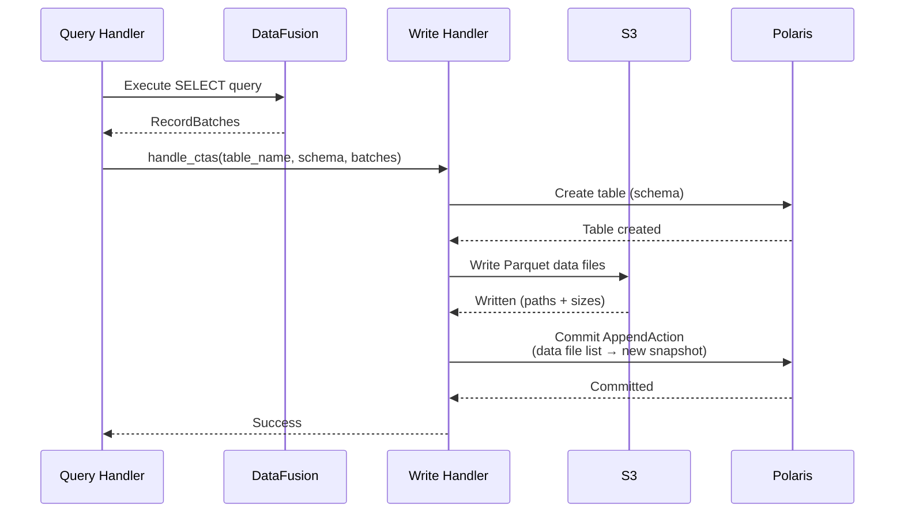

# Write Path

SQE supports writing data to Iceberg tables through SQL. Writes go through the coordinator, which executes the SELECT portion, writes Parquet files to S3, and commits to the Iceberg catalog.

## Supported Operations

### CREATE TABLE AS SELECT (CTAS)

```sql
CREATE TABLE analytics.monthly_sales AS
SELECT
    DATE_TRUNC('month', order_date) AS month,
    region,
    SUM(amount) AS total
FROM raw.orders
GROUP BY 1, 2;
```

Flow:
1. Parse SQL, extract target table name and SELECT query
2. Execute SELECT → get Arrow RecordBatches
3. Convert Arrow schema to Iceberg schema
4. Create table in Polaris catalog
5. Write RecordBatches as Parquet files to S3
6. Commit data files to Iceberg via AppendAction

### CREATE OR REPLACE TABLE

```sql
CREATE OR REPLACE TABLE analytics.monthly_sales AS
SELECT ... ;
```

Drops the existing table (if it exists) and creates a new one. Useful for dbt `table` materializations.

### INSERT INTO

```sql
INSERT INTO analytics.monthly_sales
SELECT
    DATE_TRUNC('month', order_date) AS month,
    region,
    SUM(amount) AS total
FROM raw.orders
WHERE order_date >= '2024-06-01'
GROUP BY 1, 2;
```

Flow:
1. Parse SQL, extract target table and SELECT query
2. Execute SELECT → get Arrow RecordBatches
3. Write RecordBatches as Parquet files to S3
4. Commit data files to Iceberg via AppendAction (new snapshot)

## Write Architecture



## Planned: Row-Level Operations

These operations are designed but blocked on iceberg-rust `OverwriteAction` support:

### DELETE FROM

```sql
DELETE FROM sales.orders WHERE status = 'cancelled';
```

Strategy: Copy-on-Write — rewrite affected data files without the deleted rows.

### MERGE INTO

```sql
MERGE INTO target USING source ON target.id = source.id
WHEN MATCHED THEN UPDATE SET value = source.value
WHEN NOT MATCHED THEN INSERT (id, value) VALUES (source.id, source.value);
```

Strategy: Read matching rows, compute deltas, write new data files, commit with OverwriteAction.

### UPDATE

```sql
UPDATE sales.orders SET status = 'shipped' WHERE tracking_id IS NOT NULL;
```

Desugars internally to a MERGE-like operation.

## dbt Compatibility

The write path is designed to support [dbt Core](https://www.getdbt.com/) via a native `dbt-sqe` adapter:

| dbt Materialization | SQL | Status |
|---|---|---|
| `table` | `CREATE OR REPLACE TABLE AS SELECT` | Supported |
| `incremental` (append) | `INSERT INTO SELECT` | Supported |
| `incremental` (merge) | `MERGE INTO` | Planned |
| `view` | `CREATE VIEW AS SELECT` | Supported |
| `seed` | `INSERT INTO` (from CSV) | Supported |
