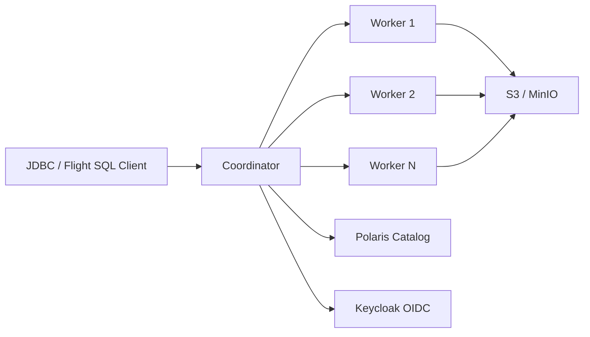

# SQE — Sovereign Query Engine

**SQE** is a Rust-based distributed SQL query engine for [Apache Iceberg](https://iceberg.apache.org/) tables. It replaces a patched Trino fork with a purpose-built engine based on [Apache DataFusion](https://datafusion.apache.org/) and [iceberg-rust](https://github.com/apache/iceberg-rust).



## Key Properties

- **No service account** — every query runs as the authenticated user. Bearer tokens pass through from client to Polaris catalog and S3 storage.
- **Arrow-native** — columnar data flows from Parquet files through the entire query pipeline to the client. No row-based serialization anywhere.
- **Iceberg-native** — built on iceberg-rust, not a connector bolted onto a generic engine. Partition pruning, metadata caching, and Iceberg v3 support are first-class.
- **Fine-grained security** — row filters and column masks enforced at the logical plan level, before the optimizer runs. Invisible columns, transparent row filtering, no information leakage.
- **Rust performance** — single binary, no JVM, no GC pauses, predictable memory usage, fast startup.

## Quick Start

```bash
# Build
cargo build --release --bin sqe-server --bin sqe-cli

# Start coordinator (single-node, default mode)
SQE_CONFIG=sqe.toml ./target/release/sqe-server

# Connect
./target/release/sqe-cli --host localhost --port 50051
```

## Project Status

SQE is in active development. The single-node engine (Phase 1-2) is functional with Keycloak auth, Polaris catalog, Flight SQL, read/write queries, and observability. Distributed execution (Phase 3) and security policy enforcement (Phase 5) are in design.
