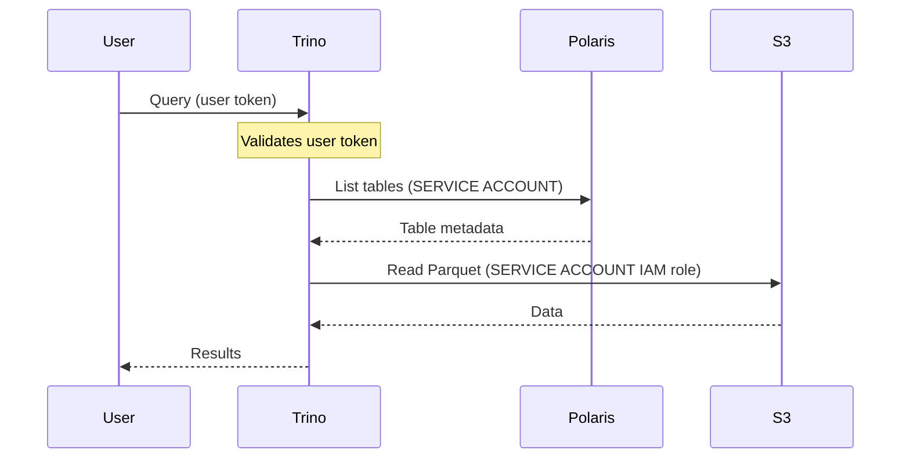
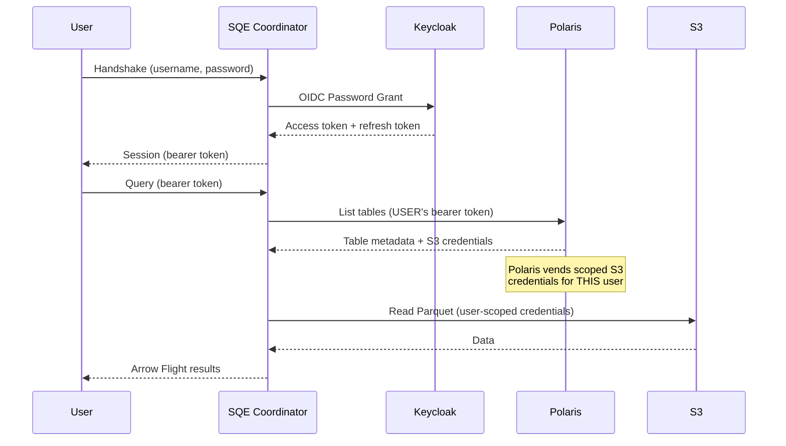
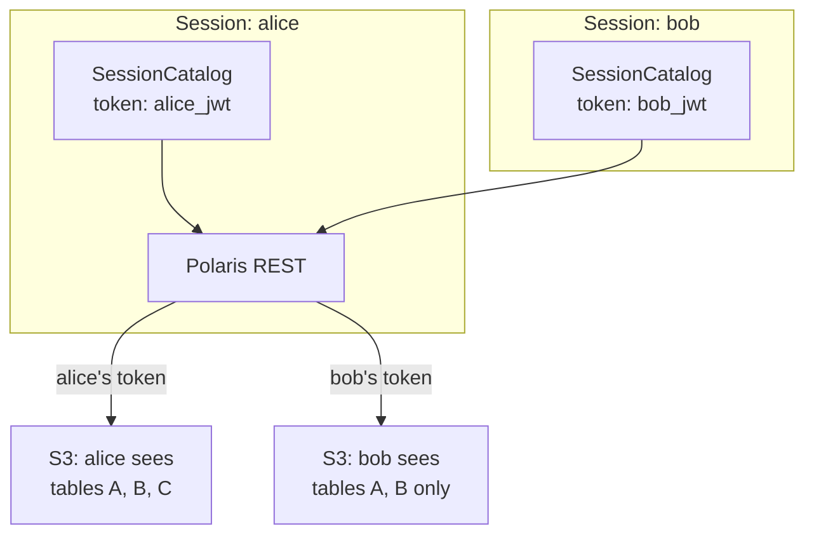
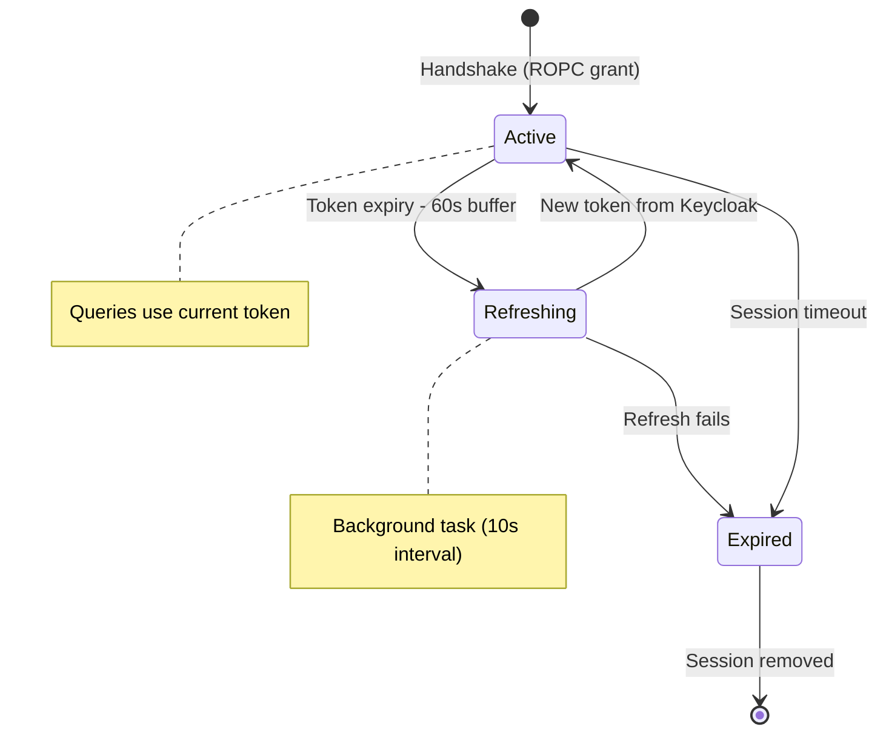

# The Auth Challenge

The core design constraint that drove us to build SQE: **no service account**.

## The Problem with Service Accounts

In a typical data platform, the query engine authenticates to the catalog and storage with a **service account** — a single identity with broad permissions. The engine then enforces per-user access control internally.

This means:
- **Polaris sees one identity** for all queries — audit logs show the service account, not the actual user
- **S3 access is all-or-nothing** — the service account can read everything, security depends entirely on the engine enforcing it correctly
- **Credential rotation** is a blast-radius event — rotating the service account key affects all users simultaneously
- **Compliance gap** — auditors want to see that *Alice* read table X, not that *sqe-service-account* did

## SQE's Approach: Bearer Token Passthrough

SQE never stores or uses a service account for data access. Instead, the user's Keycloak bearer token flows through the entire stack:

### Key Implications

| Property | Service Account Model | SQE Token Passthrough |
|---|---|---|
| Polaris audit trail | Service account | Actual user |
| S3 access scope | Everything | User-scoped (credential vending) |
| Credential rotation | Blast radius: all users | Per-user: transparent refresh |
| Security enforcement | Engine-internal only | Catalog + storage + engine |
| Compliance | Requires mapping logs | Native user identity |

## Per-Session Catalog

Each user session gets its own `SessionCatalog` instance, initialized with the user's bearer token:

Polaris enforces catalog-level access control based on the token. If Alice has access to tables A, B, C but Bob only has access to A and B, this is enforced at the catalog level — SQE doesn't need to duplicate this logic.

## Token Lifecycle

SQE manages token refresh transparently. A background task checks all active sessions every 10 seconds and refreshes tokens that are about to expire:

The **token fingerprint** (last 8 characters of the access token) is used to invalidate iceberg-rust's internal catalog session cache when a token is refreshed, ensuring the catalog client always uses the current token.
