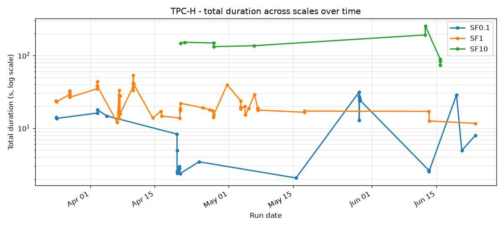
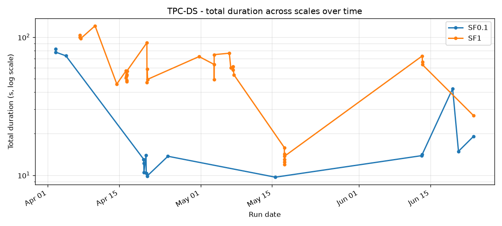
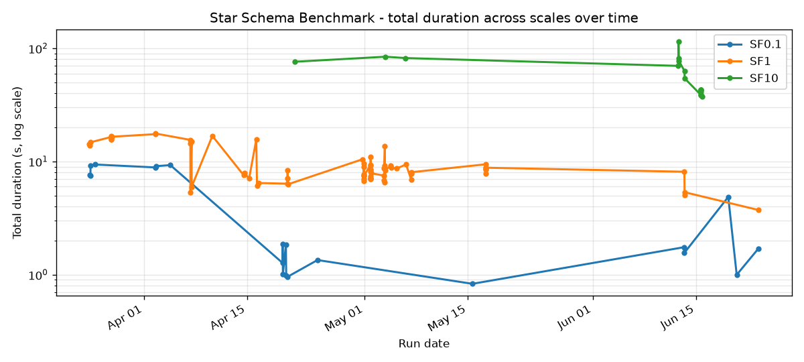
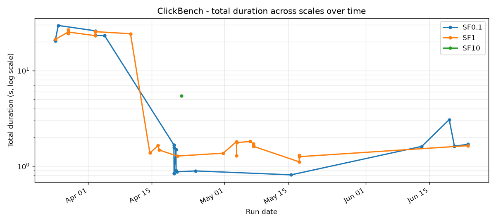
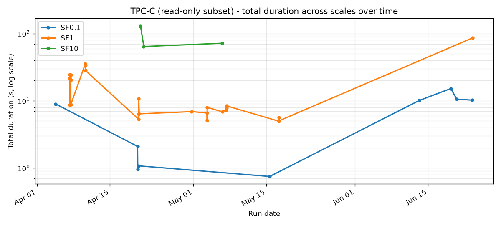
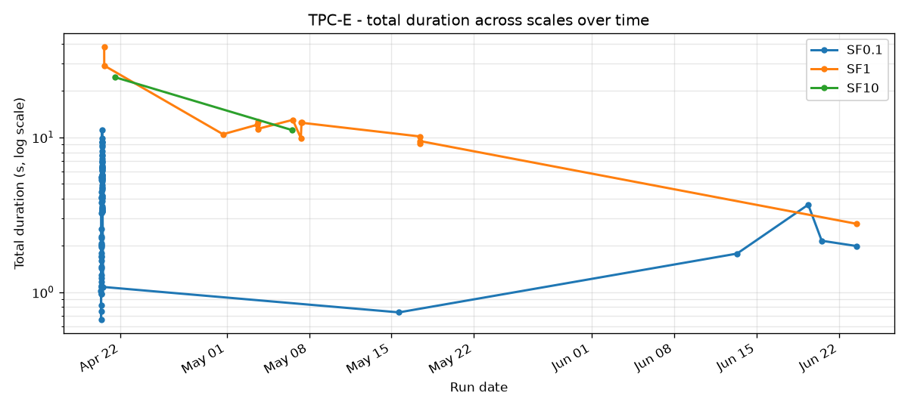
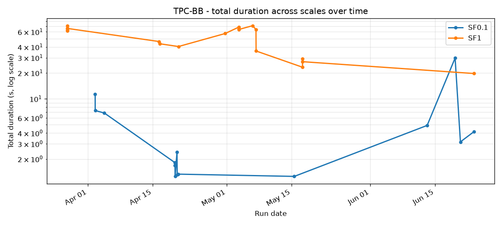

# Benchmark history

Timeline view of every benchmark run committed to `benchmarks/results/`. The canonical SF1 headline lives in the [book benchmark page](../../site/book/src/features/benchmarks.md#results-sf1-vs-trino-465) and on [getsqe.com/performance](https://getsqe.com/performance); both are a snapshot of the latest run. This page is the longitudinal view that shows how each suite moved across six months of optimisation work.

Charts are regenerated by walking the JSON files in `benchmarks/results/`. Run `make benchmark-charts` to refresh after a new run lands.

## June 2026: SF10 on the level rig

SF10 got serious in June 2026. The morning runs showed SQE 3 to 5x slower than Trino on every scan-bound query. The evening runs showed SQE winning TPC-H outright. Three things changed in one day, and only one of them was the engine being slow:

1. **The rig was biased.** SQE ran on the host and read the dockerized S3 store through Docker's port-forward, which saturates at ~160 MB/s aggregate. Trino ran inside the Docker VM and read container-to-container at ~320 MB/s. Every scan-bound query gave Trino twice the storage bandwidth. The fix is `docker-compose.compare.yml`: both engines containerized in the same network, same CPU count, bounded heaps, same per-query memory.
2. **Parquet decode was single-threaded.** The reader overlapped I/O across files but decoded everything on one polling thread. Large file tasks now split into 128MB byte-range subtasks, each decoded on its own runtime task (MR !352).
3. **FairSpillPool starved wide plans.** TPC-DS q39 registered ~90 spillable consumers and each got ~95MB of an 8GB pool; a partial aggregate with a constant GROUP BY key cannot emit early under DataFusion 53 and the raw pool error surfaced. The default pool is now greedy with tracked consumers (MR !353).

SF10 totals on the level rig (Trino 481, range across runs):

| Suite | SQE single-node | SQE distributed 2w | Trino 481 |
|---|---|---|---|
| TPC-H | 130.5s | 95.5s | 106.4s - 138.6s |
| SSB | 42.0s | 53.6s | 28.0s - 41.1s |
| TPC-DS | 543.9s | 338.3s | 328.4s - 468.0s |

Open items from the same day's profiles: the Tier-2 dynamic-filter wrapper evaluates per batch on one thread after decode (q09 spends 20s there), unsorted bench data defeats all min/max pruning (`files_pruned_minmax=0` across every query), and distributed workers lack scan backpressure at SF10 (four TPC-DS inventory queries exhaust the 4GB worker pool when decode outruns Flight shipment).

## What is plotted

For each suite (TPC-H, TPC-DS, SSB, ClickBench, TPC-C, TPC-E, TPC-BB) at each scale (SF0.1, SF1, SF10) we plot three views:

1. **Total run duration over time**: one line, one point per run. Big drops show the day a planner / runtime fix landed; spikes show a bad benchmark machine or a regression caught fast.
2. **Per-query duration heatmap**: rows are queries, columns are runs, colour is duration in seconds. White cells are runs where the query was skipped or failed. Reading top-to-bottom shows which queries are consistently expensive; reading left-to-right shows where a fix moved a row from red to yellow.
3. **Pass count over time**: one line. Useful when a refactor introduces new failures we want to catch quickly.

## Suites at a glance

Each chart below puts SF0.1, SF1, and SF10 on the same time axis (log scale on Y so all three fit). Click through to a suite for the per-scale detail.

### TPC-H



22 queries, decision support. Strict comparison against Trino 465 lives in the [README's headline table](../../README.md#performance-receipts-sf1-vs-trino-465) and the [book benchmark page](../../site/book/src/features/benchmarks.md#results-sf1-vs-trino-465). Detail: [TPC-H](./tpch.md).

### TPC-DS



99 queries, decision support, harder than TPC-H. Q72 is consistently the slowest query and shows up as a dark band in the heatmap. Detail: [TPC-DS](./tpcds.md).

### Star Schema Benchmark (SSB)



13 queries derived from TPC-H, optimised for star joins. Used during the runtime-filter pushdown work as a sanity check. Detail: [SSB](./ssb.md).

### ClickBench



43 queries, focused on log analytics over a wide hits table. Detail: [ClickBench](./clickbench.md).

### TPC-C (read-only subset)



8 read queries from TPC-C. The full benchmark needs OLTP transaction support; SQE runs the read subset. Detail: [TPC-C](./tpcc.md).

### TPC-E



11 queries, financial trading workload. Heavy on date / range filters. Detail: [TPC-E](./tpce.md).

### TPC-BB



10 queries from BigBench. Mix of structured and semi-structured workloads. Detail: [TPC-BB](./tpcbb.md).

## How runs are recorded

Every `./scripts/benchmark-test.sh` invocation writes a JSON file with shape:

```json
{
  "benchmark": "tpch",
  "scale_factor": 1.0,
  "protocol": "flight",
  "timestamp": "2026-05-08T07:11:23",
  "summary": {
    "total": 22,
    "pass": 22,
    "fail": 0,
    "diff": 0,
    "skip": 0,
    "error": 0,
    "total_duration_ms": 19347
  },
  "queries": [
    { "id": "q01", "status": "pass", "duration_ms": 1124, "rows": 6 },
    ...
  ]
}
```

These JSON files are committed to the repo (per `CLAUDE.md`) so the timeline is reproducible by anyone with `git log`. The chart-generation script is `scripts/render-benchmark-charts.py`; it is pure Python with `matplotlib` as the only dependency.

## What the charts can and cannot tell you

What they show:

- **Day a fix landed**: a step-change in total duration usually corresponds to a single commit landing on `main`. Cross-reference with the [Performance Roadmap](../specs/performance-roadmap.md) and the dated blog posts.
- **Regression caught fast**: a single-run spike that the next run reverses is the common shape after a bad change is rolled back.
- **Consistently slow queries**: rows in the heatmap that stay orange / red across the whole period are queries the planner has not yet learned to handle well. q72 in TPC-DS was the standout for a month before the 2026-05-16 dynamic-filter type-coercion fix collapsed it from 10.7s to 0.77s; the orange band on the heatmap stops there.
- **New benchmark machine**: a step-change that affects every query the same way is usually environmental (different machine, different disk, different Trino version).

What they do not show:

- **Wall-clock query latency** to a real client. Benchmarks run inside the SQE process loop with Flight SQL and capture only the engine time. Network round-trips are not included.
- **Variance from a single run**. We do not run with repeats and confidence intervals; one point per run. Smoothing comes from running benchmarks many times across the period.
- **Cost-per-query in the cluster mode**. Distributed execution adds shuffle / scheduling overhead that the single-node Flight SQL benchmarks do not capture. See `docs/blog/2026-04-02-distributed-execution.md` for the cluster-mode timings.

## Cross-suite headline (May 2026)

Numbers below are from the latest SF1 run on the same machine, against Trino 465 with identical Iceberg + S3 storage. Same data as the README table; reproduced here so the timeline is self-contained.

| Suite | SQE | Trino | Avg speedup | Pass |
|---|---|---|---|---|
| TPC-H (22) | 16.8s | 26.7s | **1.6x** | 22/22 |
| SSB (13) | 8.3s | 5.8s | **0.70x slower** | 13/13 |
| TPC-DS (99) | 13.4s | 45.6s | **3.4x** | 93/99 |
| TPC-C (8 read) | 0.41s | 2.65s | **6.5x** | 8/8 |
| TPC-E (11) | 9.3s | 172.0s | **18.5x** | 11/11 |
| TPC-BB (10) | 28.0s | 255.7s | **9.1x** | 10/10 |
| ClickBench (43) | 1.3s | 4.46s | **3.4x** | 43/43 |

The numbers are approximate (run-to-run variance is real) but the rank order is stable across the last month of runs. Two fixes landed in May moved the needle: the dynamic-filter type-coercion fix on May 16 collapsed q72 from 10.7s to 0.77s, and the runtime-filter pushdown into iceberg-rust's scan path on May 17 took TPC-DS from 42.5s to 13.4s, TPC-BB from 38.2s to 28.0s, and TPC-E from 10.8s to 9.3s. SSB regressed slightly (7.0s -> 8.3s) because lineorder's uniform FK distribution defeats row-group pruning.

## Differential validation (June 2026)

Timing data is only as good as the result data behind it. Two layers of validation now run before any number is trusted:

1. **Engine diff.** `sqe-bench compare <suite>` runs every query against SQE (Flight SQL) and Trino (HTTP) on the same Iceberg tables and diffs the result rows. A row-count or value mismatch fails the query. A query that returns zero rows on BOTH engines is reported as `Vacuous`, not `Match`: agreement on nothing validates nothing.
2. **Data oracle.** `scripts/validate-generator-tpcds.py` loads the generated parquet and DuckDB's official `CALL dsdgen` output side by side, checks per-table row counts and per-column null fractions, and runs all 99 queries against both datasets inside DuckDB. A query that returns rows on official data and none on ours is a generator-fidelity bug, found without either engine in the loop.

The oracle earned its keep on day one. It proved 16 of 29 vacuous TPC-DS results were generator gaps (invented county names, colors, brand vocabularies the qualification queries cannot select), found that TPC-C generated zero-warehouse foreign keys at fractional scales, and settled the one genuine engine disagreement in SQE's favor: TPC-DS q75 differs by two rows because Trino's `DECIMAL(17,2)` division rounds ratios 0.8983 and 0.8984 up to 0.90 and drops them from a `< 0.9` filter. DuckDB matches SQE exactly.

Known remaining vacuous queries (all need correlation machinery the generator does not have yet, each worth 5 or fewer rows on official data): q04, q11, q17, q39, q74 at SF0.1; q08, q24, q25, q41, q54, q85, q91 at SF1.

Distributed execution is validated separately on a forced-distribution rig: single worker, distribution thresholds at zero, so every fact scan crosses Arrow Flight even for single-file tables. The rig exists because gates that decide whether code runs decide whether it gets tested. It exposed that dynamic join filters never reached the workers (fixed June 2026; TPC-DS SF1 under the rig went from 4.4x slower than Trino to 1.7x faster) and that SSB's remaining gap is hash-set join selectivity that a serialized range predicate cannot carry to a worker.

## Related

- [Performance Roadmap](../specs/performance-roadmap.md): the optimisation backlog, in order.
- [Runtime Filter Pushdown](../features/runtime-filter-pushdown.md): the Path B+B-2 work that drove most of the April-May TPC-H speedups.
- [Our Nemesis: TPC-DS Q72 (April)](../blog/2026-04-16-our-nemesis-q72.md): the original investigation, when the query was still 12x slower.
- [q72, our nemesis, and the Int32 that hid for a month (May 16)](../blog/2026-05-16-q72-the-nemesis.md): the post-mortem on the fix that finally landed.
- [Five Layers of Caching and an 8.8x Speedup](../blog/2026-04-12-caching-and-the-8x-speedup.md): the early-April caching work.
- [The Benchmark That Lied (June 12)](../blog/2026-06-12-the-benchmark-that-lied.md): vacuous results, the DuckDB oracle, and the day Trino was the one with the wrong answer.
