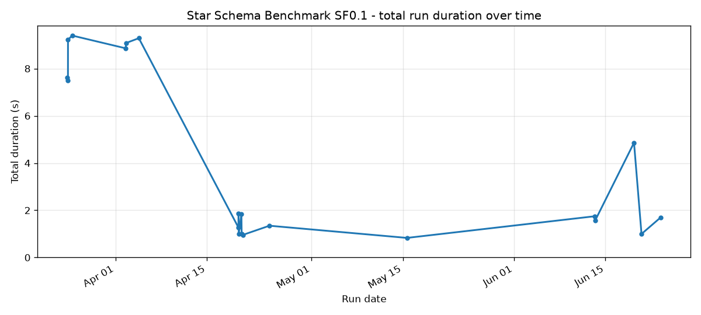
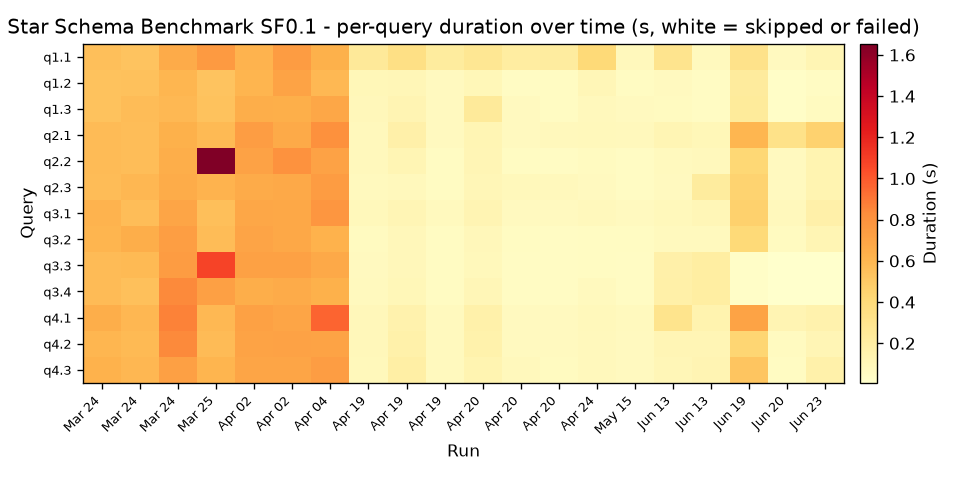
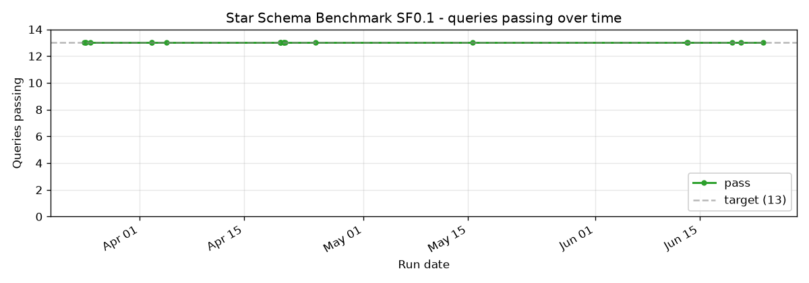
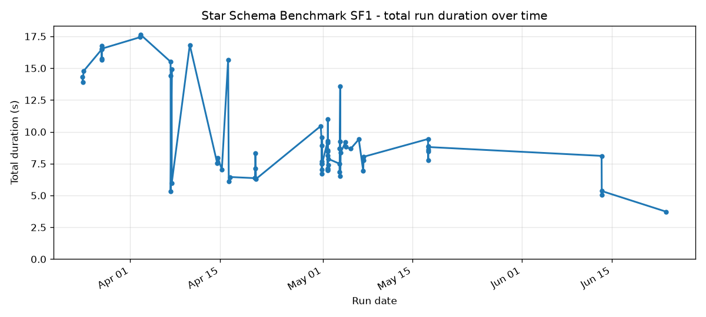
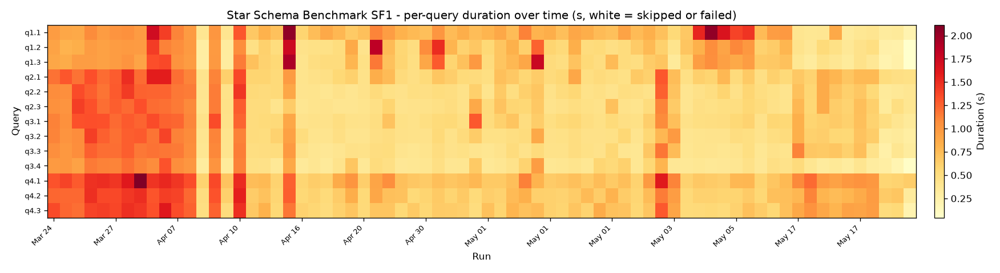
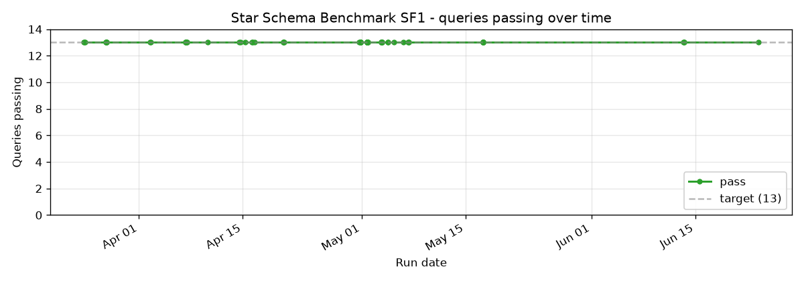
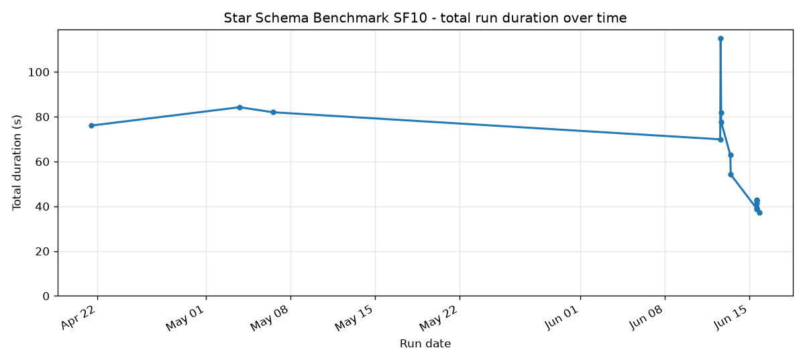
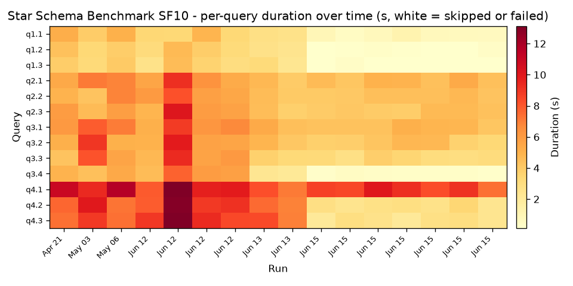
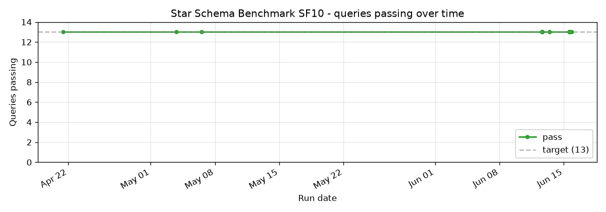

# Star Schema Benchmark

13 queries derived from TPC-H, restructured around a single fact (`lineorder`) joined against four dimensions (`customer`, `supplier`, `date`, `part`). The shape that data warehouses are usually optimised for.

SSB was the first benchmark to break when SQE's runtime-filter work shipped because of an ordering bug between SortPreservingMerge and SortExec; the chart shows the dip + recovery. It was also the first to confirm the Path B+B-2 work landed.

## Cross-scale

## SF0.1

## SF1

13/13 pass since late March. The total duration line shows the runtime-filter improvement landing in mid-April.

## SF10

SSB still trails Trino at SF10, the same pattern as SF1. On the level rig (Trino 481), SQE runs 42.0s single-node and 53.6s distributed-2-worker against Trino's 28.0s - 41.1s range. The remaining gap is build-side key-set (bloom filter) selectivity that a serialized range predicate cannot carry to a worker; shipping the key sets to workers is the open work. Dynamic-filter pushdown plus star-schema join reordering closed part of the gap but not all of it.

## Implementation references

- Queries: `crates/sqe-bench/queries/ssb/`
- Star-schema reorder: `crates/sqe-planner/src/star_schema_reorder.rs`
- Runtime filter: `docs/features/runtime-filter-pushdown.md`
- Runner: `scripts/benchmark-test.sh ssb`
