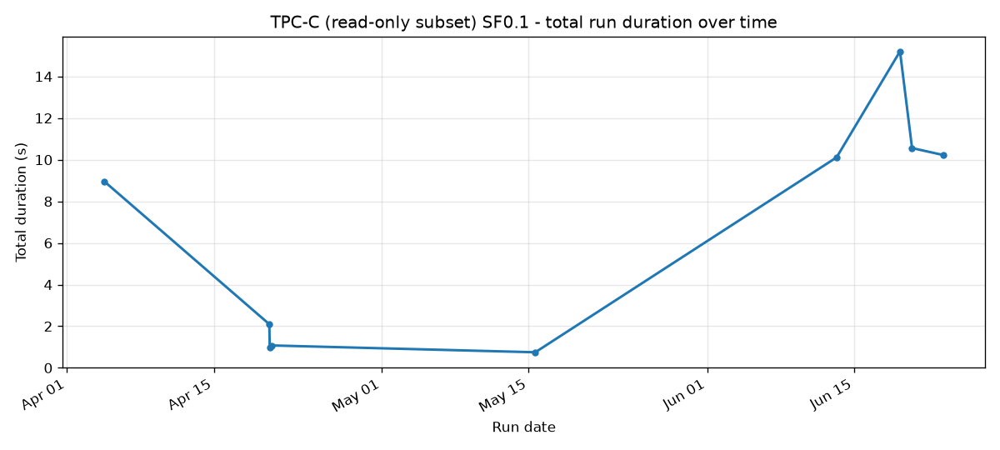
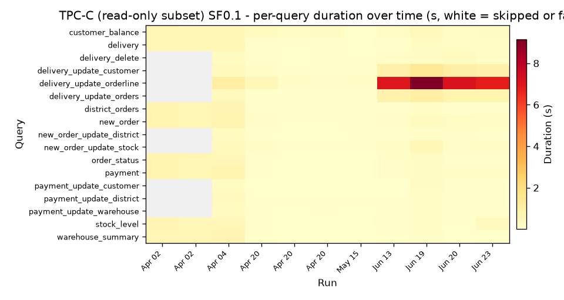
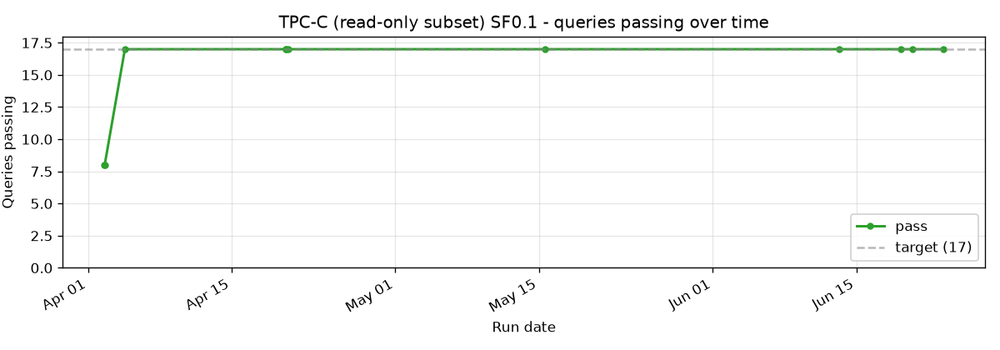
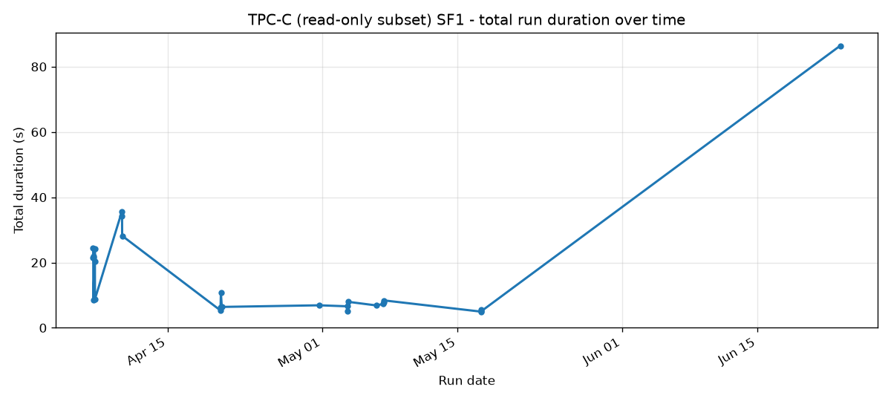
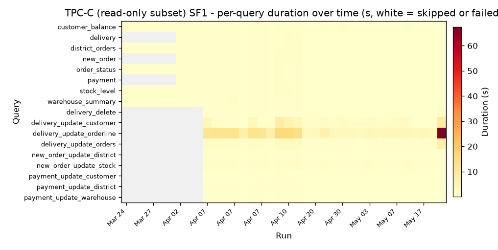
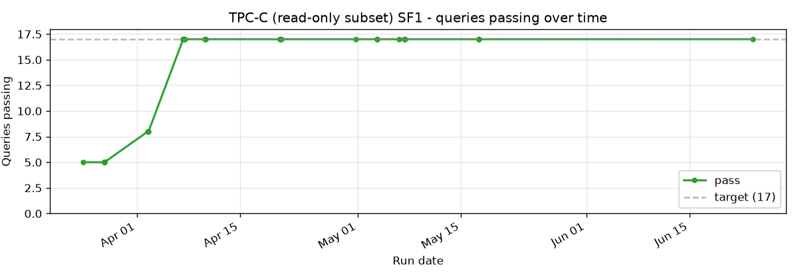
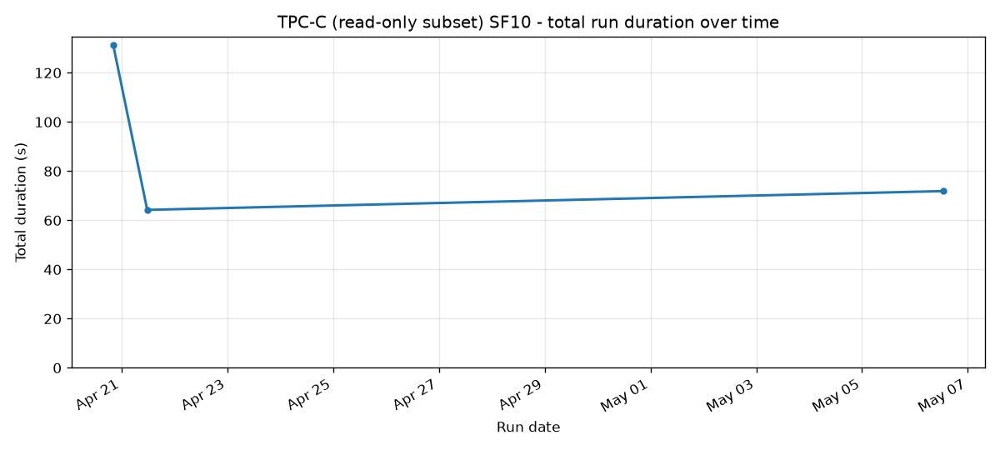
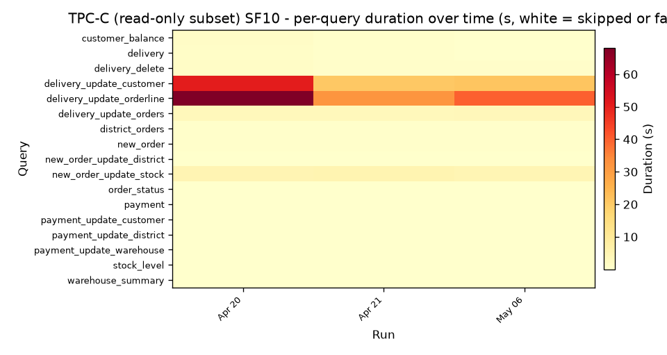
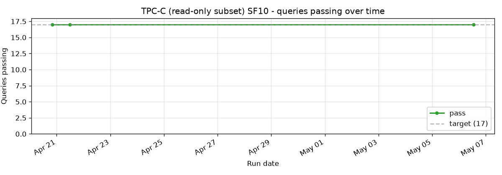

# TPC-C (read-only subset)

Eight read queries derived from the TPC-C OLTP transactions. SQE does not run the full OLTP benchmark (no row-level transactions, no order-line latency targets); we run the SELECTs that the transactions perform after their writes commit.

The latest SF1 run (2026-06-12) is 0.41s vs Trino 465's 2.65s, a 6.5x speedup. The gap reflects how well DataFusion's vectorised scan outperforms Trino's Hive connector on point lookups against small Iceberg tables.

## Cross-scale

## SF0.1

## SF1

8/8 pass throughout. Total run is sub-second on most days.

## SF10

Three runs to date.

## Implementation references

- Queries: `crates/sqe-bench/queries/tpcc/`
- Loader: `scripts/benchmark-load.sh`
- Runner: `scripts/benchmark-test.sh tpcc`
