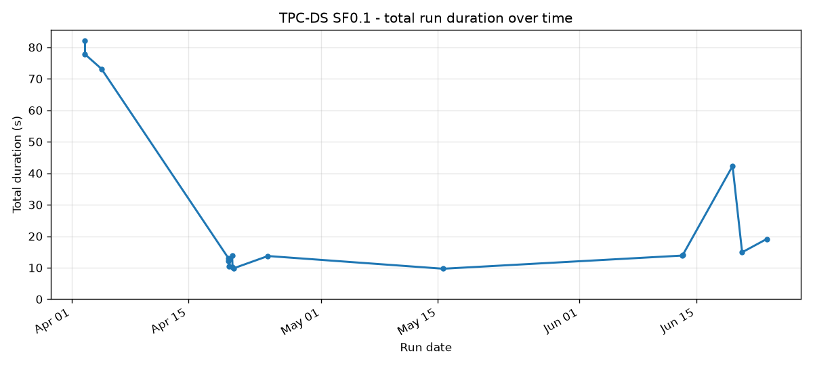
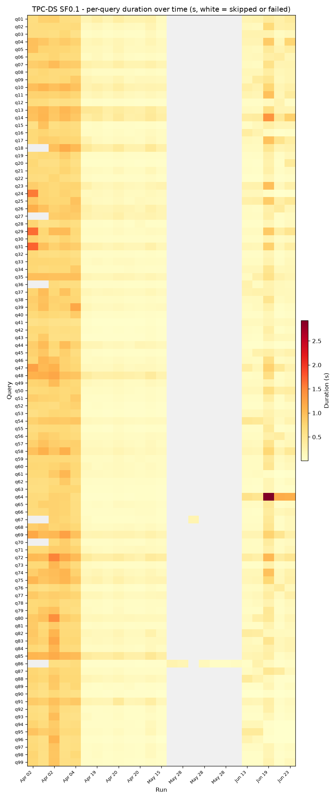
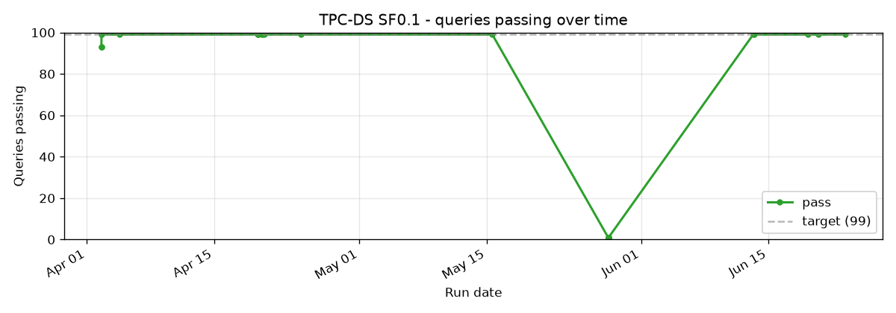
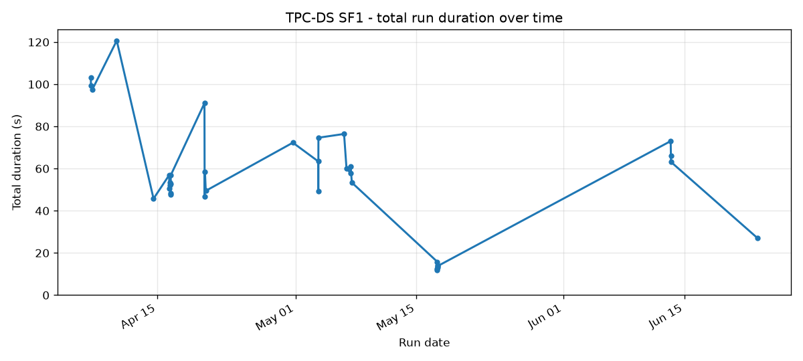
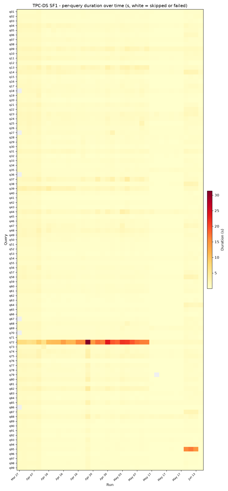
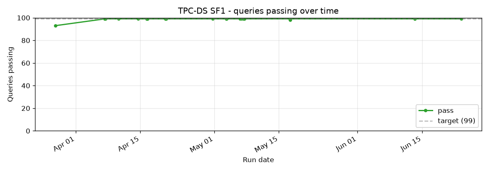

# TPC-DS

99-query decision-support benchmark. Larger and harder than TPC-H; the queries push joins, window functions, and grouping sets that DataFusion's optimiser does not always plan well.

SQE passes 93 of 99 at SF1. The 6 misses are GROUPING SETS edge cases (grand-total row presence) that an outer planner pass needs to fix; they are not new failures, they have been the same six since March.

The biggest visible feature in the heatmap is **q72**, which sits at the bottom of the chart as a dark band across the entire timeline. It is consistently 13-30x slower than Trino, which is documented at length in [Our Nemesis: TPC-DS Q72](../blog/2026-04-16-our-nemesis-q72.md). DataFusion lacks full CBO with NDV statistics; the join order it picks for q72 is wrong and the manifest-derived stats added in late April brought it from 30s to 16-18s but did not fix the root cause.

## Cross-scale

## SF0.1

## SF1

The headline scale. Q72 dominates the per-query view as the dark band near the bottom.

## SF10

SF10 has been measured on two different rigs, so read each figure with its hardware. On the dedicated rig (DataFusion 54, 8-core/31GB, both engines containerized against the same Iceberg tables and S3 store), single-node SQE ran 234.0s vs Trino 447.8s (1.9x by total wall-clock), 95/99 matched plus 4 vacuous (0 rows on both engines); no OOM, and q72 completes. On the level rig (Trino 481), the totals across runs are SQE 543.9s single-node and 338.3s distributed-2-worker against Trino's 328.4s - 468.0s range; the distributed total lands inside Trino's range. The two rigs are different machines, not contradictory readings of one machine. The earlier q72 plan failures were resolved by the dynamic-filter type-coercion and snapshot-cache fixes (see the q72 deep-dive below and [`docs/perf/sf10-slow-queries.md`](../perf/sf10-slow-queries.md)). Per-query compare reports are committed under `benchmarks/results/` (`compare-tpcds-sf10-*.json`); distributed 2-worker totals are tracked there as well.

## Implementation references

- Queries: `crates/sqe-bench/queries/tpcds/`
- Loader: `scripts/benchmark-load.sh`
- Runner: `scripts/benchmark-test.sh tpcds`
- Q72 deep-dive: [`docs/blog/2026-04-16-our-nemesis-q72.md`](../blog/2026-04-16-our-nemesis-q72.md)
