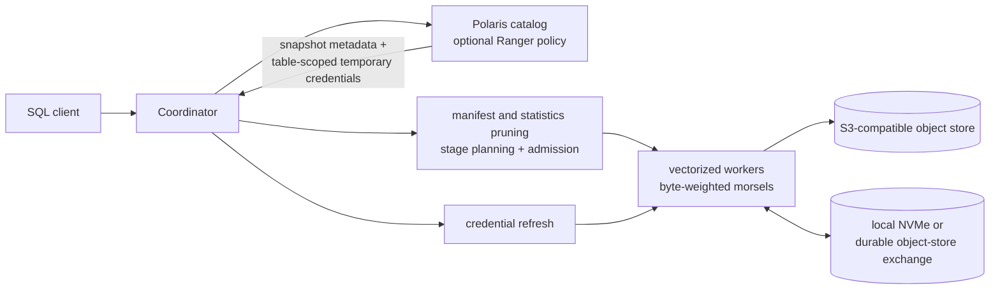

# Iceberg at multi-terabyte scale: engine research and SQE recommendations

**Date:** 2026-07-25  
**Scope:** SQE, Apache Iceberg, Apache Polaris, optional Apache Ranger, S3-compatible object storage  
**Target:** SF100 qualification followed by reliable multi-terabyte analytical queries

## Executive decision

The best direction is **not to replace SQE with DuckDB or copy Trino wholesale**.
Keep the current DataFusion-based engine and combine the strongest proven ideas
from several systems:

- use **Iceberg** for snapshot isolation, metadata pruning, partition evolution,
  file statistics, and safe object-store commits;
- use **DuckDB** as the reference for vectorized single-node pipelines, Parquet
  pushdown, row-group parallelism, and excellent local execution;
- use **Trino** as the reference for distributed stages, fine-grained splits,
  dynamic filtering, resource groups, durable exchange, and task retry;
- use **Velox** as the reference for proactive operator spill, adaptive scan
  behavior, and dynamic-filter propagation;
- use **morsel-driven scheduling** for byte-weighted, work-stealing scan units;
- require **Polaris-vended, table-scoped credentials** for every production read
  and write;
- use **Ranger as an optional policy decision layer**, not as a substitute for
  storage-path enforcement.

SQE already has a strong foundation: Iceberg-aware planning, vectorized
DataFusion execution, distributed workers, runtime filters, signed work
tickets, spill-aware local operators, and per-session catalog identities. The
main multi-TB gaps are distributed exchange durability, byte-based
backpressure, adaptive join and scan scheduling, end-to-end credential vending,
and evidence from genuinely separate hosts.

The recommended architecture is:



For SF100 and multi-TB work, the immediate priority is:

1. make storage access fail-closed on vended credentials;
2. replace batch-count shuffle limits with byte accounting and spill;
3. introduce durable exchange and task retry for long jobs;
4. make scan and join decisions adaptive to bytes, skew, and live pressure;
5. qualify the system at SF100 on separate machines before claiming scale-out.

## What the researched systems teach us

### Comparison

| System | What it does especially well | What SQE should adopt | Why it is not the complete answer |
|---|---|---|---|
| Apache Iceberg | Snapshot metadata, manifest/file pruning, partition evolution, optimistic commits | Treat metadata and layout as the first query-optimization layer | It is a table format, not a distributed execution engine |
| DuckDB | Very efficient vectorized execution, Parquet pushdown, local spill, simple operation | Dense Arrow batches, row-group parallelism, pushdown, fast embedded/local mode | Primarily single-process; its Iceberg integration and fault model do not replace a multi-node serving engine |
| Trino | Distributed stages and splits, dynamic filtering, resource management, task-retry FTE | Split scheduling, coordinator-side dynamic pruning, durable exchange, task retry, scan limits | JVM operational footprint and connector model are different; adopting the ideas does not require adopting Trino |
| DataFusion | Native Arrow pipelines, extensible physical plans, Parquet pruning, increasingly broad spill support | Remain on DataFusion and contribute missing spill/adaptive behavior upstream where practical | Some blocking operators and distributed concerns still need SQE-owned safeguards |
| Velox | Adaptive execution, proactive spilling, efficient filters and scans | Spill before allocation failure, filter reordering, asynchronous spill I/O | It is an execution library rather than the complete catalog/control plane |
| StarRocks / ClickHouse | High-performance lake reads, caching, data skipping, native execution | Evaluate caching and pre-aggregation only from measured workload needs | Adding another database would duplicate governance and execution surfaces |

### DuckDB: the local execution reference

DuckDB is a useful performance reference for SQE's coordinator-local and worker
pipelines:

- its execution model is vectorized rather than tuple-at-a-time;
- Parquet projection and filter pushdown avoid decoding unused data;
- Parquet parallelism is created at the row-group level, so a file needs enough
  row groups to use the available CPU threads;
- its guidance favors moderately sized Parquet files rather than huge single
  files or floods of tiny files;
- it can spill larger-than-memory work to a configured temporary directory.

The important lesson is not “run all multi-TB queries in DuckDB.” It is:
**each SQE worker should look like an excellent embedded vectorized engine, while
the SQE control plane supplies the distributed reliability that DuckDB does not
target.**

DuckDB's Data Chunk Compaction work also demonstrates that vectorized execution
can still degrade when joins produce many sparse, tiny batches. SQE should
measure batch density after filters and joins and compact underfilled batches
before network exchange or expensive downstream operators.

### Trino: the distributed execution reference

Trino is the strongest directly relevant model for multi-TB distributed SQL:

- a query is divided into stages, tasks, and fine-grained splits;
- dynamic filters are applied both to worker scans and to coordinator split
  enumeration, avoiding files and partitions before they are scheduled;
- fault-tolerant execution persists intermediate exchange data, allowing tasks
  to be retried without rerunning every upstream stage;
- resource groups, scan limits, memory controls, and low-memory policies protect
  the cluster under concurrency;
- Iceberg maintenance procedures compact files and manifests and remove expired
  metadata.

Trino's current task-retry defaults are not magic SQE constants, but they give
useful starting scales: roughly 64 MiB task inputs, bounded task memory, and
exchange files much larger than transport pages. SQE should tune these values
from its own Arrow batch sizes, network, NVMe, and object-store latency.

The main lesson is: **a long analytical query must be a restartable graph of
bounded tasks, not one fragile in-memory stream.**

### DataFusion and Velox: execution mechanics

DataFusion already gives SQE Arrow-native, streaming, pull-based execution and
Parquet row-group/page pruning. Retaining it avoids throwing away SQE's current
Iceberg and distributed work.

Velox adds two particularly valuable design lessons:

1. spill should be triggered proactively from operator and query memory
   pressure, not only after an allocation is about to fail;
2. scans should adapt prefetch, filter order, and dynamic filters to the observed
   data and workload.

For joins, aggregation, sort, and exchange, spill files need explicit
partitioning, checksums, lifecycle ownership, asynchronous I/O, and metrics.
“The operator supports spill” is not sufficient unless the complete distributed
pipeline is bounded.

### Morsel-driven scheduling: the scan unit

The morsel-driven parallelism research uses small work units and runtime work
stealing to keep CPUs busy and adapt parallelism without rebuilding the plan.
That maps naturally to Iceberg:

- plan files and row groups centrally;
- emit byte-weighted scan morsels, initially around 64–128 MiB;
- allow workers to pull or steal more work;
- reduce concurrency when memory, spill, or outbound network pressure rises;
- avoid assigning one enormous file or one static file list to a worker for the
  lifetime of a stage.

The unit must be based on estimated compressed and decoded bytes, not only file
count or Arrow batch count.

## Recommended Iceberg table design

The largest performance wins usually come from reading less data. Execution
tuning cannot compensate for a table that has millions of tiny files, poor
clustering, or unusable statistics.

### File and row-group targets

Start with:

| Setting | Starting point | Reason |
|---|---:|---|
| Data file target | 256–512 MiB | Iceberg defaults to 512 MiB; large enough to control metadata without creating multi-GB scheduling units |
| Parquet row group | 64–128 MiB | Supplies useful pruning and CPU parallelism inside each file |
| Scan morsel | 64–128 MiB estimated compressed input | Small enough for work stealing; large enough to amortize scheduling |
| Parquet page | about 1 MiB initially | Compatible with the Iceberg default; tune only with evidence |
| Compression | Zstandard | Good analytical storage reduction; measure CPU trade-off on the target hardware |
| Delete file target | about 64 MiB | Matches the Iceberg starting default and avoids excessive delete-file metadata |
| Manifest target | about 8 MiB | Matches Iceberg's default and keeps planning metadata manageable |

These are starting points, not universal constants. Benchmark with the actual
object store because StorageGRID, AWS S3, RustFS, and local NVMe have different
latency, bandwidth, and request behavior.

Avoid both extremes:

- tiny files increase object requests, manifest size, planning work, and open
  cost;
- multi-gigabyte row groups reduce parallelism, increase retry cost, and make
  memory estimates coarse.

### Partitioning

Use hidden Iceberg transforms on columns that are frequently selective:

- `day(ts)` or `month(ts)` for time-oriented retention and range filtering;
- `bucket(N, id)` for high-cardinality identifiers when equality filters or
  distribution benefit;
- identity partitioning only for stable, low-cardinality dimensions.

Do not partition by a high-cardinality raw identifier and do not encode business
partition paths in query logic. Iceberg partition evolution should allow layout
changes without rewriting old SQL.

Keep partition counts moderate. If a partition typically receives only a few
megabytes, it is too fine. If common predicates still scan terabytes from one
partition, it may be too coarse or require an additional transform.

### Sort and clustering

Within partitions, range-sort or cluster by:

1. the most valuable selective range/equality columns;
2. frequent join keys when doing so also improves filtering or distribution;
3. event time for append-heavy time-series tables where range scans dominate.

Iceberg stores file-level lower and upper bounds. Clustering makes those bounds
selective; Iceberg documentation reports order-of-magnitude improvements in
appropriate cases. Z-ordering may help mixed predicates, but it should be
enabled only when benchmarked against a simpler sort order because it adds write
and maintenance cost.

### Statistics

Keep useful Iceberg metrics for filter and join columns:

- lower and upper bounds;
- null and value counts;
- approximate distinct counts and histograms where the engine can use Puffin
  statistics;
- full or sufficiently long truncated bounds for important identifiers.

Use Parquet Bloom filters selectively for high-cardinality equality predicates.
They consume space and CPU and are not a replacement for partitioning,
clustering, or file statistics.

### Maintenance

Run maintenance from observed table health rather than an arbitrary daily job:

- compact small data files;
- compact position/equality delete files and rewrite data files when delete
  density becomes expensive;
- rewrite manifests when manifest counts or planning latency grow;
- expire snapshots according to time-travel and recovery requirements;
- remove orphan files only after a safety interval longer than the maximum
  write/commit duration;
- refresh extended statistics after material layout changes.

Expose per-table health metrics: file count, median and p95 file size, delete
ratio, manifest count, snapshots retained, planning time, files selected, row
groups selected, and bytes read versus table bytes.

## Recommended planning and execution architecture

### Snapshot-pinned planning

For each query:

1. resolve authorization and load the table through Polaris;
2. pin one Iceberg snapshot ID for the query;
3. obtain table-scoped credentials for the required access mode;
4. prune manifests, data files, and delete files from Iceberg metadata;
5. split selected files into byte-weighted row-group morsels;
6. stream tasks to workers rather than materializing an unbounded task list.

Metadata caches must include at least catalog/warehouse, table UUID or location,
snapshot ID, and authorization scope. Never allow a metadata or credential cache
entry created for one principal to leak credentials or authorization decisions
to another.

### Multi-level pruning

Apply filters at every safe level:

1. Iceberg partition transforms;
2. manifest partition summaries;
3. file metrics;
4. Parquet row-group statistics;
5. page indexes and Bloom filters when present;
6. vectorized predicate evaluation after decoding.

Projection pushdown and late materialization should decode filter/join columns
first and fetch wide payload columns only for surviving rows. The query profile
must show effectiveness at every level, otherwise “pushdown enabled” cannot be
distinguished from actual pruning.

### Dynamic filters

When a join build side is small enough:

- construct exact-value, range, or Bloom dynamic filters;
- send them to workers for row-group/page/vector filtering;
- send them to the coordinator so unscheduled Iceberg files and morsels can be
  removed;
- stop waiting after a bounded time so an unavailable filter cannot stall the
  query.

Dynamic filters must be snapshot- and query-scoped, size-bounded, and safe under
null semantics. The engine should report rows/files skipped and filter arrival
time.

### Adaptive joins

Use observed build-side bytes, not only catalog estimates:

- broadcast only when the materialized build side fits comfortably within a
  per-query budget on every receiving worker;
- use partitioned hash/Grace hash join for larger equi-joins;
- use spillable sort-merge when ordering or memory pressure makes it preferable;
- detect heavy hitters and split or replicate skewed keys separately;
- revise the strategy at a stage boundary when observations substantially
  contradict estimates.

A fixed “broadcast below N rows” rule will work at SF10 and fail unpredictably
at SF100 because row width, encoded size, skew, and concurrency matter.

### Byte-based backpressure

Every queue and transport must be byte-accounted:

- decoded Arrow bytes;
- serialized Flight/exchange bytes;
- queued and in-flight bytes;
- spill bytes and pending spill I/O;
- per-query and per-worker totals.

Producers receive byte credits from consumers. When a worker's outbound queue,
memory pressure, or spill backlog rises, scan concurrency must fall. A channel
limited to 64 record batches is not bounded in memory because record batches
have widely different sizes.

### Spillable exchange and fault-tolerant mode

Provide two execution modes:

| Mode | Exchange | Intended workload |
|---|---|---|
| Interactive | Memory plus local NVMe spill | Short queries where low latency matters and full-stage retry is acceptable |
| Resilient | Durable object-store exchange with local cache | Multi-minute/hour, multi-TB jobs where worker loss must not restart the query |

For resilient execution:

- exchange output is partitioned into immutable, checksummed segments;
- a task attempt publishes a manifest atomically;
- downstream tasks consume only committed attempt output;
- retry uses a new attempt ID and garbage-collects losing attempts;
- lifecycle rules delete abandoned exchange objects;
- credentials for exchange storage are separate from table credentials.

This is the key Trino FTE lesson. Local operator spill protects memory; durable
exchange protects completed distributed work.

### Admission and fairness

Admission should consider:

- estimated scan and decoded bytes;
- expected exchange bytes;
- build-side memory;
- number of spillable and non-spillable operators;
- expected worker slots;
- user or workload-class limits.

Add resource groups for interactive, batch, maintenance, and ingestion work.
Enforce per-query scan-byte, wall-time, memory, spill, and exchange limits.
Reserve capacity for control traffic, credential refresh, and cleanup so a
saturated data plane remains operable.

## Polaris-vended credentials: production design

### Required security invariant

In multi-tenant production:

> If Polaris does not return valid table-scoped credentials, SQE must fail the
> operation before accessing object storage.

There must be no automatic fallback from vended credentials to the shared
`[storage]` key. Ranger can authorize the catalog operation, but a broad static
S3 key would still allow a compromised or defective worker to bypass that
decision on the data path.

Use an explicit mode:

```toml
[catalog.credentials]
mode = "require_vended" # production
refresh_skew_seconds = 300
```

Other explicit modes may exist for local development, such as `static_test`, but
production validation must reject them in multi-tenant deployments.

### Credential lifecycle

SQE should:

1. send `X-Iceberg-Access-Delegation: vended-credentials` on table operations;
2. parse access key, secret, session token, expiry, endpoint, region, and
   path-style properties returned by the catalog;
3. cache by principal/session, catalog, table identity/location, and access mode;
4. refresh with single-flight behavior before expiry;
5. deliver only table-scoped storage credentials to a worker, never the Polaris
   bearer token;
6. refresh credentials during long scans without restarting completed work;
7. redact credentials and signed URLs from logs, traces, query profiles, panic
   output, and audit payloads;
8. zeroize or promptly drop superseded secret material;
9. deny cross-table and write access when the operation requested only read.

Pin Polaris to **1.4.1 or newer**, preferably the qualified current release.
[CVE-2026-42810](https://polaris.apache.org/community/security-advisories/cve-2026-42810/)
allowed wildcard injection in AWS S3 vended-credential policies in older
versions and could permit cross-table access. As defense in depth, SQE should
also reject wildcard table/namespace identifiers where they are not valid
literal identifiers.

### RustFS test limitation

RustFS is still useful for fast S3 compatibility, Iceberg correctness, and
performance tests. It is **not evidence that credential vending is secure** if
it cannot provide and enforce STS session policies.

Keep the RustFS quickstart, but configure and label it explicitly:

```text
RustFS lane
  stsUnavailable = true
  explicit local-only static credentials
  proves S3/Iceberg behavior
  does not pass the credential-vending security gate
```

Never use Polaris
`SKIP_CREDENTIAL_SUBSCOPING_INDIRECTION` as a production workaround. Polaris
documents it as a development/test bypass that can hand ambient server
credentials to clients.

### Test pyramid

#### 1. Unit and catalog-contract tests

No real STS service is required. A fake Polaris REST service returns:

- temporary access key, secret, and session token;
- expiry timestamp;
- endpoint and path-style configuration;
- a refresh endpoint or a second LoadTable response.

A strict fake object store should accept only the returned token and permitted
table prefix. Tests must prove:

- reads use the vended token rather than configured static credentials;
- missing credentials fail closed in `require_vended` mode;
- read-only credentials are not used for writes;
- table A credentials cannot enter a table B scan task;
- user A and user B cache entries are isolated;
- one refresh occurs under concurrent expiry;
- long-running tasks receive refreshed credentials;
- secrets do not appear in logs or query profiles.

This lane is deterministic and should run on every change.

#### 2. Credential-flow integration test

A lightweight STS emulator may prove that Polaris returns a session token and
SQE consumes it. If the emulator does not enforce inline session policy, this is
only a **flow** test. The existing design note proposes rustack for this purpose.
It must not be described as authorization enforcement.

#### 3. Mandatory enforcement integration test

Run Polaris with an object store that actually enforces `AssumeRole` session
policies:

- MinIO using the official Polaris S3/STS integration, if acceptable to the
  project;
- Ceph RGW, as already proposed in the repository design note;
- or a real AWS/StorageGRID sandbox for release qualification.

Test the negative cases, not only successful reads:

| Test | Expected result |
|---|---|
| Read allowed table | Success |
| Write with read-only credential | Access denied by object store |
| Read sibling table prefix | Access denied by object store |
| Use expired session token | Access denied, followed by controlled refresh |
| Worker starts with shared static key removed | Query still succeeds with vending |
| Polaris omits credentials in production mode | Query fails before S3 request |
| Malicious wildcard identifier | Rejected and never included in policy |

An emulator that accepts any access key or ignores the session token cannot
satisfy this gate.

## Optional Ranger architecture

The clean authorization chain is:

```text
identity
  -> Ranger/Polaris policy decision for catalog operation
  -> Polaris vends least-privilege temporary storage credentials
  -> object store enforces the table prefix and read/write action
  -> SQE audit correlates query, policy decision, credential scope, and snapshot
```

Ranger should make policy administration easier, but authorization must remain
correct when:

- a user's groups change;
- a policy is revoked during cache lifetime;
- namespaces contain multiple levels;
- a table is renamed or moved;
- a long query refreshes credentials;
- multiple coordinators evaluate policies concurrently.

Do not put secrets or full session policies into the audit trail. Record stable
identifiers: query ID, principal, groups/roles, catalog operation, table UUID,
snapshot ID, policy decision ID, credential scope hash, and expiry.

## Code-specific findings for SQE

These recommendations reinforce the detailed
[production-readiness review](../reviews/2026-07-25-production-readiness-review.md):

1. [`crates/sqe-worker/src/shuffle.rs`](../../../crates/sqe-worker/src/shuffle.rs)
   bounds partition queues by record-batch count and has no durable spill/reload
   lifecycle. This is the largest execution blocker for multi-TB joins and
   aggregates.
2. The worker already has local spill and credential-refresh building blocks,
   but the entire scan-to-Flight-to-shuffle path is not byte-bounded.
3. [`crates/sqe-coordinator/src/query_handler.rs`](../../../crates/sqe-coordinator/src/query_handler.rs)
   currently constructs read scan tasks from shared storage configuration rather
   than consistently propagating table-vended credentials.
4. [`crates/sqe-worker/src/executor.rs`](../../../crates/sqe-worker/src/executor.rs)
   already understands session tokens and credential refresh, so the read-path
   gap is primarily coordinator extraction, scoped caching, fail-closed
   validation, and refresh wiring.
5. [`docs/site/book/src/design-notes/s3vending.md`](../../site/book/src/design-notes/s3vending.md)
   correctly separates flow testing from real session-policy enforcement. The
   production-mode invariant and release gate should now be made executable.
6. Existing scan/runtime-filter/late-materialization work is aligned with the
   researched engines. The next step is to prove pruning and decoded-byte
   reduction in profiles at SF100, not add more unmeasured switches.

## Prioritized implementation roadmap

### P0 — Required before production multi-tenant use

1. Implement read-path Polaris credential vending and `require_vended`.
2. Remove shared static storage credentials from production worker pods.
3. Add expiry-aware, principal/table/access-mode-scoped caching and refresh.
4. Add the STS enforcement integration lane and negative access tests.
5. Pin a non-vulnerable Polaris release and add version/config startup checks.
6. Make shuffle queues byte-bounded and propagate backpressure to scans.
7. Add spillable partitioned shuffle with cleanup and corruption tests.

### P1 — Required for credible SF100 qualification

1. Run coordinator and workers on separate hosts/pods.
2. Implement byte-weighted morsels and adaptive scan concurrency.
3. Propagate dynamic filters to both unscheduled splits and active scans.
4. Add adaptive broadcast/partitioned/spillable join selection.
5. Add stage, task, shuffle, spill, skew, and pruning profiles.
6. Benchmark SF10 and SF100 under concurrency, not only single-query runs.
7. Test worker loss, object-store throttling, catalog latency, and credential
   expiry during a query.

### P2 — Required for reliable multi-hour, multi-TB jobs

1. Add durable object-store exchange and task-attempt manifests.
2. Retry failed tasks without recomputing successful upstream stages.
3. Add resource groups and batch-versus-interactive workload isolation.
4. Add skew-aware repartitioning and heavy-hitter handling.
5. Add automated Iceberg table-health maintenance driven by metrics.
6. Design coordinator recovery or HA around persisted query/stage state.

## Qualification matrix and acceptance gates

Run at least TPC-H and TPC-DS at SF10 and SF100, plus purpose-built stress
queries. SF100 is a qualification milestone, not the final scale model.

| Dimension | Required coverage |
|---|---|
| Cluster | 1 coordinator; 1, 2, 4, and 8 separate workers |
| Storage | production-like S3 endpoint and latency; RustFS only as a comparison |
| Layout | healthy 256–512 MiB files; small-file stress; delete-heavy table; skewed partitions |
| Queries | scan, broadcast join, repartition join, high-cardinality aggregate, global sort, DML, compaction |
| Concurrency | 1, 4, 8, and overload/admission cases |
| Failures | worker kill, coordinator restart experiment, S3 throttling, slow worker, full spill disk, expired credential |
| Security | cross-user, cross-table, read-versus-write, cache isolation, policy revocation |

Record:

- wall time and throughput;
- CPU, RSS, tracked memory, and OOM events;
- planned/read/decoded/returned bytes;
- manifests, files, row groups, and pages selected;
- exchange, spill, and retry bytes;
- task skew and straggler time;
- object-store request count, latency, throttles, and retries;
- credential vending and refresh latency;
- policy decision and cache behavior.

Release gates:

- no query is killed by memory pressure within the documented resource limits;
- exchange volume at least 5–10 times aggregate worker RAM completes through
  spill or durable exchange;
- killing one worker in resilient mode completes through task retry;
- queue memory remains within byte budgets for wide and highly selective data;
- a multi-hour simulated query refreshes credentials without shared-key access;
- object-store enforcement denies sibling-table and read-to-write escalation;
- adding workers produces documented scale-out on the targeted scan and
  repartition workloads;
- no orphan spill, exchange, or data files remain after success, failure, or
  cancellation.

## What not to do

- Do not treat SF10 success as evidence for SF100 or multi-TB reliability.
- Do not make “64 batches” the memory-safety boundary.
- Do not depend on shared S3 credentials after Ranger/Polaris authorization.
- Do not let RustFS or a permissive STS emulator certify authorization
  enforcement.
- Do not broadcast from row-count estimates without materialized-byte limits.
- Do not create one partition per high-cardinality value.
- Do not solve small files only by raising file sizes into multi-gigabyte scan
  units.
- Do not enable every statistics index or Bloom filter without measuring its
  pruning value and maintenance cost.
- Do not build a second execution engine beside DataFusion unless a measured,
  persistent limitation justifies the operational complexity.

## Sources

### Apache Iceberg

- [Performance: metadata and file pruning](https://iceberg.apache.org/docs/latest/performance/)
- [Configuration: read, write, file, manifest, and metrics defaults](https://iceberg.apache.org/docs/latest/configuration/)
- [Partitioning and partition evolution](https://iceberg.apache.org/docs/latest/partitioning/)
- [Table specification, including sort orders](https://iceberg.apache.org/spec/)
- [Reliability and optimistic concurrency](https://iceberg.apache.org/docs/nightly/reliability/)

### Trino and Presto

- [Trino Iceberg connector](https://trino.io/docs/current/connector/iceberg.html)
- [Dynamic filtering](https://trino.io/docs/current/admin/dynamic-filtering.html)
- [Fault-tolerant execution](https://trino.io/docs/current/admin/fault-tolerant-execution.html)
- [Spill behavior](https://trino.io/docs/current/admin/spill.html)
- [Query-management properties](https://trino.io/docs/current/admin/properties-query-management.html)
- [Presto distributed SQL paper](https://trino.io/paper.html)

### DuckDB

- [Iceberg extension](https://duckdb.org/docs/current/core_extensions/iceberg/overview)
- [File-format performance and Parquet row groups](https://duckdb.org/docs/current/guides/performance/file_formats)
- [Larger-than-memory workloads](https://duckdb.org/docs/lts/guides/performance/environment)
- [Parquet projection and filter pushdown](https://duckdb.org/docs/stable/data/parquet/overview)
- [Vectorized execution](https://duckdb.org/docs/lts/internals/vector)
- [Data Chunk Compaction, SIGMOD 2025](https://duckdb.org/library/data-chunk-compaction/)

### DataFusion, Velox, and scheduling research

- [DataFusion Arrow execution model](https://datafusion.apache.org/user-guide/arrow-introduction.html)
- [DataFusion efficient Parquet filter pushdown](https://datafusion.apache.org/blog/2025/03/21/parquet-pushdown/)
- [DataFusion feature and spill support](https://datafusion.apache.org/user-guide/features.html)
- [DataFusion SIGMOD 2024 paper](https://github.com/apache/arrow-datafusion/files/14586286/DataFusion_Query_Engine___SIGMOD_2024.8.pdf)
- [Velox execution-engine overview](https://engineering.fb.com/2023/03/09/open-source/velox-open-source-execution-engine/)
- [Velox VLDB paper](https://vldb.org/pvldb/vol15/p3372-pedreira.pdf)
- [Velox spilling design](https://facebookincubator.github.io/velox/develop/spilling.html)
- [Morsel-Driven Parallelism, SIGMOD 2014](https://www-db.in.tum.de/~leis/papers/morsels.pdf)

### Apache Polaris and credential vending

- [Polaris vended credentials](https://polaris.apache.org/in-dev/unreleased/vended-credentials/)
- [Polaris 1.6.0 release](https://polaris.apache.org/releases/1.6.0/)
- [Polaris S3/MinIO catalog and STS setup](https://polaris.apache.org/in-dev/unreleased/getting-started/creating-a-catalog/s3/catalog-minio/)
- [Polaris STS-unavailable object-store setup](https://polaris.apache.org/releases/1.5.0/getting-started/creating-a-catalog/s3/catalog-ozone/)
- [Polaris configuration reference](https://polaris.apache.org/releases/1.5.0/configuration/configuration-reference/)
- [CVE-2026-42810: wildcard injection in vended AWS S3 credentials](https://polaris.apache.org/community/security-advisories/cve-2026-42810/)

## Bottom line

For a fast, reliable, secure Iceberg SQL service, optimize in this order:

1. **skip data** with good Iceberg layout, statistics, and dynamic filters;
2. **bound data** with byte-based morsels, queues, memory budgets, and admission;
3. **spill data** across every blocking and exchange boundary;
4. **retry work** from durable stage outputs;
5. **scope access** with mandatory Polaris-vended credentials enforced by the
   object store;
6. **prove it** on separate hosts at SF100, under concurrency and injected
   failures.

That path preserves SQE's strong current architecture while addressing the
specific failure modes that appear when queries move from SF10 to hundreds of
gigabytes and then multiple terabytes.
