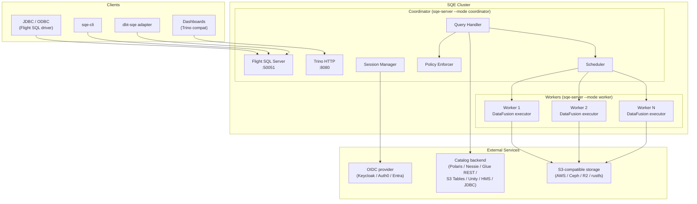
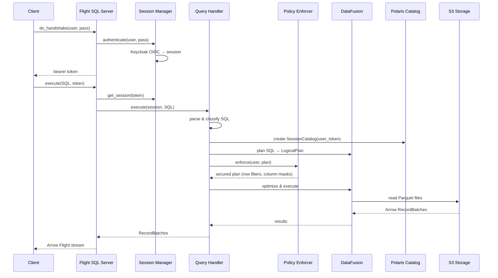
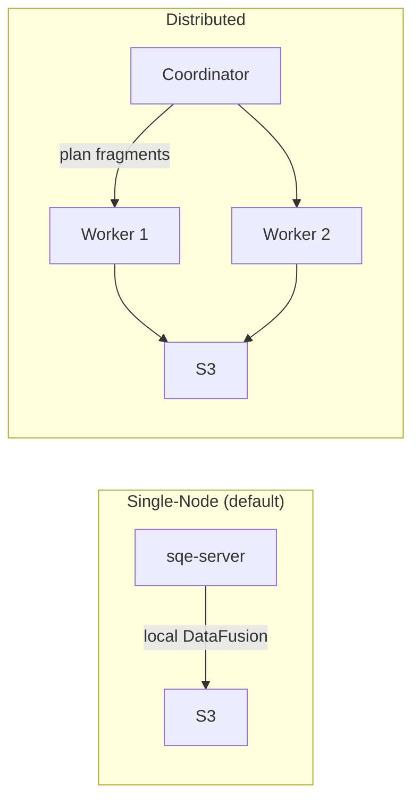
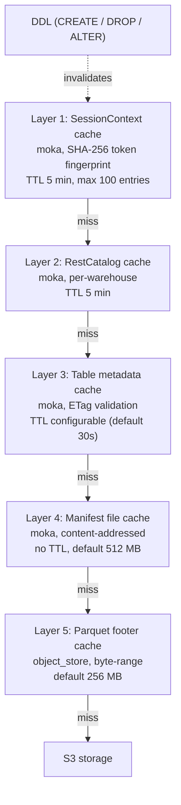

# System Overview

## Components

The catalog backend is selectable at runtime. Polaris is the primary target and the only one verified end-to-end for production write paths today. Nessie, AWS Glue, AWS S3 Tables, Unity Catalog OSS, Hive Metastore, JDBC (Postgres), and Hadoop storage-only are all reachable through the same `iceberg::Catalog` trait, with live integration tests in `crates/sqe-catalog/tests/backends_integration.rs`. AWS endpoints share the OSS Iceberg REST code path through the `aws-sigv4` cargo feature on the vendored `iceberg-catalog-rest` crate. See [features/iceberg.md](../features/iceberg.md) for the catalog-by-catalog state.

The coordinator currently runs as a single replica. It is a single point of failure: a restart drops in-flight queries and session state, which is process-local. Workers are stateless and scale horizontally. Coordinator high availability is on the roadmap. See [Kubernetes & Helm](../deployment/kubernetes.md) for the deployment topology.

## Request Flow

A query flows through SQE in these stages:

## Single-Node vs Distributed

SQE starts in **single-node mode** by default. The coordinator executes queries locally using DataFusion. No workers needed.

For larger deployments, enable workers:

| Mode | When to use | Config |
|---|---|---|
| Single-node | Dev, small datasets, < 100GB | `sqe-server` (default) |
| Distributed | Production, large scans, parallel I/O | `worker.enabled=true` in Helm |

## Ports

| Port | Protocol | Purpose |
|---|---|---|
| 50051 | gRPC (Flight SQL) | Primary query interface |
| 50052 | gRPC (Flight) | Worker data exchange |
| 8080 | HTTP | Trino-compatible endpoint |
| 9090 | HTTP | Prometheus metrics |
| 9091 | HTTP | Health probes (`/healthz`, `/readyz`) |

## Caching

SQE caches at five layers, each falling through to the next on a miss. The first two layers (session and catalog) live in memory and are short-lived; the last three (table metadata, manifest, footer) hold immutable or near-immutable Iceberg data.

Invalidation follows the Iceberg data model:

- The session cache is invalidated after any DDL statement (CREATE TABLE, DROP TABLE, ALTER TABLE).
- Table metadata uses ETag-based conditional requests. Polaris returns `304 Not Modified` when metadata has not changed, so a cache hit costs one cheap round-trip rather than a full metadata fetch.
- Manifest files are immutable by Iceberg specification, so they need no TTL-based expiry. They evict only under memory pressure.
- The footer cache evicts on an LRU basis within its configured memory budget.
