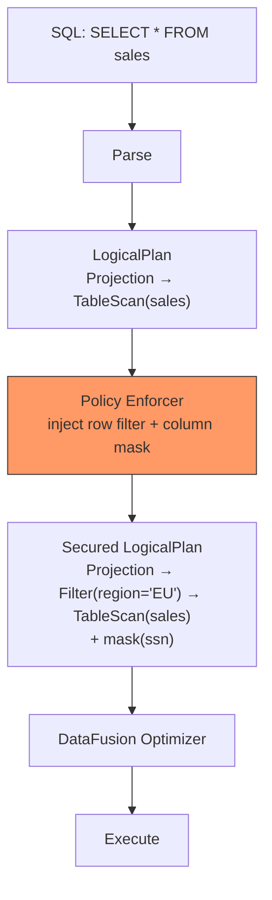

# Security & Policy

SQE enforces fine-grained security through **LogicalPlan rewriting**, injecting row filters and column masks into the query plan before DataFusion's optimizer runs.

> **Status:** The policy enforcement framework is designed and stubbed (Phase 5). Currently, a `PassthroughEnforcer` is active, which returns plans unmodified.

## Design Principle

Security enforcement happens at the **logical plan level**, not at the data level:



This approach means:
- **Row filters** are transparent. The user doesn't know they exist
- **Column masks** block predicate pushdown on raw values. You can't `WHERE ssn = '123-45-6789'` to probe masked data
- **Denied columns** are invisible. They don't appear in `SELECT *`, not as errors
- **The optimizer can push user predicates through row filters** but not through column masks

## Policy Enforcer Trait

```rust
#[async_trait]
pub trait PolicyEnforcer: Send + Sync {
    async fn evaluate(
        &self,
        user: &SessionUser,
        plan: LogicalPlan,
    ) -> Result<LogicalPlan>;
}
```

Implementations:
- **PassthroughEnforcer**: returns plan unchanged (current default)
- **OPA Enforcer**: queries Open Policy Agent for policies (planned)
- **Cedar Enforcer**: evaluates AWS Cedar policies locally (planned)

## Planned SQL Extensions

```sql
-- Grant row filter
GRANT SELECT ON sales TO ROLE analyst
  ROWS WHERE region = 'EU';

-- Grant column mask
GRANT SELECT ON customers TO ROLE support
  MASKED WITH (ssn AS '***-**-' || RIGHT(ssn, 4));

-- View effective policies
SHOW EFFECTIVE POLICY ON sales FOR ROLE analyst;

-- View grants
SHOW GRANTS ON sales;
```

## No Information Leakage

Following the **PostgreSQL RLS model**:

| Scenario | Behavior |
|---|---|
| User queries a denied column | Column is invisible in `SELECT *`, error on explicit reference |
| User queries filtered rows | Rows silently excluded, no indication they exist |
| User applies predicate on masked column | Predicate evaluated on masked value, not raw value |
| User runs `EXPLAIN` | Shows secured plan (filters visible, mask functions visible) |
| User runs `SHOW TABLES` | Only shows tables the user has access to (Polaris enforced) |

## Runtime Security Controls

SQE includes several runtime security mechanisms that are active by default or can be enabled via configuration.

### Rate Limiting

Throttles query submission to prevent abuse or runaway clients. Uses a token-bucket algorithm (via the `governor` crate).

```toml
[rate_limit]
enabled = true
per_user_queries_per_minute = 60
global_queries_per_minute = 1000
```

When a limit is exceeded, the client receives a `RESOURCE_EXHAUSTED` Flight error. Rate limiting is disabled by default.

### Query Timeouts

Every query is subject to an execution timeout. If the query exceeds the limit, it is cancelled and the client receives an error.

```toml
[query]
timeout_secs = 300              # Default: 5 minutes

[query.role_overrides]
admin = 3600                    # Admins get 1 hour
analyst = 600                   # Analysts get 10 minutes
```

Role overrides allow different timeout limits per role. The user's longest-matching role timeout wins.

### Session Lifecycle

Sessions have both idle and absolute timeouts. A background sweeper runs every 60 seconds to clean up expired sessions.

```toml
[session]
idle_timeout_secs = 900         # 15 min idle timeout
absolute_timeout_secs = 28800   # 8 hour hard cap
```

- **Idle timeout**: sessions with no query activity for this long are expired
- **Absolute timeout**: sessions older than this are expired regardless of activity

### Query Cancellation

SQE supports Arrow Flight's native cancellation mechanism. When a client cancels a query (or disconnects), the `CancellationToken` is triggered and propagated to workers, stopping execution promptly.

### Error Sanitization

In production mode (`debug = false`, the default), error messages returned to clients are sanitized:
- Internal details (stack traces, file paths, internal error types) are stripped
- Clients receive a short error message and a request ID for correlation
- Full details are logged server-side for debugging

Enable `debug = true` during development to see full error details:

```toml
[coordinator]
debug = true
```

### TLS Encryption

Flight SQL connections can be encrypted with TLS. Optional mTLS adds client certificate verification.

```toml
[coordinator.tls]
cert_file = "/etc/sqe/server.crt"
key_file  = "/etc/sqe/server.key"
ca_file   = "/etc/sqe/ca.crt"    # Optional: mTLS
```

See [Configuration](../deployment/configuration.md#tls) for details.
