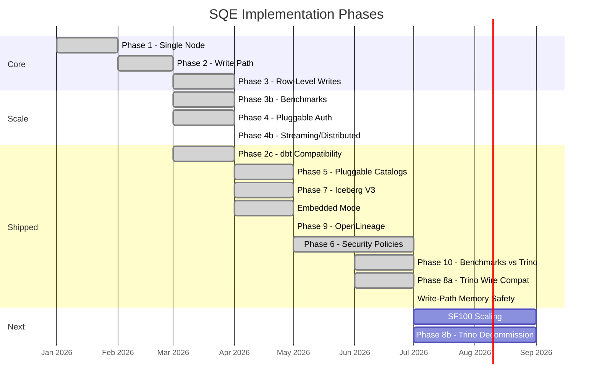
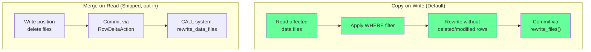
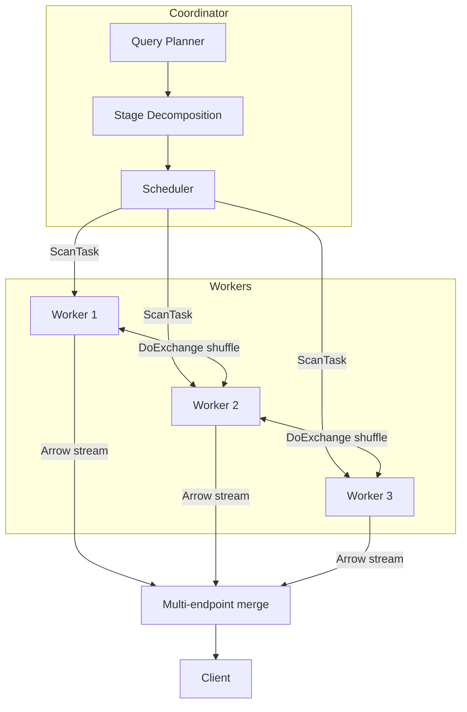

# Roadmap

SQE is developed in phases, each building on the previous. Last swept: 2026-07-05.

## Phase Overview

---

## Phase 1 - Single-Node Engine (Done)

The foundation: a working SQL engine that queries Iceberg tables through Polaris with Keycloak auth.

- DataFusion query execution
- Keycloak OIDC authentication (ROPC grant)
- Per-session catalog with bearer token passthrough
- Arrow Flight SQL server
- CLI client (`sqe-cli`)
- `SELECT`, `SHOW CATALOGS/SCHEMAS/TABLES`, `EXPLAIN`
- Prometheus metrics + structured JSON logging

## Phase 2 - Write Path & Views (Done)

SQL write operations and catalog DDL.

- `CREATE TABLE AS SELECT`
- `CREATE OR REPLACE TABLE`
- `INSERT INTO SELECT`
- `CREATE VIEW` / `DROP VIEW`
- `CREATE SCHEMA` / `DROP SCHEMA`
- `DROP TABLE` / `DROP TABLE IF EXISTS`
- Parquet writer (to S3 via Iceberg)
- Write-path memory safety: pool-tracked write buffers (oversized writes fail with a typed `ResourceExhausted` instead of OOM), streaming Flight `DoPut` ingest, streaming MERGE output and (opt-in) MERGE target reads, and an opt-in `BoundedFanoutWriter` with auto-derived caps for partitioned writes (see [Write Path, Memory Safety](../features/write-path.md#memory-safety))
- Audit logging (JSONL, OCSF): canonical `AuditEvent`, OCSF class mapping, tamper-evident hash chain, GDPR-tag masking, identity enrichment, SIEM export, web operator log
- OpenTelemetry export (OTLP/gRPC)
- Trino-compatible HTTP endpoint

## Phase 2c - dbt Compatibility (Done)

Native dbt support via `dbt-sqe` adapter over ADBC Flight SQL.

- `information_schema` virtual providers (tables, schemata, columns)
- `dbt-sqe` Python adapter (connection manager, materializations)
- `ALTER TABLE RENAME`
- dbt `table`, `view`, and append-only `incremental` materializations
- `incremental` with `merge` strategy (CoW + MoR)
- OAuth profile fields: `client_id`/`client_secret` (service principal) or a pre-fetched bearer `token`, next to the original user/password flow
- Adapter lives at `adapters/dbt-sqe/dbt/`

---

## Phase 3 - Row-Level Writes (Done)

DELETE FROM, UPDATE, and MERGE INTO are implemented via Copy-on-Write using the iceberg-rust fork vendored at `vendor/iceberg-rust/` (DataFusion 54 rebase of `risingwavelabs/iceberg-rust`), which provides `rewrite_files()` transaction support.

### Strategy: Copy-on-Write

CoW rewrites affected data files entirely, and is partition-aware: only the partitions a WHERE clause touches are rewritten. MoR has shipped: set `TBLPROPERTIES ('write.delete.mode' = 'merge-on-read')` to opt in. SQE writes a position-delete file (no PK) or an equality-delete file (with PK) and commits via `FastAppendAction` / `RowDeltaAction`. CoW remains the default for backward compatibility.

### Delivered

- `DELETE FROM table WHERE condition` - removes matching rows; supports cross-table subqueries; DELETE without WHERE = truncate
- `UPDATE table SET col = expr WHERE condition` - modifies matching rows; supports CASE WHEN transformations and cross-table subqueries
- `MERGE INTO target USING source ON condition WHEN MATCHED/NOT MATCHED ...` - full outer join approach with WHEN MATCHED/NOT MATCHED clauses
- All operations atomic via Iceberg snapshot isolation
- Table maintenance procedures: `CALL system.rewrite_data_files`, `expire_snapshots`, `remove_orphan_files`, `rewrite_manifests`
- dbt `incremental` with `merge` strategy
- Integration tests against Polaris + MinIO
- TPC-C write queries (17/17 pass), TPC-E write queries enabled

### Iceberg Dependency

Uses the iceberg-rust fork vendored at `vendor/iceberg-rust/` for `rewrite_files()`. When upstream apache/iceberg-rust ships `OverwriteAction` (tracked in Epic #2186), the dependency can be migrated back to the official crate.

### SQE Changes

| File | Change |
|---|---|
| `Cargo.toml` | Vendored iceberg-rust fork (DataFusion 54 rebase) at `vendor/iceberg-rust/` |
| `crates/sqe-coordinator/src/delete_handler.rs` | DELETE FROM execution via CoW |
| `crates/sqe-coordinator/src/update_handler.rs` | UPDATE execution via CoW |
| `crates/sqe-coordinator/src/merge_handler.rs` | MERGE INTO execution via CoW |
| `crates/sqe-coordinator/src/query_handler.rs` | Routes Merge/Delete/Update to handlers |
| `crates/sqe-coordinator/src/write_handler.rs` | Shared CoW rewrite logic |

---

## Phase 4 - Pluggable Auth (Done)

A provider chain replaced the single hard-wired Keycloak ROPC path. Ten providers ship; several can share one listener.

- `oidc_password` (ROPC): username/password exchanged for a bearer token per session
- `bearer_token`: client-supplied JWT validated against the IdP's JWKS
- `client_credentials_passthrough`: per-connection service principals. The client presents its own `client_id`/`client_secret` as Basic auth; SQE runs the client-credentials grant per connection and forwards the resulting token, so a service principal gets the same per-query identity as a user
- Mixed-auth single listener: opt-in `fallthrough_on_reject` lets ROPC, service-principal, and bearer providers coexist on one endpoint
- The Trino HTTP Basic-auth path routes through the same chain as Flight SQL
- Token caching, session-scoped refresh, catalog token forwarding
- Demo: `quickstart/polaris-ranger-service-principal/`

## Phase 4b/4c - Distributed Execution (Done)

Scale-out query execution with stateless workers. Implemented via streaming execution in two phases.

### Delivered

- **Phase A (spill-to-disk):** memory pool with watermarks (greedy by default, `memory_pool = "fair"` restores FairSpillPool), late materialization, file/page pruning, TopK, S3 I/O pipeline (coalescing, footer cache, prefetch), SortMergeJoin fallback
- **Phase B (distributed):** DoExchange shuffle, distributed sort (range-partition with sampling), two-phase aggregation, distributed joins (broadcast, shuffle hash, pre-sorted merge, predicate transfer), multi-endpoint Flight SQL, stage decomposition
- **Adaptive sort stripping** - memory-aware sort mode selection
- **Metrics** - spill, shuffle, late-mat, pruning, time-to-first-row, S3 I/O, auth, write path

### Benchmark Results (SF1, distributed 2-worker)

| Suite | Pass Rate | Time | Speedup vs single |
|---|---|---|---|
| TPC-H | 22/22 | 13.5s | 2.1x |
| TPC-DS | 98/99 | 36.1s | 2.8x |
| SSB | 13/13 | 5.3s | 2.7x |
| TPC-C | 17/17 | 8.6s | 2.6x |

SF10 numbers, the clean-rig methodology, and the per-shape guidance on when distribution pays live in the README performance sections.

---

## Phase 5 - Pluggable Catalogs (Done)

`CatalogBackend` trait replaced the hard-coded Polaris REST catalog. Eight catalog backends ship today:

| Backend | Status |
|---|---|
| Iceberg REST (Polaris, Lakeformation) | Done - default |
| Unity Catalog OSS (REST-compatible) | Done |
| Snowflake Horizon (REST-compatible) | Done |
| AWS Glue | Done |
| AWS S3 Tables | Done |
| Nessie | Done |
| Hive Metastore (Thrift) | Done |
| JDBC (Postgres, MySQL, SQLite) | Done |

Plus Hadoop storage-only warehouses (no catalog service). Catalogs also mount at runtime via SQL `ATTACH ... (TYPE ..., SECRET ...)`, with credentials managed by `CREATE SECRET`.

Multi-cloud storage via `object_store`: S3 (+ endpoint override for R2, Ceph, Garage, MinIO), Azure ADLS Gen2/Blob, GCS, local filesystem, HTTPS, HuggingFace `hf://`. Engine-side session-manager wiring for Delta + remaining edge cases is the only deferred item; tracked in `nextsteps.md`.

---

## Phase 6 - Security Policies (Shipped, off by default)

Fine-grained access control via LogicalPlan rewriting. Implemented and pluggable, and **off by default**: the policy engine defaults to `passthrough` and `access_control.backend` defaults to `none`, so enforcement is opt-in. See [GRANT and REVOKE](../sql-reference/grant-revoke.md) for the SQL surface, backends, and known gaps.

Shipped:

- Plan-rewriting `PolicyEnforcer` (row filters and column masks injected before optimization)
- `GRANT/REVOKE` with `ROWS WHERE` and `MASKED WITH`
- `SHOW GRANTS` / `SHOW EFFECTIVE GRANTS` / `CHECK ACCESS`
- Column restriction (invisible columns)
- Policy caching with TTL (moka)
- No-information-leakage model (PostgreSQL RLS style)
- Wired backends: Apache Ranger (production) and an in-memory store (dev / tests)

### Fine-Grained Enforcement with Apache Ranger (Done)

Landed June 2026 across five sub-phases; the end-to-end demo is `quickstart/polaris-ranger-keycloak/`.

- **GRANT/REVOKE to Ranger**: `access_control.backend = "ranger"` translates `GRANT`/`REVOKE`/`SHOW GRANTS` into Ranger Admin REST calls; Polaris 1.5's embedded Ranger authorizer enforces the coarse gate
- **Row filters + column masks** (Phase 1): `RangerStore` downloads the `hive` service policy set and feeds the plan rewriter; a query must pass both the Polaris gate and the SQE-side rewrite
- **Full mask vocabulary** (Phase 2A): MASK_NULL, full redact, show-first-4 / show-last-4, hash, date-show-year, and CUSTOM expressions, all type-preserving through the physical planner
- **Session-context functions** (Phase 2B): `current_user()`, `is_role_in_session(role)`, `current_database()`, `current_schema()` usable in policy expressions and user SQL; they const-fold to literals before plan distribution, so no session state ships to workers
- **Tag-based masking** (Phase 3a): column-to-tag associations in Iceberg `sqe.column-tags` table properties, mask-per-tag rules from Ranger `tagPolicies`, resource-mask-wins precedence, unmappable tags fail closed
- **Tag authoring DDL**: `ALTER TABLE ... SET TAGS (col = ('PII'))` / `UNSET TAGS`, plus the Snowflake-compatible `MODIFY COLUMN ... SET TAG` form
- **FUTURE grants**: `GRANT ... ON FUTURE TABLES IN SCHEMA x` via Ranger table wildcards
- **Conditional masks**: a CUSTOM mask expression can reference sibling columns of the same row; qualified references fail closed
- **Spark parity**: the same Ranger policies produce byte-exact masked output in SQE and Spark/Kyuubi (`parity-test.sh` in the quickstart)

Not yet wired:

- OPA (Rego) and Cedar policy engines are present as configuration options but remain experimental
- Iceberg-to-Ranger tag sync (so Spark sees SQE-authored column tags) and `SHOW TAGS` read-back
- See the "Known gaps" in [GRANT and REVOKE](../sql-reference/grant-revoke.md) for SQL-surface limits (no `WITH GRANT OPTION`, table-level INSERT only, scalar-only masks)

---

## Phase 7 - Iceberg V3 (Done)

Iceberg V3 table format support landed end-to-end. The vendored fork at `vendor/iceberg-rust/` is rebased onto DataFusion 54 and carries V3 spec coverage. SQE Iceberg matrix score: 167/189 = 88.4% (per `docs/iceberg-matrix.md`).

### V3 Features Shipped

| Feature | Status |
|---|---|
| Default values (`ALTER TABLE ADD COLUMN ... DEFAULT`) | Done |
| Schema evolution (`ALTER TABLE ADD/DROP COLUMN`, incl. nested struct fields) | Done |
| Nanosecond timestamps (`TIMESTAMP_NS`, `TIMESTAMPTZ_NS`) | Done |
| Partition evolution | Done |
| Equality deletes + position deletes (MoR) | Done |

### V3 Features Still Blocked Upstream

| Feature | Blocker |
|---|---|
| Variant type | iceberg-rust [#2188](https://github.com/apache/iceberg-rust/pull/2188) not merged |
| Geometry type | DataFusion UDT [#12644](https://github.com/apache/datafusion/issues/12644) |
| Vector / Embedding type | Iceberg V3 vector spec not finalised |
| Multi-arg partition transforms | Iceberg Java spec alignment in progress |
| Row lineage | Deferred upstream |

### Other Hardening

- Metadata cache invalidation on DDL
- Large result-set streaming (Flight SQL `do_get` back-pressure)
- Error messages tuned for catalog and auth failures
- Partition pruning across all predicate types
- Iceberg parity harness (`test/iceberg-parity-harness`): DDL/DML/metadata/interop scenarios diffed against Trino on a shared catalog

---

## Embedded Mode (Done)

`sqe-cli --embedded` turned out to be a DuckDB-class single-process engine with the same SQL surface as the distributed coordinator. The story is in the blog post `docs/site/blog/2026-05-07-accidentally-duckdb.md`.

- Persistent SQLite-backed Iceberg warehouse at `~/.sqe/warehouse/`, surviving restarts
- File-format table functions: `read_parquet`, `read_csv`, `read_json`, `read_avro`, `read_delta`, plus bare `'file.parquet'` paths
- Remote sources: `s3://`, `https://`, HuggingFace `hf://` datasets
- Cross-catalog joins across multiple `--catalog NAME=PATH` mounts
- Runtime `ATTACH` / `CREATE SECRET` against any of the supported catalog backends
- Quack RPC (`sqe-quack-wire` / `sqe-quack-server` / `sqe-quack-client`): a pure-Rust port of DuckDB's BinarySerializer, so DuckDB clients can talk to SQE over HTTP

Full reference: [Embedded CLI](../getting-started/cli.md).

---

## Phase 9 - OpenLineage Emitter (Done)

Coordinator-side OpenLineage 2-0-2 emitter with column-level lineage. Off by default; zero hot-path overhead when disabled.

- `sqe-lineage` crate: event types, observer, emitter task, file/HTTP/spool sinks, multi-catalog dataset extractor, column-lineage trace rules across 11 LogicalPlan node types
- `OpenLineageConfig` in `sqe-core` with TOML + env-var overrides + startup validation
- Hooks in `QueryHandler::execute_statement` (START / COMPLETE / FAIL)
- Documented at `docs/book/src/operations/openlineage.md`

Deferrals (documented): mTLS, per-event user-OIDC bearer forwarding, MERGE per-branch column annotations, embedded CLI emit, DDL hint extraction.

---

## Web UI (Done)

A read-only ops dashboard ships in the coordinator binary, on the health port (`metrics_port + 1`). Queries with per-fragment timing, cluster nodes, live engine metrics with 12h history, and the audit operator log. No login (network-gated), no build step, no external assets. Toggle with `[metrics] web_ui`. Reference: [Web UI](../operations/web-ui.md).

---

## Phase 10 - Performance & Benchmarks (Done; SF100 next)

The Phase 10 plan called for systematic benchmarking against Trino. That work has run its course at SF1 and SF10; SF100 is the open frontier.

### Delivered

- **`sqe-bench` harness**: seven suites (TPC-H, TPC-DS, SSB, TPC-C, TPC-E, TPC-BB, ClickBench), 222 queries, JSON reports committed to `benchmarks/results/` with per-suite history plots at `docs/evidence/benchmark/`
- **Differential validation**: `sqe-bench compare` runs every query against both engines on the same Iceberg tables and diffs the rows; vacuous results (0/0 agreement) are classified, not counted as passes
- **Generator fidelity oracle**: generated data validated against DuckDB's official `dbgen`/`dsdgen` output; the oracle caught a TPC-C generator bug and a set of TPC-DS vocabulary gaps (see `docs/site/blog/2026-06-12-the-benchmark-that-lied.md`)
- **SF1 verdict**: SQE wins six of seven suites vs Trino 465 (README receipts)
- **SF10 clean-rig verdict**: dedicated host, cache off, DataFusion 54: TPC-H 1.2x, TPC-DS 1.9x, SSB still trailing at 0.5x (scan-bound star joins)
- **Forced-distribution rig**: single worker, threshold zero, every fact scan over Flight; exposed and fixed the dynamic-filter pushdown gap to workers

Perf fixes the benchmarks drove: runtime (dynamic) filter pushdown into iceberg-rust scans with two-tier row-group/page pruning, the dynamic-filter snapshot cache (q12 161s to 2.7s), intra-file scan parallelism (`task_split_target_size`), parallel parquet decode per byte-range subtask, and the greedy memory pool.

### SF100 (Next)

SF100 inverts the SF10 playbook: broadcast joins, in-memory hash tables, and single scan streams each become the bottleneck. Needs memory-pool discipline under concurrency, a true multi-node rig (separate worker hosts), and a streaming data generator. Predicted failure modes: `docs/evidence/perf/sf100-scaling-risks.md`.

### Reliability Testing (Planned)

| Test | Method | What it validates |
|---|---|---|
| **Chaos: kill worker mid-query** | `kubectl delete pod` during scan | Coordinator retries/fails gracefully |
| **Chaos: kill coordinator** | SIGKILL during query | In-flight queries fail cleanly, no data corruption |
| **Chaos: Polaris unavailable** | Block network to Polaris | Graceful error, no hang, cached metadata still works |
| **Chaos: Keycloak unavailable** | Block network to Keycloak | Existing sessions continue, new auth fails cleanly |
| **Chaos: S3 latency spike** | tc netem delay on S3 | Query timeout, not hang |
| **Memory pressure** | Large query + small memory limit | Spill-to-disk or clean OOM, no silent corruption |
| **Token expiry during query** | Set very short token TTL | Refresh mid-query, or clean auth error |
| **Concurrent DDL + DML** | CTAS while DROP TABLE on same table | Iceberg conflict detection, clean error |
| **Long-running soak test** | 24h mixed workload | No memory leaks, no connection leaks, stable latency |

Also planned: performance regression CI (catch slowdowns before merge) and a memory/CPU profiling report.

---

## Phase 8 - Trino Decommission (Compat done; wind-down next)

Complete migration from the Trino DCAF fork. The compatibility half of this phase landed in the June-July 2026 push; what remains is the wind-down of the fork itself.

### Phase 8a - Wire Compatibility (Done)

- **Verified clients**: official Trino CLI 476, Trino JDBC driver, Metabase, Superset, DBeaver, dbt-trino; multi-page pagination verified live
- **Async statement protocol**: `POST /v1/statement` no longer executes inside the HTTP call. Fast queries return the first page inline; long ones return `QUEUED` with a poll route, so a 60s CTAS survives dbt-trino's hardcoded 30s request timeout
- **Two test harnesses**: `testing/tempto/` runs the upstream `trino-product-tests` Iceberg suite against SQE, and a SQE-vs-Trino parity harness diffs both engines on a shared Polaris catalog
- **Gap sweep #327-#363 closed**: parser and utility statements (SHOW CREATE SCHEMA, SET TIME ZONE, bare TABLE, nested ROW casts), scalar and aggregate functions (kurtosis, skewness, date_add/date_diff on nanosecond timestamps), type mapping (ROW/UUID/IPADDRESS casts, Trino type names in metadata), session properties and roles, time travel forms, `FETCH FIRST ... WITH TIES`, interval rendering, `SHOW STATS`, and unquoted-identifier folding to match Trino case semantics
- **PREPARE / EXECUTE / DEALLOCATE** round-trip, `information_schema` scoped to the session catalog, `DESCRIBE` aliased to `SHOW COLUMNS`
- ~96% function/feature coverage per [Trino Compatibility](../features/trino-compatibility.md)

### Phase 8b - Wind-Down (Next)

- Dashboard migration playbook (Superset, Grafana, etc.)
- JDBC driver migration guide (Trino JDBC to Flight SQL JDBC)
- Performance parity validation on the production workload
- Runbook for operators
- Trino fork sunset and decommission
