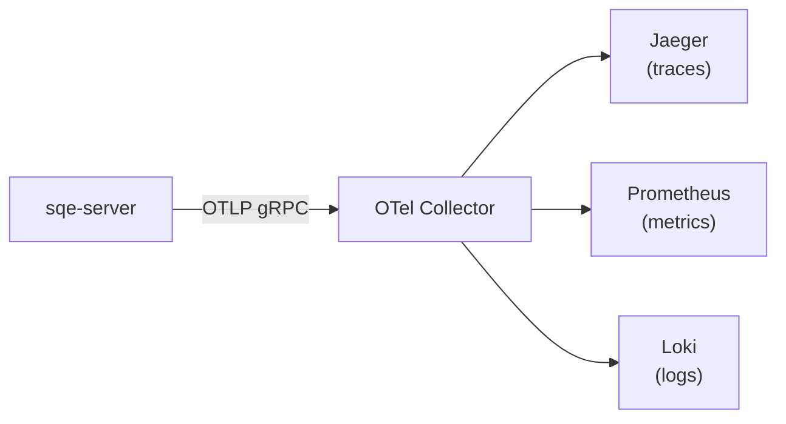

# Observability

SQE provides comprehensive observability through Prometheus metrics, OpenTelemetry traces/logs, and structured audit logging.

## Metrics (Prometheus)

Available at `http://coordinator:9090/metrics` in Prometheus text format.

| Metric | Type | Labels | Description |
|---|---|---|---|
| `sqe_query_count_total` | Counter | `status`, `statement_type` | Total queries by status and type |
| `sqe_query_duration_seconds` | Histogram | `statement_type` | Query duration distribution |
| `sqe_rows_returned_total` | Counter | — | Cumulative rows returned |
| `sqe_active_sessions` | Gauge | — | Current active sessions |
| `sqe_healthy_workers` | Gauge | — | Workers passing health checks |

Histogram buckets: 10ms, 25ms, 50ms, 100ms, 250ms, 500ms, 1s, 2.5s, 5s, 10s, 30s, 60s.

Statement types: `query`, `ctas`, `insert`, `merge`, `delete`, `drop`, `create_view`, `create_schema`, `show_catalogs`, `show_schemas`, `show_tables`, `policy`, `utility`.

### Example Queries (PromQL)

```promql
# Query rate (queries per second)
rate(sqe_query_count_total[5m])

# Error rate
rate(sqe_query_count_total{status="error"}[5m])

# P99 query duration
histogram_quantile(0.99, rate(sqe_query_duration_seconds_bucket[5m]))

# Active sessions
sqe_active_sessions
```

### Local observability stack

For a self-contained metrics view alongside the test stack, SQE ships a Docker Compose overlay using VictoriaMetrics (Prometheus-compatible, around 30 MB RAM) and Grafana:

```bash
docker compose -f docker-compose.test.yml -f docker-compose.observability.yml up -d
open http://localhost:13000    # Grafana, admin / admin
```

The overlay auto-scrapes the single-node coordinator (`localhost:19090`), the distributed coordinator (`localhost:29090`), and workers (`localhost:29091-29094`). A pre-built dashboard lives at `deploy/observability/sqe-benchmark-dashboard.json` and is auto-provisioned by the overlay. To import it manually, copy the JSON into your Grafana instance and point it at a Prometheus or VictoriaMetrics data source.

## Health Endpoints

Available on port 9091 (metrics port + 1) for both coordinator and workers.

### Kubernetes Probes

| Endpoint | Purpose | Response |
|---|---|---|
| `GET /healthz` | Liveness probe | Always returns `200 ok` |
| `GET /readyz` | Readiness probe | `200` when ready, `503` during init |

### Cluster Status (Ballista/DataFusion-style)

`GET /api/v1/status` returns a JSON snapshot of the node and cluster:

```json
{
  "status": "ACTIVE",
  "node": {
    "role": "coordinator",
    "version": "0.1.0",
    "datafusionVersion": "51",
    "uptimeSeconds": 3600
  },
  "workers": {
    "total": 2,
    "healthy": 2,
    "healthyUrls": ["http://worker-0:50052", "http://worker-1:50052"]
  }
}
```

For worker nodes, the `workers` field is `null`.

### Trino-Compatible Info (port 8080)

When the Trino compat layer is enabled, standard Trino info endpoints are available on the Trino HTTP port:

| Endpoint | Response |
|---|---|
| `GET /v1/info` | JSON: `nodeVersion`, `environment`, `coordinator`, `starting`, `uptime` |
| `GET /v1/info/state` | Plain text: `ACTIVE` or `STARTING` |

These endpoints are compatible with Trino JDBC drivers, DBeaver, and other Trino-aware tools for auto-detecting node state.

## OpenTelemetry

When `otlp_endpoint` is configured, SQE exports traces, metrics, and logs via OTLP/gRPC:



Configuration:
```toml
[metrics]
otlp_endpoint = "http://otel-collector:4317"
```

When the endpoint is empty (default), SQE falls back to structured JSON logs on stdout — no external dependency required.

### Trace Spans

Key spans emitted:
- `sqe.query.execute` — full query lifecycle
- `sqe.query.plan` — SQL parsing and planning
- `sqe.policy.evaluate` — policy enforcement
- `sqe.flight.do_get` — result streaming
- `sqe.auth.handshake` — authentication
- `sqe.worker.scan` — worker scan execution

## Audit Log

SQE writes a JSONL audit log capturing every query:

```json
{
  "timestamp": "2025-03-15T10:30:00Z",
  "username": "alice",
  "session_id": "a1b2c3d4-e5f6-7890-abcd-ef1234567890",
  "query_text": "SELECT * FROM sales.orders WHERE region = 'EU'",
  "query_hash": "sha256:e3b0c44298fc1c149afb...",
  "statement_type": "query",
  "client_ip": "10.0.1.42",
  "duration_ms": 142,
  "rows_returned": 1583,
  "status": "ok"
}
```

The `query_hash` field is a SHA-256 hash of the SQL text, useful for correlating repeated queries without storing the full text. When audit logging is enabled, all fields are always present.

Configuration:
```toml
[metrics]
audit_log_path = "/var/log/sqe/audit.jsonl"
```

When the path is empty (default), audit logging is disabled (no-op).

## Structured Logging

All SQE components use `tracing` with JSON output:

```json
{
  "timestamp": "2025-03-15T10:30:00.142Z",
  "level": "INFO",
  "target": "sqe_coordinator::query_handler",
  "message": "Query executed",
  "user": "alice",
  "statement_type": "query",
  "duration_ms": 142,
  "rows": 1583
}
```

Log level controlled via `RUST_LOG` environment variable:
```bash
RUST_LOG=info             # Default
RUST_LOG=sqe=debug        # Debug SQE crates only
RUST_LOG=sqe=trace        # Everything
```

## Kubernetes Integration

The Helm chart includes optional `ServiceMonitor` for Prometheus Operator:

```yaml
serviceMonitor:
  enabled: true
  interval: 30s
  labels:
    release: prometheus
```
