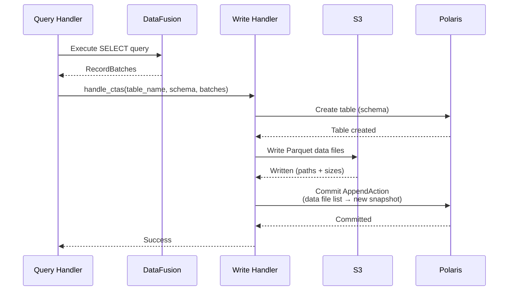

# Write Path

SQE supports writing data to Iceberg tables through SQL. Writes go through the coordinator, which executes the SELECT portion, writes Parquet files to S3, and commits to the Iceberg catalog.

## Supported Operations

### CREATE TABLE AS SELECT (CTAS)

```sql
CREATE TABLE analytics.monthly_sales AS
SELECT
    DATE_TRUNC('month', order_date) AS month,
    region,
    SUM(amount) AS total
FROM raw.orders
GROUP BY 1, 2;
```

Flow:
1. Parse SQL, extract target table name and SELECT query
2. Execute SELECT to get Arrow RecordBatches
3. Convert Arrow schema to Iceberg schema
4. Create table in the Iceberg catalog
5. Stream RecordBatches to Parquet files at constant memory
6. Commit data files to Iceberg via AppendAction

Add `PARTITIONED BY (year(ts), bucket(16, id), ...)` to partition on write. The standard Iceberg transforms (`year`, `month`, `day`, `hour`, `bucket`, `truncate`, `identity`) are parsed and applied. Partitioned writes use an unbounded writer by default; set `fanout_max_open_writers` or `fanout_buffer_budget` to opt into a bounded fanout writer that caps open per-partition writers and flushes the least-recently-written one when a limit is hit.

### CREATE OR REPLACE TABLE

```sql
CREATE OR REPLACE TABLE analytics.monthly_sales AS
SELECT ... ;
```

Drops the existing table (if it exists) and creates a new one. Useful for dbt `table` materializations.

### INSERT INTO

```sql
INSERT INTO analytics.monthly_sales
SELECT
    DATE_TRUNC('month', order_date) AS month,
    region,
    SUM(amount) AS total
FROM raw.orders
WHERE order_date >= '2024-06-01'
GROUP BY 1, 2;
```

Flow:
1. Parse SQL, extract target table and SELECT query
2. Execute SELECT to get Arrow RecordBatches
3. Stream RecordBatches to Parquet files at constant memory
4. Commit data files to Iceberg via AppendAction (new snapshot)

## Write Architecture



## Row-Level Operations

DELETE, UPDATE, and MERGE each choose Copy-on-Write or Merge-on-Read per operation, read from a table property: `write.delete.mode`, `write.update.mode`, and `write.merge.mode`. Each defaults to copy-on-write.

Copy-on-Write reads the affected data files, filters or transforms the rows, and rewrites them as new files in a single atomic commit through `RewriteFilesAction`. Merge-on-Read leaves the data files in place and writes delete files instead: position deletes for DELETE, equality deletes for UPDATE (when the table declares an identifier-field-id), and a `RowDeltaAction` for MERGE. Copy-on-Write keeps reads fast; Merge-on-Read keeps writes cheap.

### DELETE FROM

```sql
DELETE FROM sales.orders WHERE status = 'cancelled';

-- Cross-table subqueries in WHERE
DELETE FROM sales.orders
WHERE customer_id IN (SELECT id FROM blacklist);

-- DELETE without WHERE = truncate
DELETE FROM sales.orders;
```

Flow:
1. Scan table metadata to identify affected data files
2. Read each affected file, apply the WHERE filter
3. If all rows match: mark file for removal
4. If partial match: rewrite file without matching rows
5. Commit via `RewriteFilesAction` (remove old files, add rewritten files)

Under `write.delete.mode=merge-on-read`, DELETE instead writes position-delete files and commits a `RowDeltaAction`, leaving the data files untouched.

### UPDATE

```sql
UPDATE sales.orders SET status = 'shipped' WHERE tracking_id IS NOT NULL;

-- CASE WHEN transformations
UPDATE sales.orders SET amount = CASE
    WHEN amount > 1000 THEN amount * 0.9
    ELSE amount
END;
```

Flow:
1. Scan table metadata to identify affected data files
2. Read each affected file, apply the WHERE filter
3. For matching rows: apply SET expressions
4. Rewrite file with modified rows
5. Commit via `RewriteFilesAction`

Under `write.update.mode=merge-on-read`, UPDATE writes a new data file plus an equality-delete file in one `RowDeltaAction`, provided the table declares an identifier-field-id.

### MERGE INTO

```sql
MERGE INTO target USING source ON target.id = source.id
WHEN MATCHED THEN UPDATE SET value = source.value
WHEN NOT MATCHED THEN INSERT (id, value) VALUES (source.id, source.value);
```

Flow:
1. Execute a full outer join of source and target via DataFusion
2. Classify each result row: matched (UPDATE/DELETE) or not matched (INSERT)
3. Rewrite affected target data files with modifications applied
4. Add new data files for INSERT rows
5. Commit via `RewriteFilesAction` (remove old files, add new + rewritten files)

Under `write.merge.mode=merge-on-read`, MERGE routes matched and unmatched rows through a `RowDeltaAction` (position/equality deletes plus new data files) instead of rewriting the target files.

### Iceberg Dependency

Row-level writes depend on the SQE-rebased fork of [risingwavelabs/iceberg-rust](https://github.com/risingwavelabs/iceberg-rust), vendored at `vendor/iceberg-rust/`. It provides `RewriteFilesAction` / `OverwriteFilesAction` for Copy-on-Write, `PositionDeleteFileWriter` and `EqualityDeleteFileWriter` with `RowDeltaAction` for Merge-on-Read, and `DeletionVectorWriter` for Iceberg V3, none of which are available upstream yet. SQE also carries its own vendor patches (feature-gated catalog backends, `Send + Sync` catalog builders, ADD COLUMN scan projection) and owns write-path components outside the vendor tree, such as the bounded fanout writer. See `vendor/iceberg-rust/README.md` for the patch inventory.

## Memory Safety

Large writes used to be a way to run the coordinator out of memory. The write path now bounds its own memory in three ways.

The straight-line paths stream at constant memory. CTAS and INSERT write Parquet in a streaming loop rather than collecting the full result set first. Flight `DoPut` ingest streams the upload instead of buffering it. Row group by row group, the peak stays flat regardless of how many rows the SELECT produces.

Some row-level paths still have to buffer. Copy-on-Write MERGE reads the target rows, and UPDATE, DELETE, and Merge-on-Read decode each affected file before rewriting it. Those buffers register against the DataFusion memory pool (Layer A). When a buffer would exceed the pool, the write fails with a typed `ResourceExhausted` error instead of OOM-killing the process. The query dies, the coordinator lives, and the caller gets a clear reason.

Partitioned writes can open one Parquet writer per partition, and a high-cardinality partition key multiplies that into memory pressure. The bounded fanout writer caps the number of concurrently open per-partition writers. When a batch arrives for a new partition and the map is full, the least-recently-written writer closes and flushes first, then the new one opens. Cutover trades bounded memory for small-file debt, which `CALL system.rewrite_data_files` repairs. The bounded writer is opt-in: set `fanout_max_open_writers` or `fanout_buffer_budget` (see [Configuration](../deployment/configuration.md)) to turn it on. Left unset, partitioned writes use the unbounded writer.

Two knobs stay off by default until validated against a live catalog. `merge_target_streaming` streams a Copy-on-Write MERGE target from the pinned data files through the merge join as governed operator memory, instead of buffering the whole target. `write_buffer_tracking` is a diagnostic escape hatch: it defaults on, and setting it false disables the Layer A reservations (never the streaming paths) if a deployment ever hits an accounting false positive.

## Maintenance

Table maintenance runs through `CALL system.*` procedures: `rewrite_data_files` (bin-packs small files), `expire_snapshots`, `remove_orphan_files`, `rewrite_manifests`, plus `register_table` and `drop_table`. See [Iceberg Integration](iceberg.md#maintenance-procedures) for the full surface.

## dbt Compatibility

The write path is designed to support [dbt Core](https://www.getdbt.com/) via a native `dbt-sqe` adapter:

| dbt Materialization | SQL | Status |
|---|---|---|
| `table` | `CREATE OR REPLACE TABLE AS SELECT` | Supported |
| `incremental` (append) | `INSERT INTO SELECT` | Supported |
| `incremental` (merge) | `MERGE INTO` | Supported (CoW or MoR) |
| `view` | `CREATE VIEW AS SELECT` | Supported |
| `seed` | `INSERT INTO` (from CSV) | Supported |
