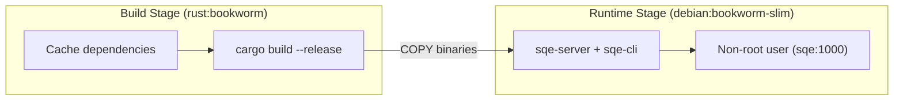

# Building from Source

## Prerequisites

| Tool | Version | Purpose |
|---|---|---|
| Rust | 1.85+ | Compiler |
| Cargo | (bundled) | Build system |
| protoc | 3.x+ | Protobuf compiler (for gRPC/Flight) |
| cmake | 3.x+ | Build dependency for some crates |
| pkg-config | any | Library discovery |
| OpenSSL dev | 3.x | TLS support |

### macOS

```bash
brew install protobuf cmake pkg-config openssl
```

### Ubuntu/Debian

```bash
sudo apt-get install -y protobuf-compiler cmake pkg-config libssl-dev
```

## Build

```bash
# Debug (fast compile, slow runtime)
cargo build --bin sqe-server --bin sqe-cli

# Release (slow compile, fast runtime)
cargo build --release --bin sqe-server --bin sqe-cli

# Or use the build script
./scripts/build.sh release
```

Binaries are placed in `target/release/` (or `target/debug/`):
- `sqe-server`: the server binary (coordinator or worker)
- `sqe-cli`: the SQL CLI client

`sqe-server` is the supported entrypoint for both roles: it takes `--config <path>` and `--mode coordinator|worker`, and it is the binary shipped in the Docker image and run by the Helm chart. The `sqe-coordinator` crate also produces an older coordinator-only binary of the same name that takes the config path as a positional argument and has no worker mode; prefer `sqe-server`.

## Test

```bash
# All workspace tests
cargo test --workspace

# Specific crate
cargo test -p sqe-coordinator

# Integration tests (require running quickstart stack)
cargo test --workspace -- --ignored
```

## Docker Build

```bash
# Build the image
docker build -t sqe:latest .

# With OCI labels
docker build -t sqe:0.1.0 \
  --build-arg VERSION=0.1.0 \
  --build-arg BUILD_DATE=$(date -u +%Y-%m-%dT%H:%M:%SZ) \
  --build-arg GIT_REVISION=$(git rev-parse HEAD) \
  .
```

The Dockerfile uses a multi-stage build:



## Workspace Structure

```
sqe/
├── Cargo.toml          # Workspace root
├── Cargo.lock
├── Dockerfile
├── sqe.toml.example
├── crates/
│   ├── sqe-core/       # Shared types, config, errors
│   ├── sqe-auth/       # Keycloak OIDC
│   ├── sqe-catalog/    # Iceberg REST catalog client
│   ├── sqe-sql/        # SQL parser & classifier
│   ├── sqe-policy/     # Policy enforcement (pluggable)
│   ├── sqe-planner/    # Plan splitting for distributed exec
│   ├── sqe-coordinator/# Coordinator + sqe-server binary
│   ├── sqe-worker/     # Worker executor
│   ├── sqe-cli/        # SQL CLI client
│   ├── sqe-metrics/    # Prometheus + OTel + audit
│   └── sqe-trino-compat/ # Trino wire protocol adapter
├── deploy/
│   ├── helm/sqe/       # Helm chart
│   └── k8s/            # Raw K8s manifests
├── docs/
│   └── book/           # This documentation (mdBook)
├── scripts/
│   ├── build.sh
│   └── test.sh
└── tests/
    └── integration_test.rs
```
