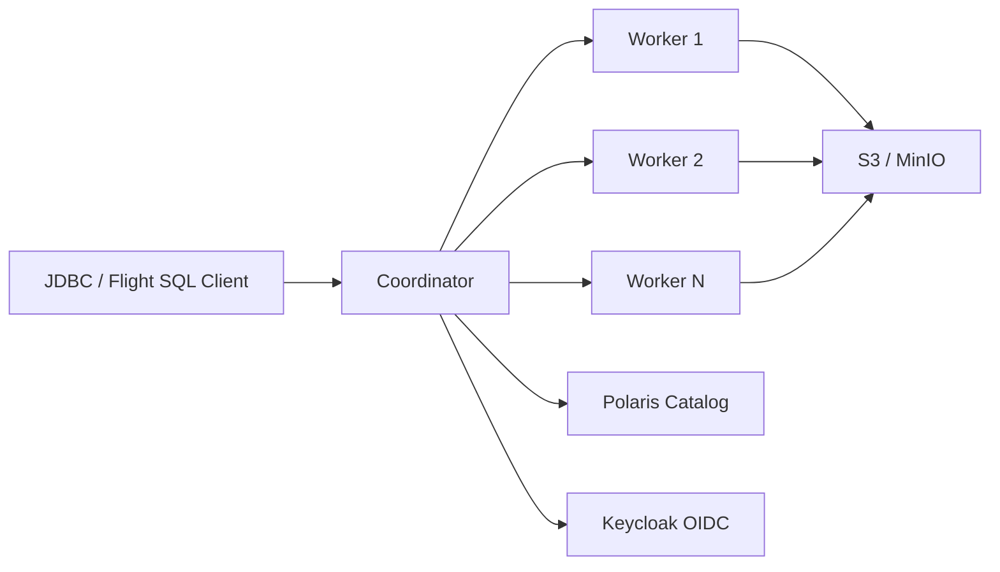

# SQE — Sovereign Query Engine

**SQE** is a Rust-based distributed SQL query engine for [Apache Iceberg](https://iceberg.apache.org/) tables. It replaces a patched Trino fork with a purpose-built engine based on [Apache DataFusion](https://datafusion.apache.org/) and [iceberg-rust](https://github.com/apache/iceberg-rust).



## Key Properties

- **No service account.** Every query runs as the authenticated user. The user's bearer token passes through to the Polaris catalog (metadata) and on the write path. Read-path S3 access currently uses the configured `[storage]` credentials; per-user read-credential vending is on the roadmap (see [S3 credential vending](./design-notes/s3vending.md)).
- **Arrow-native** — columnar data flows from Parquet files through the entire query pipeline to the client. No row-based serialization anywhere.
- **Iceberg-native** — built on iceberg-rust, not a connector bolted onto a generic engine. Partition pruning, metadata caching, and Iceberg v3 support are first-class.
- **Fine-grained security** — row filters and column masks enforced at the logical plan level, before the optimizer runs. Invisible columns, transparent row filtering, no information leakage.
- **Rust performance** — single binary, no JVM, no GC pauses, predictable memory usage, fast startup.

## Quick Start (embedded, no server)

```bash
cargo install --path crates/sqe-cli
sqe-cli --embedded                    # ~/.sqe/warehouse persistent Iceberg catalog

sqe> SELECT * FROM '/data/sales.parquet' LIMIT 5;
sqe> SELECT * FROM read_csv('s3://bucket/orders.tsv.gz');
sqe> SELECT * FROM 'hf://datasets/squad/plain_text/train-00000-of-00001.parquet';
sqe> SELECT * FROM read_delta('/data/delta/sales', version => '5');
```

Full embedded reference: [Using the CLI](./getting-started/cli.md). DuckDB comparison: [getsqe.com/compare/duckdb](https://getsqe.com/compare/duckdb).

## Quick Start (cluster mode)

```bash
# Build
cargo build --release --bin sqe-coordinator --bin sqe-cli

# Start coordinator
SQE_CONFIG=sqe.toml ./target/release/sqe-coordinator

# Connect
./target/release/sqe-cli --host localhost --port 50051
```

## Project Status

SQE is production-ready against Apache Iceberg. The cluster mode runs distributed (coordinator + stateless workers) with OIDC bearer-token passthrough, Polaris / Nessie / Glue / HMS / S3 Tables / JDBC / Hadoop catalogs, and 167/189 (88.4%) on the public Iceberg matrix scoreboard. The embedded mode (V8 through V12.1) adds DuckDB-style file-format TVFs (`read_csv`, `read_json`, `read_delta`), HuggingFace `hf://` URLs, and a single-binary CLI for laptop analytics.
