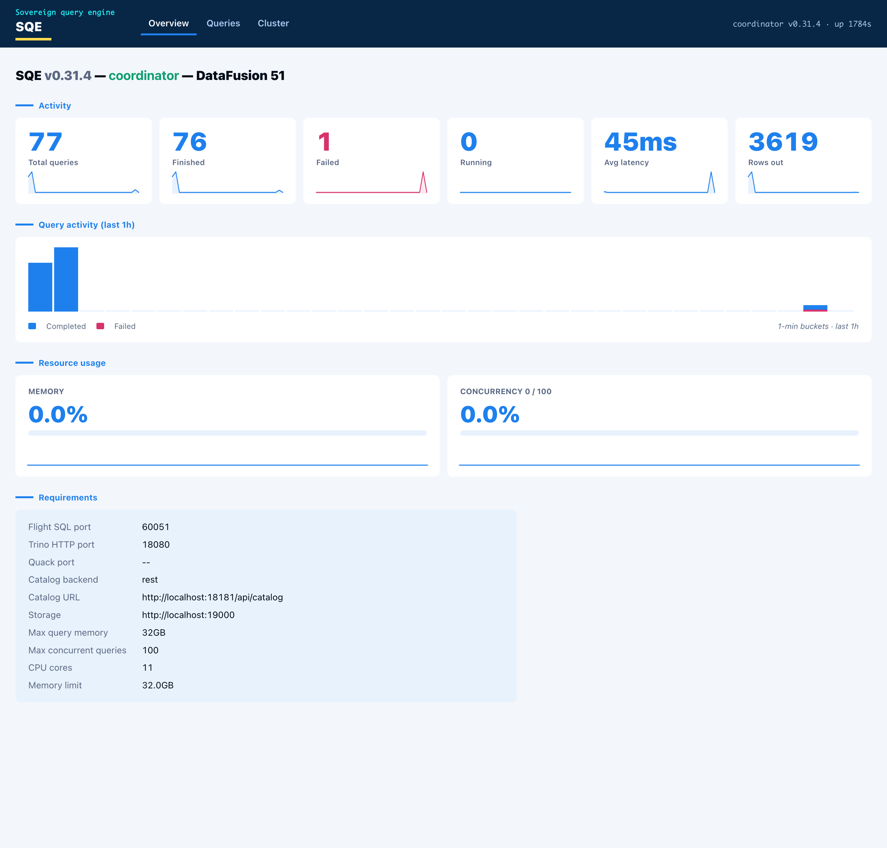

# Web UI

SQE serves a read-only web dashboard on the coordinator's health port
(`metrics_port + 1`, default `9091`). It shows the queries the engine is running
and has run, per-query timing and fragments, the cluster nodes, and live engine
metrics. The data comes from the coordinator's in-memory query tracker and
worker registry. The page adds no new instrumentation and never touches the
query path.



## Access

- Open `http://<coordinator-host>:<metrics_port + 1>/`. With the default
  `metrics.prometheus_port = 9090`, that is `http://localhost:9091/`.
- The same port also serves `/healthz`, `/readyz`, and `/api/v1/status`.
- The UI is **off by default**. Turn it on with:

  ```toml
  [metrics]
  web_ui = true
  ```

  This is TOML-only: there is no `SQE_METRICS__*` environment override for it.

  When off, `/healthz`, `/readyz`, `/api/v1/status`, and the admin endpoints
  below still respond; the dashboard and the `/api/v1/queries*` endpoints
  return 404.

## Security

The dashboard and its JSON API (`/`, `/api/v1/overview`, `/api/v1/queries*`,
`/api/v1/workers`, `/api/v1/metrics/history`) are gated by
`require_admin_bearer` (`crates/sqe-coordinator/src/web_auth.rs`, applied in
`build_health_router` in `sqe_server.rs`). A request needs
`Authorization: Bearer <token>` for an identity that holds an admin role. No
token, a bad token, or no auth provider configured is 401. A valid non-admin
token is 403. The UI is **off by default** (`[metrics] web_ui = false`); when
off, those routes are not registered and return 404.

`/healthz`, `/readyz`, and `/api/v1/status` stay open. They are the probe
surface for Kubernetes and load balancers. The Prometheus `/metrics` endpoint
on the metrics port is also ungated. Keep the metrics and health ports on an
internal network.

The UI is strictly read-only. It cannot submit queries, cancel them, or change
configuration. The query-detail endpoint omits session id, client IP, and roles
so a leaked admin token still exposes less session metadata.

## Tabs

- **Overview** carries the node identity and capabilities (enabled protocols and
  ports, catalog backend and URL, storage, memory limit), live resource gauges
  (memory pool used, concurrency against the configured cap), and the engine
  metrics (queries by state, rows out, average latency) as stat cards. Each card
  has a one-hour sparkline, and a query-activity histogram sits below them.
- **Queries** lists recent queries with id, user, state, SQL, elapsed time, rows,
  and bytes scanned. Click a row for the detail: the queue, planning, and
  execution timing, the rows/bytes/spill/peak-memory totals, and the
  per-fragment breakdown showing which worker ran each fragment.
- **Cluster** shows the worker nodes with health and in-flight load. In
  single-node mode the coordinator lists itself as one node doing both roles.

Every chart is hoverable. Pointing at a bar or a sparkline point shows the time
and value.

## JSON API

The page is a thin client over a small JSON API on the same port. The endpoints
are stable and safe to scrape directly:

| Endpoint | Returns |
|---|---|
| `GET /api/v1/overview` | node, capabilities, resources, metrics |
| `GET /api/v1/queries?state=<running\|finished\|failed\|all>&limit=<n>` | recent queries, newest first |
| `GET /api/v1/queries/{id}` | one query plus its fragments (404 if unknown) |
| `GET /api/v1/workers` | worker nodes with health and in-flight load |
| `GET /api/v1/metrics/history` | time-bucketed series for the charts |
| `GET /api/v1/status` | Ballista/DataFusion-style cluster status |

## Admin endpoints

Mutating endpoints on the same port sit behind the same bearer + admin gate as
the dashboard. Unlike the dashboard, they are **always registered**, whether or
not `metrics.web_ui` is on: they are control-plane hooks, not part of the
read-only UI, and coupling catalog invalidation to "dashboard enabled" made the
hook silently unavailable on a default deployment. The gate fails closed, so
with no auth provider configured they answer 401 rather than running.

| Endpoint | Effect |
|---|---|
| `POST /api/v1/catalogs/refresh` | Invalidates SQE's catalog caches so a catalog created or rebound out-of-band becomes visible immediately, instead of waiting out `coordinator.session_context_cache_ttl_secs`. Drops every session's cached `SessionContext` and the shared REST-catalog cache. An optional JSON body `{"username": "<u>"}` scopes the session drop to one user; a bodyless POST invalidates all sessions. Returns `{"invalidated": "all" \| "session:<u>"}`. |

The platform's workspace-provisioning path calls this right after it creates or
binds a Polaris catalog, so a new workspace catalog is queryable at once. A
pure-SQL client that only needs to refresh its own view can instead run `CALL
system.refresh_catalog_cache()` (see [CALL procedures](../sql-reference/procedures.md)).

```bash
# Global refresh (admin bearer required):
curl -XPOST -H "Authorization: Bearer $ADMIN_TOKEN" \
  http://coordinator:9091/api/v1/catalogs/refresh

# Scope the session drop to one user:
curl -XPOST -H "Authorization: Bearer $ADMIN_TOKEN" \
  -H "Content-Type: application/json" -d '{"username":"alice"}' \
  http://coordinator:9091/api/v1/catalogs/refresh
```

## How it is built

- One HTML page with vanilla JavaScript, embedded in the binary with
  `include_str!`. No Node toolchain, no bundler, no external assets, no web fonts
  or logos. The visual language follows the Schuberg Philis palette and layout
  with system fonts.
- The metrics history is an in-memory ring buffer. The coordinator samples query
  counts, rows, latency, active queries, and memory-pool usage every five seconds
  and keeps a rolling one-hour window. `GET /api/v1/metrics/history` aggregates
  the samples into one-minute buckets, so the charts advance a bar each minute
  and the current bar refreshes every sample.

For a longer history, scrape `/metrics` into Prometheus and chart it in Grafana.
The web UI is the at-a-glance view that ships in the binary.
