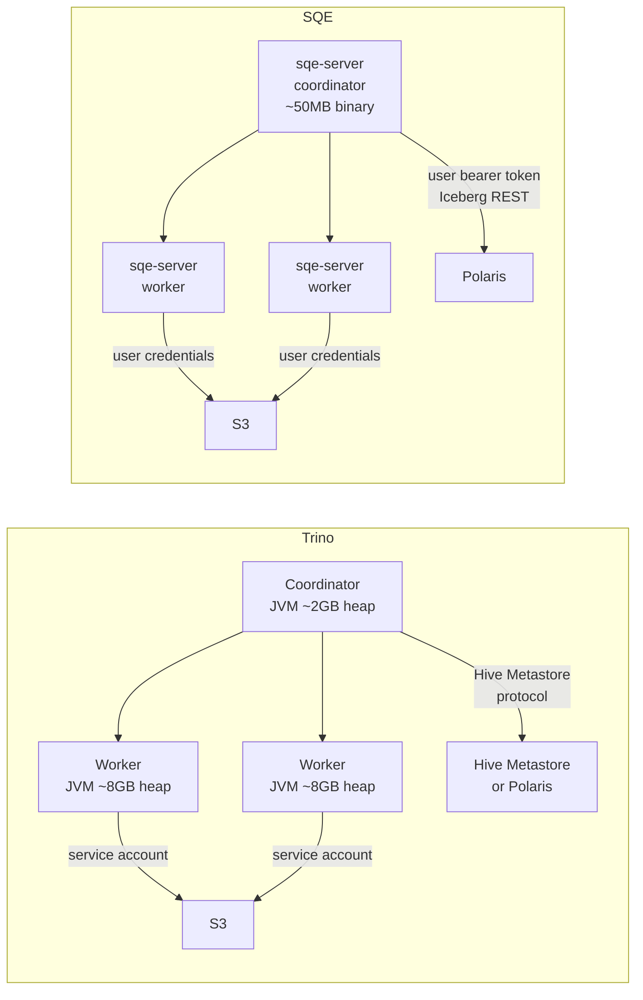
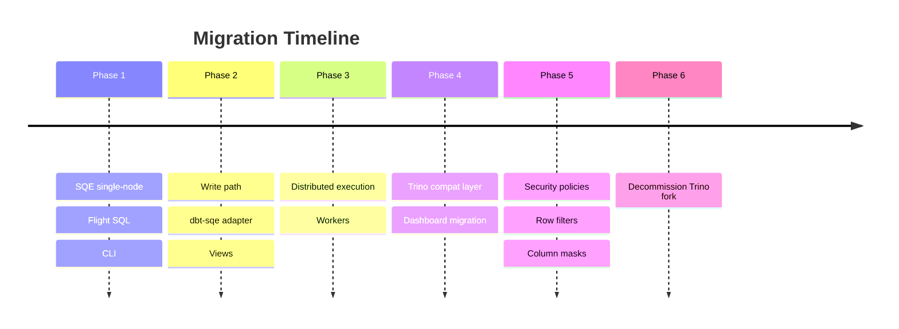

# From Trino to DataFusion

## Architecture Comparison

## What Changes

| Aspect | Trino (DCAF fork) | SQE |
|---|---|---|
| **Language** | Java 21 | Rust |
| **Binary size** | ~1.2GB (with plugins) | ~50MB |
| **Startup time** | 10-30 seconds | < 1 second |
| **Memory model** | JVM heap + GC | Direct allocation, no GC |
| **Catalog protocol** | Hive Metastore / Iceberg REST | Iceberg REST (native) |
| **Auth to catalog** | Service account | User bearer token passthrough |
| **Auth to storage** | Service account IAM role | User credentials from catalog vending |
| **Wire protocol** | Trino HTTP (custom) | Arrow Flight SQL (gRPC) |
| **Data format in-flight** | Row-based JSON pages | Arrow columnar batches |
| **Security model** | System/catalog access control | LogicalPlan rewriting (row filters, column masks) |
| **Query engine** | Custom cost-based optimizer | Apache DataFusion |
| **Table format** | Iceberg connector | iceberg-rust (native) |
| **Maintenance** | Fork of 2M+ LOC Java project | Purpose-built ~5K LOC Rust |

## What Stays the Same

- **Apache Iceberg** as the table format
- **Apache Polaris** as the REST catalog
- **Keycloak** as the identity provider
- **S3** as the storage layer
- **dbt** as the transformation framework (new native adapter instead of Trino adapter)
- **JDBC connectivity** (via Arrow Flight SQL JDBC driver instead of Trino JDBC)

## Migration Path

SQE includes an optional **Trino-compatible HTTP endpoint** (`/v1/statement`) that speaks enough of the Trino wire protocol to support existing dashboards and tools during the migration period. This is not a full Trino emulation. It covers `SELECT`, `SHOW`, and basic DDL, enough to keep things running while teams migrate to Flight SQL.

