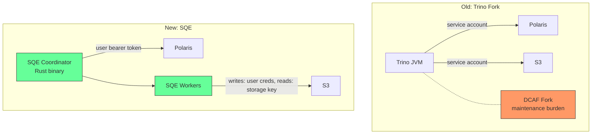

# Why SQE

## The Problem

Our data platform runs on **Apache Iceberg** tables stored in S3, cataloged by **Apache Polaris** (Iceberg REST Catalog), with authentication through **Keycloak OIDC**. We need a SQL query engine that can:

1. Authenticate users through Keycloak
2. Pass the user's bearer token through to Polaris and on the write path (no service account). Read-path S3 access currently uses the configured `[storage]` credentials; per-user read vending is on the roadmap (see [S3 credential vending](../design-notes/s3vending.md))
3. Enforce fine-grained security (row filters, column masks) per user
4. Support full SQL for analytics, dbt transformations, and ad-hoc queries
5. Run on Kubernetes with minimal operational overhead

## Why Not Trino?

We started with **Trino**, the industry-standard SQL engine for data lakehouses. It works, but:

| Challenge | Detail |
|---|---|
| **Service account model** | Trino authenticates to the catalog and storage with a single service identity. It can't pass per-user bearer tokens through to Polaris. We forked Trino (DCAF branch) to add token passthrough, but maintaining a JVM fork is expensive. |
| **Security enforcement** | Trino's security model (system/catalog access control) doesn't natively support Iceberg-level row filters and column masks applied at the query plan level. |
| **JVM overhead** | Trino requires significant heap memory, has GC pauses, and takes 10-30 seconds to start. Not ideal for auto-scaling Kubernetes pods. |
| **Maintenance burden** | Our Trino fork drifts from upstream with every release. Rebasing is a multi-week effort. Security patches are delayed. |

## Why DataFusion + Rust?

**Apache DataFusion** is a Rust-native query engine that gives us:

- **Extensible query planning**: we can inject security filters into the `LogicalPlan` before optimization, which is exactly where row filters and column masks need to go
- **iceberg-rust integration**: native Rust Iceberg library, no JNI bridge, no serialization overhead
- **Per-query context**: each query gets its own `SessionContext` with the user's bearer token. No shared service account.
- **Single binary**: the coordinator and worker ship as one ~50MB binary. Starts in milliseconds.
- **No GC**: predictable latency, no stop-the-world pauses during large scans

## The Name

**Sovereign** — because every query runs with the identity and permissions of the user who submitted it. No service account intermediary. No privilege escalation. The user's token is sovereign.

The scope is precise. The user's bearer token reaches the Polaris catalog (metadata) and the write path per user. The read path currently reads S3 with the configured `[storage]` credentials; per-user read-credential vending is on the roadmap (see [S3 credential vending](../design-notes/s3vending.md)). Catalog permissions and the plan-rewriting policy engine still gate what each user can see, so identity drives authorization even where the read path shares a storage key.
